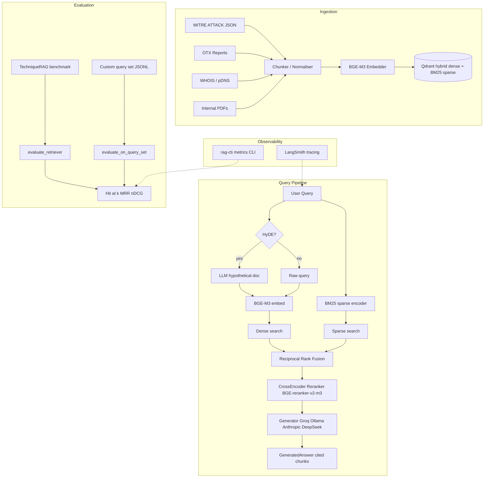

# CTI-RAG

A Retrieval-Augmented Generation system for Cyber Threat Intelligence (CTI). Given a natural-language query or an IOC string, the system retrieves the most relevant threat intelligence chunks from a hybrid vector store — spanning MITRE ATT&CK, OTX threat reports, WHOIS/pDNS records, and internal PDFs — and synthesises a cited, grounded answer via an LLM. The motivation is to make dispersed, heterogeneous CTI corpora navigable through plain-language queries, replacing ad-hoc keyword searches with semantically-aware retrieval backed by reproducible evaluation metrics.

---

## Architecture



---

## Tech Stack

| Layer | Technology |
|---|---|
| Embedding | `BAAI/bge-m3` via `sentence-transformers` |
| Vector store | Qdrant (hybrid: dense cosine + BM25 sparse) |
| Sparse encoder | Custom BM25 sparse vectors (IOC-preserving tokenizer); optional `rank-bm25` ships with `[eval]` |
| LLM (default) | Groq — `llama-3.3-70b-versatile` (analysis), `llama-3.1-8b-instant` (HyDE) |
| LLM (alt) | Ollama (local), Anthropic Claude |
| CTI sources | MITRE ATT&CK STIX, OTX, WHOIS, pDNS, PDF reports |
| Reranker | `BAAI/bge-reranker-v2-m3` CrossEncoder (CUDA, batch_size=8) |
| Evaluation | Custom `Hit@k`, `MRR`, `nDCG@k`; TechniqueRAG benchmark; RAGAS (faithfulness, answer_relevancy) |
| Tracing | LangSmith (`@traced` + `add_trace_metadata`) |
| CLI | Typer + Rich |
| Config | Pydantic Settings + `.env` |
| Testing | pytest — 486 tests, 94% coverage |
| Linting | ruff, mypy (strict), bandit |

---

## Quick Start

### 1. Install

Create a venv from the `rag_cti/` directory (this package’s `pyproject.toml` lives here):

```bash
cd rag_cti
python -m venv .venv && source .venv/bin/activate   # Windows: .venv\Scripts\activate
```

Pick an extra group (defined in `pyproject.toml`):

| Goal | Command |
|------|---------|
| **Core only** — ingest embeddings, hybrid retrieval, no LLM / no Typer CLI | `pip install -e .` |
| **Interactive demo** — `rag-cti query` + answer generation | `pip install -e ".[demo]"` |
| **Everything runtime** — PDF ingest, connectors, eval, CLI, tracing | `pip install -e ".[all]"` |
| **Contributors** — `[all]` + pytest, ruff, mypy, bandit, notebooks | `pip install -e ".[dev]"` |

Composable extras (install only what you need):

| Extra | Adds |
|-------|------|
| `generation` | Groq / Anthropic / Ollama-compatible clients, structured outputs |
| `pdf` | PDF parsing for `scripts/seed_pdfs.py` |
| `connectors` | STIX tooling for connector-heavy workflows |
| `eval` | TechniqueRAG / RAGAS / datasets / optional `rank-bm25` |
| `cli` | Typer + Rich (`rag-cti` entrypoint) |
| `tracing` | LangSmith |

Example: core retrieval plus CLI and PDFs: `pip install -e ".[cli,pdf]"`.

### 2. Configure

Copy `.env.example` and fill in your keys:

```bash
cp .env.example .env
```

Minimum required variables:

```env
QDRANT_URL=http://localhost:6333
QDRANT_COLLECTION=cti_chunks
QDRANT_API_KEY=                   # leave blank for local Qdrant

GROQ_API_KEY=gsk_...              # primary LLM provider
# ANTHROPIC_API_KEY=sk-ant-...    # optional fallback
# OLLAMA_ENABLED=true             # set true to use local Ollama instead

EMBEDDING_MODEL=BAAI/bge-m3

# Optional — LangSmith tracing (pip install -e ".[tracing]")
# LANGCHAIN_API_KEY=ls__...
# LANGCHAIN_TRACING_V2=true
# LANGCHAIN_PROJECT=cti-rag
```

### 3. Ingest the corpus

Requires at least the core install; PDF ingestion needs `[pdf]`:

```bash
python scripts/seed_mitre.py    # MITRE ATT&CK techniques (core)
python scripts/fetch_otx.py     # OTX threat reports (core)
python scripts/seed_pdfs.py     # internal PDF reports — pip install -e ".[pdf]"
```

> WHOIS and pDNS connectors exist in `src/rag_cti/connectors/` (`whois_connector.py`, `passive_dns.py`) but no standalone ingestion script is included in this release. Use `[connectors]` when working with STIX-heavy connector code paths.

### 4. Query

Install `[demo]` or `[cli]` + `[generation]` so the `rag-cti` CLI and synthesis stack are available:

```bash
# CLI
rag-cti query "How does APT29 use spearphishing for initial access?"

# Python API
import rag_cti
result = rag_cti.query("T1566 phishing techniques", top_k=10)
answer = rag_cti.generate("Explain T1566", result)
print(answer.answer)
```

Core retrieval works with `pip install -e .`; `generate` needs `[generation]`.

### 5. Evaluate

Install `[eval]` and `[cli]` (or `[all]`). External benchmark needs HuggingFace access.

```bash
# External benchmark (requires HuggingFace access)
rag-cti eval techniquerag --config all --max-records 200

# Custom query set
rag-cti eval retrieval --query-set data/eval/query_set.jsonl --config all

# RAGAS generation quality (requires DEEPSEEK_API_KEY)
rag-cti eval ragas --config hybrid -n 10 -o data/eval/ragas_results.json

# Display saved metrics
rag-cti metrics data/eval/retrieval_results.json --strict
```

---

## Evaluation Results

Three evaluation protocols. Results should be read together: the external benchmark measures generalisation; the custom query set provides per-category diagnostics; RAGAS measures generation quality.

> **Note on alpha bug fix (Phase 6.5):** Previous results labelled "dense" and "hybrid" were identical because `build_pipeline()` always created a `HybridRetriever` regardless of config. This has been fixed — `hybrid_alpha_override=1.0` now correctly produces pure dense retrieval.

### TechniqueRAG (external benchmark, 50 queries)

Independent evaluation on [QCRI/TechniqueRAG-Datasets](https://huggingface.co/datasets/QCRI/TechniqueRAG-Datasets). Queries were never seen during corpus construction.

| Config | Hit@1 | Hit@5 | Hit@10 | MRR |
|---|---|---|---|---|
| dense | 0.320 | 0.580 | 0.640 | 0.438 |
| hybrid | 0.160 | 0.500 | 0.580 | 0.277 |
| dense + reranker | 0.340 | 0.660 | 0.720 | 0.472 |
| **hybrid + reranker** | **0.360** | **0.640** | **0.700** | **0.471** |

### Custom Query Set (49 queries, 3 categories)

LLM-generated queries from the ingested corpus (17 precise, 20 semantic, 12 fuzzy). All `expected_chunk_ids` verified present in the target collection. Treat as diagnostic, not absolute.

**Overall**

| Config | Hit@1 | Hit@5 | Hit@10 | MRR |
|---|---|---|---|---|
| dense | 0.878 | 0.959 | 0.959 | 0.909 |
| hybrid | 0.327 | 0.918 | 0.939 | 0.535 |
| dense + reranker | 0.857 | 0.980 | **1.000** | 0.902 |
| **hybrid + reranker** | **0.878** | **0.980** | 0.980 | **0.916** |

**Per-category detail (Hit@1)**

| Category | N | dense | hybrid | dense+reranker | hybrid+reranker |
|---|---|---|---|---|---|
| Precise | 17 | 0.941 | 0.235 | 0.882 | **0.882** |
| Semantic | 20 | 0.750 | 0.150 | 0.800 | **0.850** |
| Fuzzy | 12 | **1.000** | 0.750 | 0.917 | 0.917 |

### RAGAS Generation Quality (10 queries, hybrid config)

End-to-end generation evaluation using [RAGAS](https://github.com/explodinggradients/ragas) with DeepSeek as judge LLM. Two independent runs to verify stability (LLM judge scores have inherent variance):

| Metric | Run 1 | Run 2 |
|---|---|---|
| Faithfulness | 0.918 | 0.885 |
| Answer Relevancy | 0.478 | 0.519 |

**Faithfulness (0.89–0.92)** is excellent — generated answers are well-grounded in retrieved context with minimal hallucination.

**Answer Relevancy (0.48–0.52)** is moderate. This is expected for two reasons: (1) RAGAS `strictness=1` generates only 1 reverse-question per answer instead of the default 3, because DeepSeek's API does not support the `n>1` parameter — this reduces the metric's discriminative power; (2) the CTI domain produces long, multi-faceted answers citing multiple techniques, which score lower on relevancy than short, focused single-point answers even when the content is correct.

### Key findings

- **Reranker is the single biggest improvement.** Cross-encoder reranking transforms hybrid from Hit@1 0.33 → 0.88 (+0.55) on the custom query set, and from 0.16 → 0.36 (+0.20) on TechniqueRAG. The reranker corrects BM25 noise that RRF cannot resolve alone.
- **Dense alone is a strong baseline.** Pure dense retrieval (BGE-M3) achieves 0.88 Hit@1 on the custom set without any reranker or sparse component.
- **hybrid+reranker has the highest MRR** on both benchmarks (0.471 TechniqueRAG, 0.916 custom), making it the recommended default config.
- **BM25 without reranker hurts.** Hybrid (RRF) without reranker consistently underperforms dense-only — the BM25 sparse component dilutes dense quality through fusion. The reranker is required to realise the benefit of hybrid retrieval.
- **Faithfulness is excellent (0.92).** The generated answers are well-grounded in retrieved context. Answer relevancy (0.48) indicates room for improvement in response precision.

---

## Future Work

### Expand query set and BM25 tuning
The current custom query set (49 queries) is limited by OTX/PDF chunk count in the collection. Expanding the corpus and retuning BM25 vocabulary/IDF weights may unlock the sparse component's potential.

### Retrieval ablation study
Systematic ablation across embedding models (BGE-M3 vs. E5-large), chunk sizes, reranker models (MiniLM vs. BGE-reranker), and `reranker_candidates_k` values.

### Agentic CTI analyst
Multi-step agent that decomposes compound queries, iteratively retrieves and reasons, cross-references IOCs across WHOIS/OTX/MITRE, and produces structured threat reports.

### Real-time ingestion
Streaming connectors for live OTX feeds and VirusTotal webhooks.

---

## Project Structure

```
src/rag_cti/
├── connectors/        # OTX, VirusTotal data fetchers
├── embeddings/        # BGE-M3 embedder wrapper
├── evaluation/        # retrieval_metrics, query_set, techniquerag, ragas_eval
├── generation/        # Generator, LLMRouter, context_builder, client
├── observability/     # LangSmith tracing seam
├── preprocess/        # chunking, normalizers, pdf_parser
├── retrieval/         # pipeline, hyde, bm25, reranker (CrossEncoder)
├── store/             # QdrantStore (dense + sparse upsert/search)
├── cli.py             # Typer CLI (query, eval, metrics)
├── cli_metrics.py     # Pure metrics loading/rendering
├── config.py          # Pydantic Settings
└── types.py           # Shared types + Protocol interfaces

scripts/               # One-shot ingestion scripts
tests/unit/            # 486 tests, 94% coverage
data/eval/             # Query set JSONL, evaluation results
docs/                  # Architecture and decision records
```

## License

MIT
