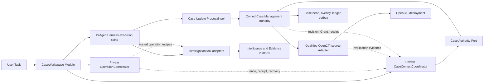

# Agent Investigation Workspace Case Context Projection

Status: **Independent design acceptance PASS** on the fourth review after three prior FAIL reviews. The accepted lifecycle target is `pi-native-workspace-lifecycle/v1`, with `opencti-case-orientation/v1` retained as the delivered safety baseline. PNW-A1, A2.1, A2.2, A3.1, and A4 have focused implementation/public-seam acceptance; PNW integrated acceptance and I&E/Working Set activation do not exist.

This document owns system shape, seams, authority boundaries, context rules, and the long-term operation-dependency architecture. It is not the owner of closed transport fields, failure codes, or current-cycle fixtures. The documentation precedence and rule owners are defined in [`docs/cti-rag/README.md`](../README.md).

The current migration target is governed by [`Pi-native Agent Workspace Lifecycle v1`](pi-native-workspace-lifecycle-v1-contract.md), with independently accepted [Pre-Investigation Task Understanding v1](pre-investigation-task-understanding-v1-contract.md), [Investigation Run Control v1](investigation-run-control-v1-contract.md), and [Workspace Output Publication v1](workspace-output-publication-v1-contract.md) contracts for the pre-run task gate, formal Run policy, and caller-visible publication gate. The delivered [`opencti-case-orientation/v1`](opencti-case-orientation-v1-contract.md) behavior remains its safety baseline. These design PASS results do not supply implementation or integrated acceptance. The detailed [`opencti-case-projection/v1`](projection-profile-v1-contract.md), [Case Management facade command/receipt](case-management-facade-contract.md), and [Durable Operation Journal](durable-operation-journal-contract.md) contracts are frozen strict-R1 target architecture. Workspace I&E consumption and real-provider Working Set disclosure remain frozen until the Pi-native no-tool Workspace vertical independently passes; isolated IER1 core-package work is governed by the I&E owner.

For Workspace exact-resource admission, Working Set, render, and disclosure policy, [`intelligence-working-set/v1`](intelligence-working-set-v1-contract.md) is the Workspace owner. [`pi-native-workspace-lifecycle/v1`](pi-native-workspace-lifecycle-v1-contract.md) exclusively owns generic Provider Dispatch proof; the legacy provider candidate retained in IWS1 sections 6–8 is reference-only. I&E retains ownership of retrieval, ranking, Declared Retrieval Coverage, Source Capture, Resource Capsule, Retrieval Receipt, and replay material. I&E core-package readiness is not Workspace activation or satisfaction of the consumer/provider gates.

The private implementation package is [`@earendil-works/pi-cti-rag-agent-workspace`](../../../packages/cti-rag-agent-workspace/package.json). Exact Orientation behavior belongs to the [Orientation contract](opencti-case-orientation-v1-contract.md); current delivery state and executable evidence belong only to [PROGRESS](PROGRESS.md).

## 1. Decision

Keep one Pi agent loop as the execution spine. One open `CaseWorkspace` uses one opaque-reference Pi Session leased by a Pi-owned `SessionRepository` and one long-lived `AgentHarness`; it adds CTI policy through Pi's lifecycle seams rather than maintaining a second transcript or turn-commit protocol. A private `CaseContextCoordinator` owns Case Projection synchronization, while a private `OperationCoordinator` owns version-bound asynchronous operation admission, output fencing, dependency indexing, remote effect recovery, and dependency-scoped suspension.

Generic pre-save-point atomicity, ordered pending Session visibility, async/full-evidence context-entry policy, run-generation fencing, bounded local abort, compaction, and branch behavior belong to Pi. CTI owns which Case material is eligible, when it must reopen, which tool operation is authorized, and which completed output may be published. [`ADR 0012`](../adr/0012-use-pi-harness-as-workspace-execution-spine.md) records this ownership decision.

The first read-product capability is closed behind Workspace trusted recipes rather than fixed model-visible tool names. Pre-Investigation Task Understanding performs only minimal normalization, intent/requested-outcome classification, and ambiguity detection; it creates no Query Candidate or capability plan. After admission, the formal Investigation Agent Run may propose target-neutral Query Candidates under a separate contract. Workspace mints opaque Resource Candidate References only from current actor-visible Orientation membership; a later tool choice may combine one such reference with a separately admitted non-executable Query Candidate, while trusted code alone binds the exact I&E selector. A future I&E bounded search mints a different I&E Retrieval Candidate Reference: the model may suggest it, but only deterministic Workspace admission may authorize exact materialization. The two namespaces never alias.

The Workspace does not keep a second Case record. In the current read-only cycle it reads a qualified actor-scoped `Case Orientation` directly from OpenCTI and renders it as explicitly source-scoped context. In the later write-enabled architecture, Case Management exposes an authorized, purpose-specific, revisioned `Case Projection`; the Workspace submits all Case changes as controlled `Case Update Proposals`.

The default consistency model is **turn-stable projection with signal-driven reconciliation and optimistic write validation**:

- One provider request sees exactly one projection epoch.
- A normal provider request does not poll Case Management unconditionally.
- New tasks, resume, known writes, external change signals, freshness deadlines, branch changes, and compaction anchors can make the projection dirty.
- Cancellable remote reconciliation happens at task admission or in the awaited safe point after a complete turn.
- The `context` hook is the final local freshness barrier. It renders synchronized state but does not start remote I/O; a late dirty state is blocked unless an explicit stale-read-only policy applies.
- Every Case mutation is checked against an expected `Case Revision` by Case Management.

### Confirmed architecture and delivery baseline

- OpenCTI is the first production Case source Adapter. The first activation exposes only the read-only Orientation Profile defined by its current-cycle contract.
- Orientation contains no Case Revision or inferred mandate, direction, accepted state, evidence role, proposal status, or write capability. It cannot authorize a Case effect.
- Full composed Projection, Case Management facade, Resource Use Permit, and Durable Operation Journal remain accepted but frozen strict-R1 target architecture until the read-only product loop is executable.
- The later owned Case Management authority composes OpenCTI observations and exposes the write-enabled Case Authority Port.
- The composed authority exposes a selective, stable semantic Projection Profile rather than mirroring the OpenCTI schema.
- Case change detection uses event-driven invalidation plus authoritative projection/delta reads and revision validation.
- Case writes are opened progressively from low to high Capability Risk Tier.
- Pi hooks enforce runtime policy; CTI-owned compilation rules define capability metadata and reject incomplete or unsafe definitions.
- Freshness is operation-specific: fresh-required for writes, bounded-stale read-only for temporary investigation continuity, and historical read-only for audit or replay.
- Exact OpenCTI field selection and CTI ontology remain deferred to CTI Domain detailed design.
- The first release assumes one investigating user per Workspace, with strict actor-scoped isolation and no automatic cross-user Unit or Session visibility.
- External source truth is not a system guarantee. The system guarantees faithful provenance, uncertainty, dependency, version, authorization, and acceptance semantics for the material it processes.
- `CaseRevision` is meaningful only with its Revision Authority, revision-contract version, and Case. It is not an OpenCTI timestamp, object ID, stream cursor, or computed text hash. Stock OpenCTI exposes none of the aggregate revision, conditional mutation, caller-intent idempotency, durable receipt, or status-lookup guarantees required for a strict Case write.
- The complete `opencti-case-projection/v1` is composed from a qualified actor-scoped OpenCTI source and facade-owned revisioned semantic overlay. Stock OpenCTI alone cannot safely supply the Profile's purpose/mandate, controls, classified Human Direction, accepted/negative findings, Case roles, semantic change attribution, or proposal ledger. The current stock-only Orientation uses a different smaller Profile identity.
- A write-enabled activation obtains its Projection basis and Case Revision from the same Revision Authority that performs receiver-side CAS. Switching authority requires a new activation and Projection; an old intent is reconciled under its archived contract, never rebased automatically.
- Production R1 uses an owned Case Management command authority that transactionally owns the Case head, neutral membership, operation ledger, terminal receipt, and OpenCTI materialization outbox. A preflight-only or bypassable facade cannot qualify.
- The first production R1 capability is one neutral Resource Reference attachment. Append-note creation remains deferred because identical note text can represent distinct analyst intents and stock OpenCTI cannot attribute a created Note to one durable caller intent.

## 2. Non-goals

- Do not redesign the internal Case schema.
- Do not freeze a Claim, Evidence, or Hypothesis ontology.
- Do not copy the global intelligence corpus into the Case or Session.
- Do not treat a Pi Session, transcript, compaction summary, or Agent Run as the Case.
- Do not add another model-tool loop, planner loop, or runtime alongside Pi.
- Do not let model text directly mutate an authoritative Case.
- Do not claim to verify the ultimate truth of open-source intelligence when provenance or source independence is unavailable.
- Do not implement shared-analysis discovery, co-editing, team notification, or cross-user context injection in the first release.

## 3. System shape



The important Seam is not the database boundary. It is the purpose-specific, authorized projection and proposal contract between Case Management and Agent Investigation Workspace.

## 4. Deep Modules and Interfaces

### 4.1 Application-facing Module

The common caller should only learn `open`, `prompt`, and `close`.

```typescript
interface CaseWorkspaceModule {
	open(input: {
		caseRef: string;
		actor: TrustedActorBinding;
		sessionRef: WorkspaceSessionRef;
	}): Promise<CaseWorkspace>;
}

interface CaseWorkspace {
	prompt(input: {
		task: string;
		images?: readonly ImageContent[];
		orientationDependencies?: readonly OrientationDependencyKey[];
	}): WorkspaceTurn;
	close(): Promise<void>;
}

interface WorkspaceTurn extends AsyncIterable<WorkspaceEvent> {
	readonly id: string;
	readonly result: Promise<WorkspaceTurnResult>;
	cancel(): void;
}
```

`CaseWorkspace` owns the Pi Harness integration through private Adapters. In the target lifecycle, `open` asks Pi's generic repository to acquire the durable Session under a fenced single-writer lease and reconstructs one non-durable Workspace-lifetime Harness. A public `WorkspaceTurn` adapts one logical product task, which may span several Pi model turns and tool batches, into CTI events and exactly one terminal result. Pi commits each admitted batch at its save-point boundary, serializes independent generation-control groups, and commits one Agent Run settlement group after `agent_end`; CTI signs the resulting Context Snapshot, generation, and terminal receipts. The caller does not pass revision tokens, projection profiles, write capabilities, tool authorization state, or refresh/reconciliation controls.

The delivered Slice 0b mechanism instead creates a private staging Session/Harness per public Turn and copies a qualified four-entry group into a caller Session. That mechanism remains valid evidence for the Orientation safety baseline, but it is a migration bridge superseded as a target by the [Pi-native lifecycle contract](pi-native-workspace-lifecycle-v1-contract.md). `orientationDependencies` remains a temporary compatibility input. [Pre-Investigation Task Understanding](pre-investigation-task-understanding-v1-contract.md) cannot choose dependencies; the initial context compiler uses all Orientation dependencies for free-form tasks. Only trusted closed workflows or operation recipes may narrow them. Model interpretation never supplies dependency provenance.

### 4.2 Internal Case Authority Port

Case Management is remote but owned. Define one authority port at the Seam, with a production network Adapter and an in-memory Adapter for tests. Its production implementation composes qualified OpenCTI observations with the facade's revisioned semantic overlay; OpenCTI is a true external data source, not a second Case revision issuer.

```typescript
interface RevisionAuthorityRef {
	authorityId: string;
	revisionContract: "case-revision/v1";
	caseId: string;
}

type CaseRevision = string;

interface AuthorityRevision {
	authority: RevisionAuthorityRef;
	revision: CaseRevision;
}

interface CaseAuthorityPort {
	open(request: ProjectionOpenRequest, signal?: AbortSignal): Promise<CaseProjectionSnapshot>;

	changesSince(
		request: ProjectionChangesRequest,
		signal?: AbortSignal,
	): Promise<CaseProjectionChangeSet>;

	propose(
		request: CaseUpdateProposalRequest,
		signal?: AbortSignal,
	): Promise<CaseUpdateProposalReceipt>;

	proposalStatus(
		request: CaseUpdateProposalStatusRequest,
		signal?: AbortSignal,
	): Promise<CaseUpdateProposalStatus>;
}
```

`CaseRevision` is an opaque equality token issued by one Revision Authority. The comparable identity is `(authorityId, revisionContract, caseId, token)`. The Workspace must not parse or increment it, derive it from an OpenCTI timestamp/stream position, or compare it across authorities or Cases. A complete observation or Projection digest is source evidence, not a Case Revision. A write activation is invalid unless its Proposal basis and receiver-side CAS share the same authority tuple.

The revision covers the facade-owned semantic overlay, canonical membership, and Case command head. The proposal ledger has its own revision because no-effect and `satisfied_without_change` receipts change proposal status without changing Case semantics. Independently writable OpenCTI technical facts are also not silently pulled into the Case revision domain; each selected block carries typed source-version, traversal-completeness, authorization-filter, and materialization evidence. The complete Projection is therefore a fenced multi-source observation anchored by one Case head, not a claim that the facade transaction snapshot covered the ledger or OpenCTI graph.

### 4.3 Projection contract without a new Case ontology

Case Management maps its mature internal model into semantic blocks. The Workspace never sees the internal Case object graph or storage schema.

```typescript
type CaseProjectionSnapshot = CaseProjectionV1;
```

The port uses the normative `CaseProjectionV1` type directly. It does not define a second coarse block, presence, Grant, source-revision, or materialization shape that an Adapter could implement instead.

The semantic roles are Workspace needs, not Case fields. `opencti-case-projection/v1` is the first later write-enabled Projection Profile; the current read-only Profile is `opencti-case-orientation/v1`. A qualified OpenCTI Adapter supplies only the technical facts it can prove; the Case Management facade supplies revisioned semantic classification and composes the final actor-scoped Projection. Notes, Opinions, configurable statuses, labels, containment, or inferred relationships are not promoted to mandate, direction, accepted state, evidence role, or proposal status without the facade-owned classification. Exact source selection remains CTI Domain detailed design.

`viewScope` is deliberately narrow: a complete Projection means complete for this actor, purpose, requested selection, and exact Profile. It never claims that the actor can see the whole OpenCTI Case graph. OpenCTI container access does not authorize every contained object or relationship, and a hidden item may not be safe to count, name, type, or distinguish from deletion.

Every block type declared by the Profile returns one envelope. Omission is invalid. Presence has exact meaning:

- `populated`: the structured payload validates and is available to the actor;
- `empty`: the authority confirms no values in the actor-authorized selected view, not global nonexistence;
- `redacted`: the actor is allowed to know that material was withheld and the marker itself leaks no forbidden metadata;
- `not_applicable`: the Profile's owner-attested condition says the block does not apply to this Case;
- `not_selected`: the purpose/selection contract intentionally excluded the block, so it cannot satisfy a later operation prerequisite;
- `unavailable`: the Adapter could not establish the block; it is never interpreted as empty, redacted, or deleted.

The semantic digest covers the normalized structured payload or explicit presence state, authority label, authorized Resource References, and authorized security metadata. For a hidden or safely disclosed redacted item it covers only the permitted envelope, never the hidden value, cardinality, type, identifier, marking, or topology. It excludes volatile transport time and model rendering. The Workspace separately creates a deterministic render digest over the semantic Projection, renderer version, task/Lens, selected Working Set, block selection, and token policy. A renderer change therefore cannot masquerade as a Case change, and identical rendered text cannot prove identical Case semantics.

#### Projection Profile Manifest

**Problem solved:** a list of returned blocks cannot prove that required Case meaning was selected, authorized, complete, renderable, and dependency-addressable.

**Inputs:** an immutable Profile identity/revision/digest; closed snapshot, delta, receipt, and block payload schemas; declared block types; allowed presence states; deterministic renderer rules; typed dependency-key templates; required Adapter guarantees; and current lifecycle metadata saying whether the exact revision is served.

**Output:** one compiled Profile contract used to validate the production and in-memory Adapters, Projection candidates, receipts, dependency origins, and rendering fixtures.

**Boundary:** the manifest declares Workspace semantics, not OpenCTI field paths. Field/resolver traversal remains inside the OpenCTI Adapter. It cannot claim that static validation proved the remote deployment's authorization, pagination, snapshot, event, or retention behavior; deployment qualification and runtime fences own those checks.

**Failure behavior:** unknown fields, schemas, block types, presence states, renderers, dependency keys, or manifest versions reject the trusted definition at build/start. A response missing one declared block envelope, mixing revisions, failing a digest, or using an unsupported Profile revision publishes no Projection. An optional unavailable block may leave the Profile usable only when its manifest permits that state; operations requiring it remain unavailable.

The first Profile has these coarse block types. These are stable semantic obligations, not an OpenCTI DTO or final CTI ontology:

| Block type | Selection | Minimum semantic content |
|---|---|---|
| `case_spine` | required, always | stable Case identity/display reference, Case kind, investigation purpose, lifecycle state, and current mandate |
| `scope_and_controls` | required, always | included/excluded scope, time boundaries, handling constraints, prohibited actions, and authorized control limitations |
| `human_direction` | required, always; may be empty | current human corrections, directions, supersession/status, stable decision reference, author role, and effective time |
| `accepted_state` | required, always; may be empty | accepted findings, decisions, and negative findings with authority, scope, status, and stable references |
| `open_work` | required, always; may be empty | active work, open questions, blockers, contradictions, owners, deadlines, and stable work-item references |
| `resource_index` | optional, task-selected | neutral Resource References and assessed Evidence References, their distinct Case roles, exact Resource versions, provenance summary, and availability |
| `recent_change` | optional, task-selected | authoritative change references, affected block keys, actor/time when authorized, and continuity limitations; never a replacement for current state |
| `proposal_status` | required envelope, always; may be empty or unavailable | current actor/Workspace terminal proposal summaries or retained tombstones without request bodies; local outcome-unknown/synchronization state remains in the journal |

Required means the block envelope must be returned and its presence state must be allowed by the exact manifest. It does not mean raw bodies must be injected. Large bodies and graph neighborhoods remain references loaded on demand. `recent_change` and OpenCTI History are audit/reconciliation aids; finite History/stream retention means they cannot supply native as-of Projection replay.

The exact closed payloads, presence/usability matrix, trusted binder, bounded materialization protocol, dependency origins, failure codes, and deployment fixtures are normative in [`opencti-case-projection/v1` Contract](projection-profile-v1-contract.md). The first five semantic obligations require a facade-owned overlay; unavailable overlay state makes the full Profile unusable rather than causing semantic inference from OpenCTI prose. A stock-only orientation mode, if later delivered, has a different Profile identity and cannot be used as this Profile's write basis.

The Adapter must authorize the Case root, each contained entity and relationship, endpoints, Tasks, Notes, authors, attachments, and references independently. A deletion-like signal is classified as `deleted_or_visibility_lost` until an actor-scoped authoritative read can safely distinguish it. When that distinction is not authorized, protected cached content is removed without revealing whether the item still exists.

### 4.4 Controlled write contract

Do not expose one unvalidated generic mutation endpoint to the model. Case Management supplies a small set of named write capabilities with schemas and approval policies. Model-facing tools are generated or registered from those capabilities.

Every proposal envelope binds values the model cannot choose. The port uses the detailed contract types directly rather than defining a parallel DTO:

```typescript
type CaseUpdateProposalRequest = SubmitCaseOperationV1;
type CaseUpdateProposalReceipt = CaseOperationReceiptV1;

interface CaseUpdateProposalStatusRequest {
	effectBinding: FacadeEffectBindingV1;
}

type CaseUpdateProposalStatus = CaseOperationStatusV1;
```

Case Management remains responsible for authorization, validation, business invariants, approval, concurrency, and the authoritative new revision.

`proposalStatus` is a scoped recovery query for one already-issued stable intent. It is not another mutation path. Transport unavailability, 404, or an unrecognized response is not no-effect proof; the Workspace continues reconciliation until the advertised lookup guarantee expires, then records `indeterminate_effect`. `gone` is an explicit retained tombstone that prevents identity reuse, not a claim that an unobserved effect failed. `applied` advances the Case head exactly once and identifies the new effect. `satisfied_without_change` proves the canonical membership was already true, returns the unchanged base revision, and creates no new effect. Every other terminal disposition is authoritative no-effect only because Case Management commits that decision under the same identity that prevents a later commit.

The exact request digest, atomic decision point, receipt/status states, retention, recovery, Projection inclusion proof, and R1 conformance rules are normative in [Case Management Facade Command and Receipt Contract](case-management-facade-contract.md). The production path owns Case head, neutral membership, ledger, receipt, and materialization outbox in one durable transaction. OpenCTI lag after `applied` is `accepted_but_unsynchronized`, not a command rollback.

### 4.5 Risk-tiered capability policy

Every Case Write Capability must be source-defined, compiled, and deployment-qualified before it can become eligible for a model-visible tool. Capability identity and tool decomposition are different seams: a tool may compose capabilities, and a capability may be exposed through different task-specific tool shapes.

| Tier | Output impact | Default policy |
|---|---|---|
| R1 | Reversible additive record, such as a neutral Resource Reference; a note is eligible only after its distinct-intent and receipt contract is proven | May be automatic with audit |
| R2 | Candidate finding, provisional evidentiary role, ambiguity record, or investigation workflow change | Proposal; automatic acceptance only under an explicit policy |
| R3 | Accepted attribution or other authoritative finding, scope, priority, or lifecycle state | Human approval required |
| R4 | Destructive entity merge, closure, withdrawal, or external publication | Explicit approval; two-person approval where required |

The manifest must make the risk decision mechanically checkable rather than restating it in prose:

```typescript
interface CaseWriteCapabilityManifest {
	capabilityId: string;
	capabilityVersion: string;
	manifestDigest: string;
	riskTier: "R1" | "R2" | "R3" | "R4";
	operationClass:
		| "case_additive"
		| "case_authority_change"
		| "identity_merge"
		| "scope_or_lifecycle_change"
		| "external_publish";
	reversibility: "reversible" | "conditionally_reversible" | "irreversible";
	approval: "policy_automatic" | "human" | "two_person";
	execution: "effect_sequential";
	businessPayloadSchemaId: string;
	receiptSchemaId: string;
	requiredProjectionBlocks: readonly string[];
	trustedBinderIds: readonly string[];
	mayEffectKeyTemplateIds: readonly string[];
	outputBlockTypes: readonly string[];
	dataFreshness: "current";
	authorizationFreshness: "current";
	policyFreshness: "current";
	digestProfileId: string;
	idempotency: {
		namespace: string;
		scopeBinderIds: readonly string[];
		identityBinderId: string;
		minimumProofRetentionSeconds: number;
	};
	reconciliation: {
		statusLookupId: string;
		lookupConsistency: "linearizable_for_identity";
		notFoundMeaning: "unknown" | "authoritative_not_applied_after_fence";
	};
	requiredAdapterGuarantees: readonly string[];
}
```

**Problem solved:** a risk label alone cannot prove what an operation reads, publishes, changes, retries, or requires from its target.

**Inputs:** one closed business-payload schema; trusted binder and canonical-key templates; operation/publication/effect classes; current data, authorization, policy, lifecycle, and approval requirements; idempotency and receipt transition rules; recovery lookup/retention; and the Adapter guarantees needed to implement them.

**Output:** one immutable capability contract plus a dynamic actor/Case/purpose-specific Capability Grant. Only a current `available` Grant makes the capability eligible for admission; the owning target still revalidates every proposal.

**Boundary:** the model supplies business intent only. Trusted code supplies Case, actor, tenant, purpose, Case Revision, resource version/status, authorization/policy/Grant revision, approval identity, operation/effect identity, request digest, dependency keys, and Effect Domains. Any attempt to place those trusted fields in the business payload is rejected and audited, not silently ignored.

**Failure behavior:** an invalid source-controlled manifest fails build/start. Missing deployment guarantees disable only that capability unless the missing guarantee is shared by the required Projection Profile. A lifecycle or Grant change before dispatch denies the operation; after possible dispatch it stops new effects but preserves the original manifest, identity, reservations, and reconciliation contract. A runtime effect outside the declared domains quarantines the capability, widens the dirty/suspended scope to the smallest authority partition that can safely contain the unexpected effect, and raises an integrity incident.

A versioned trusted Risk Compatibility Matrix defines allowed combinations. The current Orientation cycle enables no Case write row. The first later write-enabled release enables only the R1 row for reversible `case_additive` neutral reference membership with current authorization/policy/Case data, sequential effect execution, Case-head participation, no Case-authority change, no lifecycle/scope change, no merge/delete, and no external publication. R2-R4 labels remain defined, but no capability in those rows is enabled until its complete matrix row, schema, approval, effect, conformance, and behavioral tests are delivered.

For every mutation capability, the registry separately declares immutable fence dependencies and owner-approved possible Effect Domains, stable identity/digest semantics, status lookup and receipt retention guarantees, and whether identical same-key replay is permitted while the caller's outcome remains unknown. Fence dependencies may deny dispatch but do not become reservations unless the effect may change them. Case-head is mandatory for every first-release Case mutation. Static definition lint and deployment qualification are distinct: lint checks declaration consistency; the shared conformance suite and deployment evidence establish whether a production or in-memory Adapter may activate the exact capability.

#### First production R1: neutral Resource Reference

The first R1 contract accepts one validated Working Set entry identity as business intent. Trusted code resolves the exact Intelligence Resource identity/version/status and binds the Case, actor, policy, base revision, and original model-intent dependency closure. The semantic effect is one neutral membership predicate: the resource is referenced by this Case. In OpenCTI this maps to the Container `object` reference relation, not to a STIX Core Relationship and not to a supporting/contradicting evidentiary assertion.

Its closed possible Effect Domains are the Case head, exact membership predicate, `resource_index` block head, per-operation proposal status, independent proposal-ledger head, and `proposal_status` block head. Acceptance never patches the Resource, changes an evidentiary role, creates a Note, changes Case lifecycle/scope, or asserts a CTI semantic relationship.

Stock OpenCTI can show that the membership predicate currently exists but cannot prove which request caused it, condition the mutation on the observed Case state, or return a durable caller-intent receipt. Predicate presence, content search, event delivery, and predicate absence are therefore insufficient to activate strict automated R1. The production capability requires a qualified Case Management command authority that atomically owns the Case head, current facade fences, canonical membership, identity/digest ledger, terminal receipt, and materialization outbox, plus an I&E operation-bound Resource-use permit and proof that an `applied` effect appears in a later Projection.

The command authority can claim real Case-partition CAS only for state whose writers pass through its serialization point. Adding a local receipt table or process lock around stock OpenCTI while other writers bypass it does not satisfy the production contract. An all-writer shadow coordinator remains a separately qualified transitional option for the one neutral predicate only.

Append-note creation is deferred. Human-readable equality is not caller-intent identity, two identical notes may be intentional, and the inspected OpenCTI contract has no durable Note receipt/status path. It may later become a separate R1 capability after a unique effect marker or receipt-owning facade proves its multiplicity, idempotency, and recovery behavior.

### 4.6 Compiled Case Contract Catalog

**Problem solved:** a Projection Profile, capability manifest, canonical-key registry, renderer, operation recipe, and Adapter can each be locally valid while their combination is incomplete or unsafe.

**Inputs:** source-controlled immutable Profile and capability manifests; closed schema, binder, canonical-key, renderer, digest, risk, receipt-state, and enforcement-rule registries; built-in vertical-slice operation recipes; a version-pinned Adapter artifact/target descriptor; and deployment conformance evidence.

**Output:** a deterministic compiled catalog followed by an opaque qualified activation. The catalog has an immutable `catalogDigest`; the activation has an `activationDigest`, current registry/lifecycle revision, active required Profile, per-capability availability, and diagnostics. `CaseWorkspace` receives only the opaque activation and generated private operation recipes, never mutable catalog tables.

**Boundary:** compilation is pure and proves definition consistency only. Qualification matches an exact Adapter build, target deployment/schema fingerprint, conformance-suite result, and startup probes. Neither phase substitutes for per-operation current authorization, target commit validation, response validation, or reconciliation. There is no runtime registration Interface, administrator-uploaded rule language, model-selected manifest, or mutable "latest" lookup.

**Failure behavior:** any malformed or semantically invalid source-controlled definition rejects the build/start; it is not silently isolated. During qualification, an optional capability missing target guarantees is disabled independently, while loss of the required core Projection Profile makes the activation unusable for a Case-bound prompt. A runtime contract violation quarantines only entries depending on the disproved guarantee unless the guarantee is shared. Already possibly dispatched effects continue recovery under their original archived catalog/activation digests.

```typescript
interface CaseContractModule {
	compile(input: TrustedCaseContractDefinitions): CaseContractCompilation;

	qualify(input: {
		compiled: CompiledCaseContractCatalog;
		adapter: CaseAdapter;
		conformance: AdapterConformanceEvidence;
	}): Promise<CaseContractQualification>;
}

type CaseContractCompilation =
	| { kind: "compiled"; catalog: CompiledCaseContractCatalog }
	| { kind: "invalid"; issues: readonly ContractIssue[] };

type CaseContractQualification =
	| { kind: "ready"; activation: ActiveCaseContract; disabledCapabilities: readonly ContractIssue[] }
	| { kind: "unusable"; issues: readonly ContractIssue[] };
```

`catalogDigest` covers exact manifest/schema/key/renderer/recipe/rule content. `activationDigest` additionally covers Adapter artifact, target deployment and schema fingerprint, conformance evidence, and the active Profile/capability set. Operation Intents, model requests, derivation records, and receipts bind both. Mutable served/deprecated state lives in a separately revisioned lifecycle record; changing it does not rewrite the immutable manifest.

The first digest profile is `cti-jcs-sha256/v1`: RFC 8785 JSON Canonicalization Scheme plus SHA-256, with duplicate JSON names, lone Unicode surrogates, non-finite numbers, and values outside the admitted binary64/safe-integer schema domain rejected before hashing. Exact or large integers use schema-constrained canonical strings. A manifest cannot select the algorithm that verifies itself, and security-relevant digest projections are fixed by trusted artifact kind rather than capability-authored field lists.

Definitions and decoders referenced by durable intents, receipts, and Workspace Artifacts remain archived for their governed retention. Missing historical contract material never causes reinterpretation under a new catalog. Recovery uses the durable intent's already-bound dependencies/effects conservatively, keeps the affected domains suspended, and raises an integrity/retention failure until the original contract can be restored or authoritative resolution occurs.

Validation obligations have one owner and stable failure-code family:

| Phase | Owns | Failure family |
|---|---|---|
| raw parse | duplicate members and admitted Unicode/number domain | `manifest_parse_*` |
| structural schema | closed shape, required fields, enums, immutable references | `manifest_schema_*` |
| semantic compilation | resolved slots/keys/binders, complete output dependencies, risk/effect/receipt matrices | `manifest_lint_*` |
| deployment qualification | exact Adapter/target/profile/capability guarantees and conformance evidence | `adapter_conformance_*` |
| operation admission | current authorization/policy/lifecycle/Grant, payload, freshness, approval, dependency availability | `operation_admission_*` |
| pre-dispatch fence | current revisions, manifest lifecycle, durable reservation, and effect-domain availability | `operation_dispatch_fence_*` |
| response/publication fence | complete schema/proof/digest/version and non-stale atomic publication | `operation_result_*` |
| reconciliation | monotonic receipt transitions, original-identity lookup, unknown-effect handling | `effect_reconciliation_*` |

Authorization and data freshness are orthogonal. Bounded-stale or exact historical modes can relax only declared data revisions. Ordinary live authorization, facade policy, revocation, Capability Grant, manifest lifecycle, and disclosure are current at each declared admission, pre-dispatch, and publication fence. An authentic operation-bound `ResourceUsePermitV1` is an I&E decision reservation linearized at issuance, not cached stale state; only that exact operation/effect/target/use may consume it before expiry, while Case Management still revalidates its own live fences in the command transaction.

### 4.7 Internal operation Interface

The application-facing Interface remains `open -> prompt -> close`. Callers do not coordinate retries, revisions, dependency graphs, effect reservations, or resume ordering. Inside one `CaseWorkspace`, a closed trusted recipe catalog maps internal operation kinds to their bindings, outputs, effects, and Adapters:

```typescript
interface OperationShape {
	request: unknown;
	result: unknown;
}

type OperationCatalog = Record<string, OperationShape>;

interface DependencyReference {
	owner: string;
	kind: string;
	keyVersion: number;
	parts: readonly {
		name: string;
		canonicalValue: string;
	}[];
}

interface DependencyExplanation {
	status: "usable" | "historical_only" | "challenged" | "unauthorized" | "suspended";
	roots: readonly DependencyReference[];
	paths: readonly (readonly DependencyReference[])[];
}

type OperationOutcome<Result> =
	| { kind: "published"; publication: "current" | "historical" | "receipt_only"; result: Result; operationReceiptId: string }
	| { kind: "not_published"; reason: "stale" | "challenged" | "unauthorized" | "failed" | "aborted"; operationReceiptId: string }
	| { kind: "suspended"; explanation: DependencyExplanation }
	| { kind: "effect_pending"; effectIntentId: string; retryAfter?: string }
	| { kind: "accepted_but_unsynchronized"; effectReceiptId: string; resultingRevision: CaseRevision }
	| { kind: "indeterminate_effect"; effectIntentId: string; explanation: DependencyExplanation };

interface OperationCoordinator<Catalog extends OperationCatalog> {
	perform<Kind extends Extract<keyof Catalog, string>>(
		kind: Kind,
		request: Catalog[Kind]["request"],
		options?: { signal?: AbortSignal },
	): Promise<OperationOutcome<Catalog[Kind]["result"]>>;

	explain(reference: DependencyReference): DependencyExplanation;
	close(): Promise<void>;
}
```

Trusted bootstrap compiles and qualifies the Case contract once for the deployment. `CaseWorkspace.open()` consumes the opaque active contract, constructs the private `OperationCoordinator`, and waits for recovery of unresolved operations before exposing any overlapping effect capability. It may still open read-only or with one dependency chain suspended while disjoint operations remain available. `explain` is read-only diagnostics for tests, UI, and operations; it cannot release a suspension or alter a receipt.

The catalog is not a generic runtime command bus and is not model-visible. Each recipe is trusted code compiled with the active Profile/capability/key definitions. It captures hidden actor, authorization, Case, policy, task, Working Set, resource, contract-lifecycle, and effect bindings from a consistent Workspace view. Model payloads cannot declare dependency keys, output edges, Case Revision, idempotency identity, or effect domains. Internal operation kinds also do not determine how many LLM tools exist: one tool may compose several operations, and several tools may reuse one operation.

The contract Module does not expose a second `bind/advance` state-machine protocol. `OperationCoordinator.perform` remains the single internal execution path and owns operation transitions; the compiled/qualified contract supplies its immutable recipes, validators, typed binders, and availability decisions. This avoids duplicating recovery logic or teaching the coordinator manifest tables.

## 5. Context composition and authority

The model context has four independent layers:

```text
stable investigation protocol
+ current Case Projection
+ task-scoped Working Set
+ Session conversation or compaction summary
```

They have different authority:

| Layer | Meaning | Authority |
|---|---|---|
| Case Projection | Current authorized Case view | Authoritative for the Case revision shown |
| Intelligence Resource | Reusable source with provenance | Source material, not automatically a Case conclusion |
| Workspace Finding | Retrieved or derived during the task | Provisional until accepted |
| Session history | What user and Agent previously said or did | Historical interaction, not Case truth |

An Intelligence and Evidence result first enters the Working Set as a `Workspace Finding`. First-slice R1 can make only the neutral Case-to-Resource membership authoritative after `applied` and exact Projection inclusion proof; it does not make the Resource content or Workspace Finding proposition an authoritative Case finding. That requires the appropriate later R2/R3 Case finding/judgment acceptance and its own fresh Projection evidence.

### 5.0 Workspace State composition

`Workspace State` is a coordinated composition, not one large persisted Unit and not a fourth source of CTI authority.

| State slice | Authority or owner | Workspace persistence | Model visibility |
|---|---|---|---|
| Case and actor binding | application identity plus owning remote authorization | durable identifiers and authorization receipt | constraints only |
| User Task and Assessment Lens | Agent Workspace | durable, versioned task state | yes |
| Case Projection State | Case Management | protected current materialization plus durable revision/digest receipt | selected current projection |
| Intelligence material | Intelligence and Evidence Platform | stable references and version vector; bodies are fetched or cached | selected capsules only |
| Working Set State | Agent Workspace semantics, with Pi Session as v1 commit authority | typed entry/selection/edge/receipt/outcome records in one Pi save-point group | yes |
| Session State | Pi Session | conversation tree, compaction, branch, and custom receipts | conversation/summary only |
| Model invocation proof | Pi logical invocation artifact plus Workspace disclosure policy | pre-invocation Model Input Receipt and canonical logical-artifact digest | receipt only |
| Workspace Artifact State | Agent Workspace | immutable Draft, Unit, and assessment artifact versions | selected by task and visibility |
| Execution and Synchronization State | Agent Workspace | ephemeral in-flight reads/model streams; durable output derivations, remote Effect Intents, effect reservations, proposal receipts, and sync receipts | structured outcomes only |

The model context is a rendering of this composition at one synchronized epoch:

```text
Model Context = render(
  current Case Projection
  + current User Task and Lens
  + selected Working Set and Workspace Artifacts
  + current Pi Session context
)
```

It is not itself a durable memory store. Interaction history belongs to Session; durable task direction and derived analytic memory belong to Workspace task/artifact state; authoritative Case state belongs to Case Management; reusable source and corpus state belongs to Intelligence and Evidence.

For the first Pi-native read vertical, small Workspace-owned state is Session-native: raw User Task identity, admitted Task Context decisions, Workspace Capability snapshots, bounded Working Set entry/reference state, and their authenticated receipts commit as typed Pi Session entries at the owning save point. This is the only v1 Working Set commit authority and avoids a second Workspace database or transaction. Large or reusable Resource bodies remain I&E-owned. Protected exact-input replay is disabled and deferred; v1 retains only the mandatory pre-invocation receipt and logical-artifact digest.

An exact Resource Capsule returned by I&E is validated and applied to Working Set state before model use. Its raw body never becomes an ordinary product `tool_result` transcript message; the finalized tool outcome carries only an actor-safe bounded reference/status, while the unified context policy renders the currently revalidated Working Set material from its owning state.

On resume, the Workspace reconstructs current state from its durable task and artifact records, Pi Session receipts, a newly authorized Case Projection, and versioned I&E references. It must not restore an old rendered context as authority.

Confirmed durability split:

- durable: Case/actor binding identifiers; Pi Session-native User Task, Task Context, Workspace Capability and v1 Working Set records; immutable Workspace Artifact versions and dependency edges; projection/sync receipts; remote Effect Intents and reservations; local unknown-effect knowledge; and terminal proposal receipts/proofs;
- reconstructable: Case Projection bodies, I&E resource bodies, reusable indexes, derived context capsules, and rendered model context;
- ephemeral: active provider payload, in-flight tool batch, hook-local state, temporary token selection, and cancellable remote calls.

### 5.1 Intelligence maturation and ambiguity boundary

An Intelligence Resource is not an Evidence Reference merely because OpenCTI imported it, a connector normalized it, or several feeds repeated it. OTX Pulses and MISP Events may be valuable leads while still containing community assertions, copied reporting, stale indicators, parser uncertainty, or disputed attribution.

The Workspace must preserve these independent semantic layers:

| Layer | Question | Required behavior |
|---|---|---|
| Provenance | Who published, relayed, or transformed this material? | Preserve the original producer, relay path, timestamps, and resource version |
| Source Reliability | How trustworthy is that producer or channel historically? | Keep separate from the truth of this item |
| Information Credibility | How well is this particular assertion corroborated or contradicted? | Assess per assertion; do not inherit truth from source reputation |
| Extraction Ambiguity | What alternative parses or entity resolutions remain plausible? | Preserve alternatives and the source span; do not silently collapse them |
| Candidate Finding | What proposition is being considered for this Case? | Keep support, contradiction, assumptions, and alternatives attached to the proposition |
| Accepted Judgment | What has Case Management accepted as current Case state? | Project as authoritative only after the required approval and revision change |

Confidence values may later annotate several of these layers, but they must not be collapsed into one score. In particular, probability or likelihood of a proposition is not the same as confidence in the analytic basis for that judgment.

#### Source volume without false confidence

Growing the number and variety of open sources improves discovery coverage and Reporting Prevalence. It does not require a small project to perform original source verification, but the system must avoid claiming more than it knows.

Keep at least these observations separate:

- total resources carrying the assertion;
- source or channel kinds represented;
- known independent Source Lineages;
- shared, derived, circular, or unknown dependencies;
- contradictory reporting.

The Workspace may state that an assertion is widely reported or captured across several source kinds. Only materially independent lineages count as Independent Corroboration, and even that remains fallible. Source-type diversity is useful context but is not proof of independence. Unknown dependency keeps the resources usable while preventing multiplicative support.

Confirmed first-release policy: Reporting Prevalence may affect retrieval priority, coverage summaries, and which ambiguity deserves investigation. It does not by itself improve an ACH candidate band or create a Leading Hypothesis. Independent Corroboration and diagnostic evidence may affect Information Credibility, while their provenance and contradictions remain visible.

For attribution, use separate candidate relationships rather than a single multi-value Actor field:

```text
observed activity
  -> Candidate Finding: attributed-to Actor A
       support: Resource P1
       contradiction: Resource M2
       assumptions: infrastructure is exclusive to A
  -> Candidate Finding: attributed-to Actor B
       support: Resource M2
       contradiction: Resource P1
  -> unresolved alternative: shared, compromised, rented, or false-flag infrastructure
```

An observable can be shared by multiple actors or can change control over time. Therefore deduplication of an observable, name, or alias must not deduplicate the analytic relationships around it. Identity merge is a separate, destructive decision; OpenCTI documents that merge is irreversible, so the Agent may detect and propose possible duplicates but may not execute an ambiguous merge automatically.

#### Data-fusion boundary

Mature CTI design separates three judgments that may all involve similarity:

1. `Entity Resolution Hypothesis`: whether two source-local names or identities refer to the same entity.
2. `Activity Clustering Hypothesis`: whether observations, TTPs, tools, malware, or infrastructure belong to the same Campaign or Intrusion Set.
3. `Attribution Hypothesis`: whether that activity or Intrusion Set was carried out by a real Threat Actor.

OpenCTI can be highly reused for the representation and governance around these judgments, but its automation has a narrower boundary:

- deterministic observable IDs and type-specific `name OR alias` upsert support exact normalization and already-accepted aliases;
- `aliases` has same-entity semantics and must not contain unresolved ambiguity;
- OpenCTI automatic dedup does not match Threat Actors by TTP or behavioral similarity;
- STIX/OpenCTI `Intrusion Set` carries a coherent activity cluster even when the real Threat Actor is unknown;
- `attributed-to` remains a separate, sourced relationship between activity and actor;
- OpenCTI inference propagates existing relations under declared rules; an inferred edge is derived from its input edges and is not new independent evidence;
- source containers, creators, external references, and graph history provide lineage inputs but do not by themselves prove that repeated reports are independent.

The Intelligence and Evidence Platform should preserve Source-local Identities, exact aliases, reversible possible-same-as or distinct-from hypotheses, activity-cluster candidates, sourced attribution relationships, inference basis, and lineage dependency. The Workspace may draft comparisons for a current Case. Case Management owns which resolution, clustering, or attribution judgment becomes accepted Case state. Irreversible OpenCTI merge remains R4 and is not the mechanism for representing ambiguity.

Default draft rule: behavioral, TTP, tooling, infrastructure, or timing similarity may produce an `Activity Clustering Hypothesis`. It may produce a separate `Entity Resolution Hypothesis` only when the bound basis also contains identity-specific evidence such as an explicit cross-source name mapping, stable identifier correspondence, or accepted provenance link. Neither draft implies Actor Attribution. The outputs remain separate even when one investigation produces both.

The mature standards provide useful primitives but not a complete Case hypothesis workflow: STIX separates observed facts, higher-level intelligence objects, relationships, confidence, Grouping, and Opinion; OpenCTI adds source reliability, knowledge confidence, provenance, and workbench validation; MISP supplies taxonomies for source reliability, information credibility, likelihood, and analytic confidence. The Case Projection Profile should selectively expose their meaning while Case Management owns acceptance and lifecycle.

### 5.2 Reversible R2 candidate ranking

The Agent may rank competing Attribution Candidates as an R2 `Provisional Assessment`. This is a structured analytic artifact, not a model answer promoted to Case truth and not a weighted sum of feed scores.

#### Scale-independent evidence units

The ACH matrix compares `Assessment Evidence Units`, not raw resource, observable, or file counts. An Assessment Evidence Unit groups semantically compatible material for one Assessment Scope while retaining every underlying Resource Reference, Source Lineage, time interval, ambiguity, contradiction, and Reporting Prevalence.

```text
Intelligence Resources and raw observables
  -> normalized assertions or observations
  -> purpose-bound Assessment Evidence Units
  -> bounded Working Set
  -> Assessment Draft matrix
```

This is a semantic and indexing principle, not a decision to create a particular database table or model-visible tool. The Intelligence and Evidence Platform may materialize reusable units or generate them from indexes on demand. Once a unit enters an Assessment Basis, it requires a stable reference, version or digest, grouping-rule version, and explicit Coverage Boundary.

Examples:

- twenty feeds repeating the same time-scoped assertion become one unit with twenty Resource References and the resolved or unknown lineage groups;
- a large domain feed remains one Resource containing many normalized observables; an assessment may compare a bounded infrastructure cluster, not one matrix row per domain;
- a historical infrastructure observation retains `observedAt` and validity context even when it is no longer operationally current.

Aggregation must not combine different propositions, incompatible time ranges, contrary observations, or materially different provenance roles merely to reduce tokens. A summarized unit declares its population, time range, filters, total and selected counts, grouping rule, omissions, and a stable query or artifact reference for drill-down. Silent sampling or truncation cannot claim complete coverage.

Recency is a relevance signal, not a truth score. Old data may be deprioritized for a current blocking action while remaining material to historical attribution, infrastructure reuse, or change-over-time analysis. The Assessment Scope determines temporal applicability; ingestion time, publication time, observation time, first/last seen, and validity interval must not be silently collapsed.

Confirmed design: Assessment Evidence Units are Case- and purpose-bound rather than globally canonical. The same underlying domain population may be grouped differently for infrastructure attribution, registrar-abuse analysis, current blocking, or historical campaign reconstruction, while every grouping remains reproducible from its Coverage Boundary and basis digest.

#### Multiple lenses and versioned evolution

An Assessment Lens makes the direction explicit: current User Task, focus, preferences, requested exclusions, and grouping purpose. It may affect selection, grouping, retrieval priority, and the questions posed to the LLM. It cannot alter underlying Resource content, provenance, security markings, accepted Case state, lineage dependency, or the Coverage Boundary needed to interpret the result.

Two authorized users may create different Assessment Evidence Units for the same Case, group, or resource population. Those Units coexist as `Analytic Divergence`; neither is canonical merely because it was created first or selected a Leading Hypothesis. Shared indexes and normalized observations may be reused internally, but the derived Units retain their own lens, basis, and audit history.

Evolution is append-only at the assessment level:

- the same Assessment Scope and Lens with changed Case state, resources, lineage, time coverage, or grouping implementation produces a new immutable Assessment Unit Version;
- a materially different task direction, focus, exclusion, or grouping purpose produces a sibling Unit rather than a new version that overwrites the previous perspective;
- every Provisional Assessment binds the exact Unit version vector it used;
- a material Unit change challenges dependent assessments and requires a new Assessment Draft, while prior Units and assessments remain auditable;
- a current pointer or projection may advance to a newer Unit version, but historical bases never follow that pointer implicitly.

Mechanical controls can reject unauthorized resources, fabricated citations, stale or mismatched versions, hidden Coverage Boundaries, invalid lineage claims, and authority-label violations. They cannot guarantee that a grounded LLM interpretation is analytically correct or prevent every directional influence. Different grounded interpretations are expected; unsupported or undeclared manipulation of the basis is not.

#### First-release visibility and isolation

The first-release workframe is deliberately smaller than a collaborative Case platform:

```text
Private Assessment Unit
  -> explicit validation and R2 proposal
  -> Case-projected Provisional Assessment
```

- every Unit, Lens, Draft, Working Set, and Session is bound to its originating actor, authorization scope, Workspace, and Case;
- another user may access the same authorized Intelligence Resources but receives neither the first user's derived Units nor their model-visible context;
- a Private Assessment Unit becomes Case-visible only through an explicit, validated R2 proposal accepted by Case Management;
- accepted R2 artifacts are projected according to Case authorization and task relevance, with provisional authority and balanced limitations;
- there is no implicit `shared` state, collaboration index, team notification, co-editing, or automatic cross-user context injection in the first release;
- actor, owner, tenant, authorization, and visibility metadata remain in the contracts so a later collaborative state can be added without weakening isolation or rewriting artifact identity.

Multi-user collaboration, if added later, introduces a new explicitly shared analysis state between private work and Case acceptance. It must not reinterpret existing Private Assessment Units as shared by default.

Use an Analysis of Competing Hypotheses-inspired method:

1. Define the reasonable candidate set together, including `unknown` and relevant non-exclusive explanations such as shared, rented, compromised, transferred, or false-flag infrastructure.
2. Bind one immutable assessment basis: Case Revision, Intelligence Resource versions, source-lineage graph, extraction records, and the candidate set.
3. Compare every material item against every candidate as `consistent`, `inconsistent`, `neutral`, or `unknown`, with a short rationale. Record diagnosticity separately: evidence consistent with every candidate has little ranking value.
4. Collapse copied or circular reporting into one provenance lineage before evaluating corroboration. Source count is not evidence count.
5. Rank primarily by decisive inconsistencies and diagnostic evidence, not by the volume of supporting mentions. Ties and `insufficient_information` are valid outcomes.
6. Perform sensitivity analysis by removing or reversing each critical item. Record which evidence, assumption, or future indicator would change the ordering.
7. Store the complete assessment as a new version. A reassessment supersedes but never rewrites the prior reasoning basis.

The structured Assessment Draft may propose an ordinal candidate grouping plus a separate optional `Leading Hypothesis`:

```text
candidateBands: plausible | weakened | insufficient_information
leadingHypothesis: candidate reference | none
```

Two candidates may occupy the same band. The Agent may propose a `Leading Hypothesis` only when it judges that one candidate uniquely and materially dominates the alternatives under the bound scope and basis; `none` remains valid. It is a relative analytic orientation, not an accepted attribution, probability, action authorization, or Investigation Priority. Exact probabilities and aggregate numeric confidence remain deferred until the organization has a calibrated method and evaluation data. `analyticConfidence` remains a separate assessment of the basis for the ranking.

The LLM performs hypothesis generation, comparative reasoning, explanation, and sensitivity analysis. Deterministic Implementation around it must:

- resolve source lineage and resource versions;
- require coverage of every candidate and material evidence item;
- reject citations not present in the bound assessment basis;
- prevent copied reports from being counted as independent corroboration;
- validate the proposed bands, leader eligibility, result vocabulary, authority label, and Case Revision;
- retain the matrix and concise rationales for audit without retaining hidden chain of thought.

Mechanical validation can establish that the draft is well-formed, grounded in the bound basis, sufficiently covered, and policy-compliant. It cannot prove that the Agent's analytic judgment is true or replace that judgment with a syntactic score.

Tool decomposition is not yet decided. `submit_provisional_assessment` is retained below only as a placeholder capability name for testing the Pi execution constraints. The actual tool set and Interfaces must be derived later from concrete investigation workflows, data-fusion responsibilities, write risks, and operational complexity rather than treating every domain concept as an independent tool.

The accepted result has two consumers:

- the next model turn receives a balanced assessment capsule through the Working Set and, after reconciliation, the Case Projection;
- audit receives the immutable assessment basis, concise matrix rationales, reducer and policy versions, actor/run identity, receipt, and supersession history.

The audit artifact does not retain hidden chain of thought. Operational invocation logs remain separate from the Provisional Assessment domain record.

The balanced capsule must include the optional Leading Hypothesis together with its strongest live challenger, decisive contradictions, basis limitations, overturn conditions, and challenged/superseded status. The Workspace must not project a leader as an isolated conclusion. The full matrix remains available on demand instead of occupying every model request.

ACH identifies discriminating evidence gaps; it does not mechanically determine the next Investigation Priority. The Agent chooses a next collection or analysis action by combining discrimination value with current cost, risk, permission, availability, and time constraints. Changing an authoritative Case priority remains a separate controlled Case capability.

Possible assessment classifications, Actor roles, candidate compatibility rules, and investigation-intent labels remain candidate designs. They must be derived from concrete CTI questions and mature data-fusion behavior before entering the stable domain language. The current invariant is narrower: every Leading Hypothesis is bound to one explicit Assessment Scope and Basis; there is no unqualified Case-wide leader.

A Provisional Assessment becomes invalid for further use when a material input is retracted, revoked, re-resolved, superseded, found to share an upstream lineage, or changed in credibility; when a critical assumption is rejected; or when the Case scope or candidate set changes. The old assessment remains auditable and is marked `challenged` or `superseded`. The Agent may generate a new R2 assessment from the new basis, but it cannot silently edit the old assessment or promote the new ordering to accepted attribution.

### 5.3 Pi-native ACH execution contract

ACH uses the existing Pi loop as a two-phase protocol; it does not introduce a planner, evaluator, or nested model loop.

```text
Phase A: investigate
  read-only I&E tools -> bounded Working Set -> current Assessment Basis

Phase B: submit
  LLM emits structured Assessment Draft -> mechanical assessment boundary
  -> trusted schema, basis, citation, coverage, and lineage validation
  -> validated Provisional Assessment + R2 receipt
  -> turn_end reconciliation -> balanced capsule in next Case Projection
```

One Provisional Assessment addresses exactly one `Assessment Scope`: one explicit investigation question, bounded subject/time range, and bounded candidate set. It must not attempt to rank the entire Case graph. If all material evidence cannot be represented or retrieved within the allowed Working Set, the result is `insufficient_information` or the question is split; silent evidence truncation is not allowed.

The model submits only analytic material:

- candidate statements and explicit `unknown` or non-exclusive alternatives;
- evidence-to-candidate C/I/N/U matrix cells with short grounded rationales;
- proposed candidate bands and optional Leading Hypothesis with an explicit comparative rationale;
- assumptions, gaps, diagnosticity, and change indicators;
- stable references to resources already present in the bound Assessment Basis.

The model does not submit Case identity, actor identity, Case Revision, Evidence versions, Source Lineage independence, approval, or idempotency. A future trusted Adapter or equivalent mechanical boundary binds those values and validates the proposed analytic result without claiming to infer attribution itself.

The mechanical boundary returns structured validation issues or an accepted assessment receipt containing the validated candidate bands, optional Leading Hypothesis, critical contradictions, sensitivity/overturn conditions, basis limitations, and discriminating evidence gaps. These fields make the next reasoning step observable without instructing the Agent which action to take.

#### Runtime constraints if submission is implemented as a Pi tool

These are feasibility constraints discovered from the current AgentHarness, not a decision that the assessment must be one standalone tool:

1. `submit_provisional_assessment` has `executionMode: "sequential"` and must be the only tool call in its assistant message. A preceding read and submission in the same assistant message is rejected; the model must first observe the complete read-tool results in the next provider request.
2. The Module observes the completed assistant message before tool execution and locally rejects a submission that has sibling tool calls. The trusted Adapter repeats all material checks; hook ordering is not a security boundary.
3. `CaseWorkspace.prompt()` completes initial cancellable Case and Assessment Basis synchronization before calling `harness.prompt()`. This is also when task-dependent active tools must be selected, because AgentHarness snapshots active tools before `before_agent_start`.
4. The awaited `turn_end` subscriber performs remote reconciliation after the complete tool batch. The `context` hook only removes the previous ephemeral projection, verifies local synchronized state, and injects the current Projection and Working Set.
5. `tool_call` performs fast local denial only. Authoritative authorization, Case Revision, Assessment Basis digest, resource-version, lineage-policy, and idempotency checks execute inside the trusted tool Adapter with its abort signal.
6. `tool_result` records a structured receipt and dirty reasons locally. Session receipts are appended serially at `turn_end`, not from parallel tool-result handlers.
7. If an R2 proposal was accepted but `turn_end` reconciliation fails, the subscriber fails the run as `accepted_but_unsynchronized`. Do not rely on tool-result `terminate`: AgentHarness terminates a batch early only when every finalized sibling result requests it.
8. One application-owned aggregate handler composes `context`, `tool_call`, and `tool_result` policy. Independent return-value handlers are unsafe because AgentHarness keeps the last non-undefined hook result.

#### Optimistic assessment validation

The R2 submission binds two independent concurrency tokens:

```text
baseCaseRevision
+ assessmentBasisDigest
```

`baseCaseRevision` detects concurrent Case changes. `assessmentBasisDigest` covers the Assessment Scope, candidate versions, Evidence version vector, Source Lineage policy state, and assessment-method version. A mismatch produces `basis_conflict`; the mechanical boundary does not silently repair the matrix or retry the write. The next turn receives the changed basis and the LLM decides whether to reassess.

The deterministic validator rejects at least:

- missing mandatory alternatives or material matrix cells;
- resource references outside the bound basis;
- revoked, superseded, or unauthorized resource versions;
- a claim of independent corroboration for an `unknown-dependency` group;
- ordinal labels outside the allowed vocabulary, a leader outside the candidate set, or model-supplied trusted envelope values;
- a forced winner when coverage or diagnostic evidence is insufficient;
- a submission mixed with sibling read or mutation tool calls.

#### Leading-hypothesis anchoring controls

A prior Leading Hypothesis is useful context but also a source of anchoring. Mechanical context composition therefore enforces:

- `none` is a valid and common Leading Hypothesis value;
- a leader is never rendered without authority label, scope, basis version, strongest live challenger, decisive contradictions, and overturn conditions;
- a changed material basis marks the old assessment `challenged` before it can influence another write;
- discovery outputs distinguish evidence that discriminates among candidates from evidence that merely confirms the current leader;
- Investigation Priority is not copied from candidate rank and cannot be changed merely by accepting an Assessment Draft;
- accepted attribution and consequential actions require their own R3/R4 capabilities.

## 6. Projection state

```typescript
type ProjectionState =
	| { kind: "unbound" }
	| { kind: "synchronizing"; targetEpoch: number }
	| { kind: "fresh"; authorityRevision: AuthorityRevision; epoch: number }
	| { kind: "dirty"; authorityRevision: AuthorityRevision; epoch: number; reasons: readonly DirtyReason[] }
	| { kind: "stale_read_only"; authorityRevision: AuthorityRevision; epoch: number; reason: string }
	| { kind: "conflicted"; base: AuthorityRevision; current: AuthorityRevision }
	| {
			kind: "accepted_but_unsynchronized";
			lastProjection: AuthorityRevision;
			resulting: AuthorityRevision;
			effectId: string;
	  }
	| { kind: "revoked"; reason: string }
	| { kind: "closed" };
```

`ProjectionState` describes the active Case materialization, not whole-Workspace availability. `indeterminate_effect` therefore does not appear as a single Projection state: it is one or more Effect Reservations in the operation journal, and admission is derived independently for each operation.

The coordinator tracks at least:

- Case Revision and projection epoch.
- authorization, policy, Capability Grant, and contract-lifecycle revision.
- task fingerprint and selected work item identifiers.
- Working Set fingerprint and resource versions.
- Projection Profile/schema/manifest digest, renderer version, catalog digest, and activation digest.
- dirty reasons and latest observed external change cursor.
- pending proposal receipts.
- Session branch and compaction generation.
- Projection semantic digest, render digest, block-presence states, token count, and last successful synchronization time.

The private `OperationCoordinator` additionally tracks constrained durable operation facts with immutable observations, per-output dependency edges, per-effect-domain reservations, and the strongest authoritative receipt observed for each effect identity. The Dependency Index is a rebuildable projection of those durable records, not an independent source of truth.

Persistence is provided by the private deep `DurableOperationJournal`, whose semantic Interface is `resume`, `admit`, `observe`, and `claimRecovery`. Admission, local output publication, dispatch marking, authority receipt merge, Projection-inclusion merge, and index/archive recovery have explicit atomic aggregates; callers never coordinate journal tables. The normative concepts, logical constraints, crash matrix, PostgreSQL qualification, and fault-injectable in-memory behavior are in [Durable Operation Journal Contract](durable-operation-journal-contract.md).

### Invariants

1. A provider request contains exactly one complete Case Projection epoch.
2. A projection body is ephemeral and is not ordinary Session history.
3. Old projection messages are removed before the current one is injected.
4. A new projection is validated completely before it replaces the active one.
5. Required blocks are never silently dropped for token budget.
6. Authorization revocation clears cached sensitive content and cannot fall back to a stale projection.
7. Case writes carry the active expected revision and an idempotency key.
8. A branch or compaction can change Session history but cannot roll back the Case.
9. Model reasoning and tool output never become authoritative through summarization.
10. Concurrent reconciliation is single-flight; later dirty reasons cannot be erased by an earlier refresh.
11. A streamed model fragment or tool progress update is display-only until its enclosing operation completes and passes Workspace validation.
12. Every asynchronous result is applied only if its request binding is still current; transport success alone never proves semantic freshness.
13. A global operation epoch may order diagnostics or fence two claims for the same output target, but it is never an implicit dependency and cannot invalidate an unrelated operation.
14. Every current Workspace output has explicit derivation edges; every remote mutation has declared possible effect domains and a reconciliation contract before it can be enabled.
15. Remote Effect Intent persistence precedes dispatch, and an authoritative effect receipt can never be discarded merely because a later local input fence changed.
16. Every active Projection contains one envelope for every Profile-declared block type; omission has no runtime meaning.
17. Case semantic digest and model render digest are separate dependency origins.
18. Authorization, policy, Capability Grant, and contract lifecycle always require current validation even when Case data use is bounded-stale or historical.
19. A source-controlled contract definition error fails build/start; a deployment-specific optional-capability guarantee gap disables only that capability.
20. An operation and its recovery pin the exact catalog and activation digests under which its trusted bindings, keys, effects, and receipt schema were created.

## 7. When to reproject

The decision is state-based, not turn-count-based.

| Time | State evidence | Action |
|---|---|---|
| Workspace open | No active projection | Full open at current authorized revision |
| New User Task | Task fingerprint or explicit focus changed | Conditional open; reselect task slice even if Case revision is unchanged |
| Resume after pause or crash | Stored receipt, current Case head, authorization revision | Delta if continuous and compatible; otherwise full rebase |
| Before first provider request | Projection missing, dirty, expired, or policy changed | Freshness barrier; fail closed if no safe projection |
| Before every provider request | Active epoch and dirty reasons | Deterministically render synchronized state; block a late dirty state rather than starting uncancellable remote I/O, unless explicit stale-read-only applies |
| Read-only I&E tool result | Working Set changed, Case unchanged | Re-render Working Set only; no Case refresh |
| Referenced I&E resource retracted, revoked, re-resolved, or re-lineaged | Provisional Assessment basis changed | Mark affected assessment challenged, refresh the Working Set, and block its reuse until reassessed; refresh the Case Projection only if Case Management records a new authoritative state |
| Case proposal `applied` | Receipt includes new revision/effect | Persist receipt, enter `accepted_but_unsynchronized`, and install a fresh same-authority Projection only with exact inclusion proof before dependent model work |
| Case proposal `satisfied_without_change` | Receipt proves canonical membership was already true | Keep the unchanged Case head, release effect reservations atomically, and create no synchronization wait |
| Case proposal rejected | Case revision unchanged | Keep projection; expose validation issues as tool result |
| Case proposal conflict | Current revision differs from base | Block proposal, fetch changes, rebase, and require a new decision |
| External ordinary update | Change signal or revision probe differs | Mark dirty; reconcile after the current complete tool batch |
| Human correction, removal, scope change | Corrective or invalidating change | Full rebase before further reasoning; challenge dependent artifacts by lineage, or the entire current Assessment Basis when dependency is incomplete |
| Authorization or classification change | Policy revision changed | Immediately block tools; revoke or full reauthorize |
| Before consequential mutation or external effect | Projection too old or dirty | Validate current revision; block until fresh |
| Freshness deadline expires | No reliable push signal | Cheap head/revision probe; fetch only if changed |
| Compaction completed | Session generation changed | Keep Case out of summary; re-anchor and conditionally refresh |
| Session branch changed | Target branch receipt and current Case head | Default to current-head full rebase |
| Explicit historical replay | User chose an old Case revision | Read-only historical projection; all writes blocked |
| Workspace close | No active operation | Clear sensitive cache and unregister hooks; never perform implicit writeback |

### Delta

Use a delta only when all are true:

- Case identity and base revision match.
- the change cursor is continuous.
- authorization, schema, projection profile, and renderer remain compatible.
- integrity checks pass.
- changes are additive or have explicit replace/tombstone operations.
- no required unknown semantic block appears.
- the delta is smaller and safer than a full projection.

### Full rebase

Use a full rebase for first open, cursor gaps, human corrections, removals, reclassification, Case merge/split, lifecycle structural change, task purpose change, branch navigation, schema or policy change, digest mismatch, unknown required blocks, large deltas, and optimistic concurrency conflict.

A full rebase replaces the Case materialization. It does not merge the new Case into an old Session summary. Workspace Findings and unresolved local effect/synchronization state remain separate and are re-evaluated against the new revision. A correction or removal challenges only artifacts whose recorded dependencies intersect owner-attested changed block keys or guaranteed semantic block digests. The Workspace never infers a narrower validity scope from free-text similarity. If the Case authority/source evidence cannot prove block-level continuity or dependency recording is incomplete, the conservative fallback challenges the whole current Assessment Scope and Basis, not unrelated Workspace work.

### Stop or suspend

Stop or suspend for access revocation, Case deletion or lock, identity or tenant mismatch, integrity failure, unsupported required schema, inability to establish freshness before a consequential action, or an `applied` write followed by failure to prove the resulting revision/effect in a Projection.

## 8. What to project

### Always include

- Case identity and investigation purpose.
- lifecycle status and current mandate.
- scope, exclusions, time boundaries, handling constraints, and prohibited actions.
- explicit human corrections and directions.
- accepted findings, decisions, and negative findings that affect the current task.
- Case Revision, authorization/policy/Grant revision, Profile/schema/manifest digest, actor-authorized view scope, block-presence states, semantic digest, and projection time.

### Select for the current task

- active work items, milestones, owners, and deadlines that affect execution.
- open questions, unresolved contradictions, known gaps, and blockers.
- competing Candidate Findings and alternative attributions relevant to the task, with status clearly separated from accepted findings.
- current Provisional Assessments relevant to the task, including assessment-basis revision, candidate bands, optional Leading Hypothesis, strongest live challenger, critical contradictions, overturn conditions, and any challenged marker.
- relevant accepted outcomes and recent decisions.
- neutral Resource References and assessed Evidence References, with their distinct Case roles, relevance, security marking, and short provenance summary.
- relevant recent authoritative changes.
- actor-disclosable terminal proposal summaries or tombstones, plus separately labeled local unknown/synchronization state from the Workspace journal.

Task selection changes `not_selected` block envelopes into populated, empty, or another explicit owner-returned state through a new Projection read. It never reinterprets omission. An unavailable optional block disables only recipes that require it; unavailable required control meaning prevents installation of the Projection candidate.

### Load on demand through tools

- raw source or attachment bodies.
- complete provenance chains.
- large timelines and full audit history.
- knowledge-graph neighborhoods and cross-Case correlation.
- full analyzer, enrichment, or GNN attribution outputs.
- unrelated closed work and old notes.

### Never inject as Case authority

- the full Case database export.
- the global intelligence corpus.
- another Workspace's scratchpad.
- chain of thought or hidden model rationale.
- unaccepted Candidate Findings presented as facts.
- community-feed assertions, parser-selected entities, or alias matches presented as accepted attribution.
- unauthorized or redacted fields.
- hidden-object counts, identifiers, types, topology, or a claim that redaction occurred when the actor is not authorized to learn that metadata.
- old projections accumulated in the transcript.
- duplicated resource bodies already available by reference.

## 9. Selection and token policy

Selection uses the User Task, explicit user pins, current work item, active resource references, recent authoritative changes, and tool outcomes. Authority and security are filters; relevance and recency are ranking signals.

Priority order under pressure:

1. identity, mandate, scope, security, and human corrections.
2. current task contract and required accepted state.
3. blockers, contradictions, and recent invalidating changes.
4. directly relevant resource references with provenance.
5. open work and recent decisions.
6. optional older history and background.

Required blocks cannot be truncated into misleading fragments. If required material cannot fit, switch to references and explicit retrieval steps or stop with `projection_too_large`.

The renderer is deterministic for the same projection, task fingerprint, Working Set, and token budget. This improves caching, auditability, and test reproducibility.

## 10. Pi seam mapping

Pi already provides the agent/tool loop, event order, Session tree, explicit save points, and compaction entry points. The target lifecycle deepens Pi with an opaque-reference repository/fenced lease; opt-in save-point, independent control, and Agent Run settlement transactions; an ordered pending-entry facade; full-evidence context-entry policy; and a run-generation/abort barrier. These are requirements, not claims about the current implementation:

| Pi seam | Workspace behavior |
|---|---|
| `CaseWorkspace.prompt()` wrapper | Conditional Projection before Pi snapshots active tools; revalidate active contract lifecycle and Capability Grants; update task-dependent tool set |
| pre-run Task Understanding invocation | Produce one bounded no-tool proposal through the shared Pi dispatcher; deterministic Workspace code admits Additional Task Context, clarifies, falls back, or fails before any Agent Run |
| initial Investigation context compiler | Compile the exact [`workspace-initial-investigation-context/v1`](initial-investigation-context-v1-contract.md) product: fixed seven-section manifest, explicit empty slots, owner-local mandatory reconstruction, chronological Pi history mapping, ephemeral derived context, and activated provider Tool schemas; Orientation remains the safety baseline and Projection is a bound authority overlay |
| `before_agent_start` | Final run preflight and receipt; do not persist the projection body as ordinary messages |
| `context` | Remove prior ephemeral Case rendering, apply the final local freshness check, and inject one layered Case Context plus Working Set; no remote I/O |
| product `tool_call` | Reject trusted-envelope fields in model payload; perform fast local capability/Grant and batch-shape denial; admit the compiled operation recipe; authoritative remote checks remain in the trusted Adapter |
| finalized `tool_result` | Treat a complete Investigation product result as an operation candidate; Task Understanding produces no Tool result |
| pre-save-point transaction / awaited `turn_end` subscriber | Validate the complete assistant/tool batch, perform cancellable reconciliation, then atomically admit or reject its Pi entries and CTI receipts before the save point becomes durable |
| Harness `save_point` | Create the signed Context Snapshot checkpoint from the durable Session head; never maintain a second Workspace transcript commit |
| transactional Harness configuration | Derive later-turn active tools/resources/context from current admitted Workspace state and apply them only after the owning save-point commit; rollback restores the prior snapshot |
| independent Session control transaction | Persist a signed dependency-generation advance before later intersecting provider work; an active intersecting batch is fenced or rolled back first |
| Provider Dispatch Transaction | After final conversion/order, request policy and auth preparation, recursively snapshot the actual resolved request-model/context/ordered tools/closed request-options/auth behind an opaque reference; bind all current Model fields without a registry and keep model headers separate from post-auth request-options headers; exact evidence must match before a single-use permit can consume the resident value |
| Agent Run settlement after `agent_end` | Append one receipt-last terminal group; only its successful expected-leaf commit permits public `turn_completed` |
| existing `prepareNextTurn` | Let Pi rebuild Session context; no replacement loop callback is needed |
| steering/follow-up queue | Change task fingerprint or deliver a Case change notice at a safe boundary |
| `session_before_compact` | Tell summarization to preserve task work and references, not to summarize Case truth |
| `session_compact` | Record a new receipt/anchor and conditionally refresh |
| `session_tree` | Rebind branch-local work to the current Case head |

The `context` hook must be owned by one aggregate handler or an application-level hook pipeline. Multiple independent return-value handlers are unsafe because current Harness semantics keep the last non-undefined result instead of composing transforms or applying deny-wins automatically.

Task Understanding creates no assistant, control-action, or tool-result transcript. Only the unchanged Original User Task and canonical Admitted Task Context become eligible entries. A malformed, missing, cancelled, or stale pre-run proposal follows deterministic fallback/failure policy and never fabricates a follow-up user message or starts an Investigation Agent Run without admission.

Any model-visible tool that may dispatch a Case mutation must be `executionMode: "sequential"`, and a mutation submission must not share its assistant message with unrelated tool calls. Actual tool count, names, and whether several payload families share one tool remain deferred; unrelated read-only I&E operations may remain parallel.

The provider call, each complete tool execution, each atomic Working Set update, each remote proposal, and each receipt reconciliation are internal operations even though Pi still sees ordinary messages and tools. `message_update` and `tool_execution_update` never create operation outputs. A Working Set update has no independent local commit: its staged records become authoritative only with source-ordered finalized tool results in the owning Pi save point. A completed assistant message may create a historical Session output and one or more current candidates with different publication rules; the trusted recipe, not the model, declares those output dependencies.

### 10.1 Hooks and lint ownership

Pi supplies enforcement seams, not the CTI policy vocabulary or authoritative remote checks:

- `tool_call` runs active-contract/capability lookup, business-payload schema and trusted-field checks, batch-shape checks, and proposal preflight and can block execution without network access.
- the trusted tool Adapter binds `caseId`, actor, `baseRevision`, Assessment Basis digest, approval receipt, and idempotency key; these values are not model inputs. It performs authoritative authorization and freshness validation with the tool execution abort signal.
- `tool_result` validates the qualified Case Management receipt, classifies accepted/rejected/conflicted outcomes, and marks the projection dirty; a raw OpenCTI mutation payload is never upgraded into that receipt.
- the awaited `turn_end` subscriber reconciles `applied` receipts and Projection proofs before dependent provider work can start.
- contract compilation prevents unregistered mutation semantics and unsafe capability metadata from entering a build; deployment qualification separately controls which conformant capabilities may become active.

Hooks should not mutate security-critical tool arguments. In the Coding Agent extension surface, mutated arguments are not automatically schema-validated again. Trusted binding therefore belongs inside the tool Adapter.

## 11. Session, compaction, and branching

In the target lifecycle, the Pi-repository-leased Session is both the durable transcript and the live Harness work buffer. A Pi-owned pending transaction keeps an assistant/tool batch and its CTI receipts invisible to later provider context until the whole batch is admitted and atomically saved. A Context Snapshot receipt binds the save-point head, Case/actor/policy identity, branch, and per-dependency context generations. Independent control groups durably advance those generations before intersecting work can resume. After `agent_end`, a distinct receipt-last Agent Run settlement group records the logical public Turn terminal before `turn_completed`. The context-entry policy evaluates complete ancestry and receipt evidence for provider context, compaction input, and branch summary, so partial, stale, unknown, or unauthorized bodies never become active merely because they exist in history.

Historical entries remain append-only. A later invalidation advances the affected signed dependency generation; therefore an A -> B -> A binding sequence cannot revive an old A span. The standalone stale/protected marker remains only in the delivered Slice 0b migration format and is not an independent target domain concept. [ADR 0011](../adr/0011-contain-stale-session-prose-with-dependency-receipts.md) preserves the safety reason; [ADR 0012](../adr/0012-use-pi-harness-as-workspace-execution-spine.md) changes the mechanism.

Store projection receipts, not projection bodies, in non-model-visible Session custom entries:

```typescript
interface ProjectionReceipt {
	caseId: string;
	caseRevision: CaseRevision;
	authorizationRevision: string;
	policyRevision: string;
	profileId: string;
	profileVersion: string;
	profileManifestDigest: string;
	catalogDigest: string;
	activationDigest: string;
	taskFingerprint: string;
	projectionEpoch: number;
	semanticDigest: string;
	rendererVersion: string;
	renderDigest: string;
	reason: string;
	createdAt: string;
}
```

Recommended custom entry types:

- `cti.workspace.opened`
- `cti.case_projection.applied`
- `cti.case_proposal.result`
- `cti.case_sync.event`

Session custom entries may reference an operation, Effect Intent, or authoritative proposal receipt, but the operation journal and effect reservation are Workspace-owned durable state outside ordinary Session history. Rewinding a Session branch cannot erase a possibly dispatched remote effect or release its dependency suspension.

The projection body stays in a protected Workspace cache. If exact historical replay is required, Case Management should support as-of revision reads; otherwise store an encrypted projection artifact outside the ordinary Session and retain only its digest and reference.

Compaction summarizes Agent work: task intent, decisions made during the run, resource references, tool outcomes, pending proposals, and unresolved work. It does not summarize the authoritative Case Projection into permanent memory. The next model request injects the current projection again.

Branch navigation rewinds Session work, not the Case. Default execution rebases against the current Case head. An explicit historical mode may inspect an old revision but is read-only.

## 12. Concurrency and external change handling

- External change feeds reduce latency but are never the only correctness mechanism.
- A freshness deadline and revision check protect against missed events.
- Ordinary external changes wait until the current provider response and complete tool batch finish.
- authorization revocation or a safety-critical lifecycle change blocks tools immediately and may abort the run.
- long-running tool results remain provisional if the Case changed while the tool was running.
- optimistic conflicts are not silently retried. Rebase first, then let the model or user decide whether the proposal still applies.
- if a proposal is accepted but the Workspace cannot synchronize the new revision, terminate the run with an `accepted_but_unsynchronized` outcome. Never pretend the write rolled back.

### 12.1 Asynchronous result fencing

Network completion and Workspace validity are separate decisions. Every remote operation receives a locally generated request binding containing the applicable subset of:

- Workspace and Agent Run identifiers, a stable logical operation identity, and an attempt identifier; a local epoch may order attempts for the same output target but is not a Workspace-wide dependency;
- actor, tenant, purpose, authorization revision, and capability;
- Case ID, Case Revision, projection epoch, and Assessment Basis digest;
- Working Set fingerprint and referenced Intelligence Resource versions;
- request ID and, for mutations, a stable idempotency key.

The response is first captured as an unapplied candidate. The coordinator then compares its binding with current Workspace State and performs one atomic apply. A response whose exact current dependencies changed, whose authorization was revoked, whose resource version was replaced, or whose Assessment Basis was challenged is a late result: it may be retained as an operational receipt or explicitly historical output, but it cannot update current Working Set state, create a current artifact, authorize a dependent action, or replace the active projection. An unrelated later operation does not make the response late merely because it has a larger local epoch.

A pre-request freshness check proves only that the request started from an authorized current revision. Without a remote snapshot lease or lock spanning the entire network call, the Workspace cannot guarantee that the basis remained current until the response arrived. The first-release guarantee is therefore version-bounded reasoning plus end-of-operation fencing: every promotable result and every effect is revalidated against current authority. This permits useful historical reasoning while preventing an unnoticed stale response from becoming a current artifact or mutation.

This yields different treatment by operation type:

- a completed read may be retried, but its response remains version-bound and must still pass the current-state fence;
- a model response may become Session history only after stream completion; a structured draft or proposed effect must pass the current Case, Basis, and authorization fence;
- a mutation timeout is an unknown remote outcome, not a rejection. It is never blindly repeated with a new key;
- a change event only invalidates. It does not prove the newest state, so revision probes and authoritative reads remain necessary.

Pi already prevents tool execution when a completed assistant message has `error` or `aborted` stop reason. During streaming, however, Pi temporarily places the partial assistant message in its in-memory context. The Workspace therefore treats `message_update` and `tool_execution_update` as display-only signals. Only a final `message_end`, final tool result, and the awaited turn save point can advance durable Workspace state. If the Case changes during a model call, ordinary prose is retained only as reasoning against its recorded old epoch; any assessment submission or mutation is rejected by the trusted Adapter unless it still matches the current revision and Basis.

### 12.2 Operation-dependency contract

The Workspace uses one generic contract rather than a bespoke state machine for every tool. The contract is an internal execution and synchronization mechanism, not a CTI ontology and not a model-visible schema.

#### Dependency Reference and Version Binding

**Problem solved:** a global dirty flag or Workspace epoch cannot distinguish a changed Case block from an unrelated Intelligence Resource or Working Set entry.

**Inputs:** a closed canonical-key template identified by owner, kind, and key version; ordered parameter descriptors with scalar type, trusted binder, normalization, and length-framed byte encoding; bound authoritative parameter values; an opaque value version or digest; and one of four uses:

- `authorize`: a live binding permits access, disclosure, or execution and revocation has zero stale allowance; an owner-issued operation-bound decision permit is a separate exact-use reservation, not a stale live binding;
- `current`: the referenced value must still be current before a current output can be published;
- `basis`: the exact version is part of a derivation; later material change challenges the derived current artifact while preserving history;
- `historical`: the exact old version may remain historical and can never satisfy a current write or finalization precondition.

**Output:** an immutable edge origin recorded in an operation receipt and, when an output is published, the Dependency Index.

**Boundary:** version tokens are comparable only for equality within their owning key. References intersect by exact canonical tuple bytes; the first release key registry declares equality-only overlap. The coordinator never accepts caller-built strings or guesses overlap from prefixes, labels, Unicode similarity, or payload content. When an authority has one broad concurrency domain, every affected recipe explicitly declares that same typed reference alongside narrower semantic references. For example, a current Case Projection read and every Case mutation both declare the canonical `case-head/v1(authorityId, caseId)` key even when they also declare block or membership keys. Compilation rejects a recipe or capability that omits an authority-mandated broad domain. Changing parameter order/type/binder/encoding or overlap semantics creates a new key version. The Workspace does not parse or order a Case Revision. Dependency granularity cannot be finer than the owning authority can prove. Owner-attested block keys or guaranteed semantic digests may narrow a post-reconciliation challenge; rendered text comparison may not.

**Failure behavior:** authorization loss makes the candidate and dependent content unauthorized; current drift makes an unapplied current candidate stale; basis drift challenges an already published derived artifact; historical bindings remain historical unless their access is revoked. A temporarily unavailable body does not imply semantic retraction: references remain, while operations that require the body wait or report it unavailable. An unknown or unregistered canonical reference fails admission; it never falls back to a best-effort comparison or an empty dependency set.

#### Output Claim

**Problem solved:** one completed operation can produce outputs with different validity. A model response may contain historical prose and a current tool intent, while a retrieval may contain several independently complete resource capsules.

**Inputs:** a stable output target, publication class, atomic group, replacement mode, and the exact input slots from which the output derives.

**Output:** a current materialization, a derived Workspace Artifact or Working Set entry, a historical Session record, or an operational/authority receipt, installed with its dependency edges.

**Boundary:** progress and partial streams have no Output Claim. A whole atomic group must validate before any member is installed. Every promotable output lists dependencies explicitly. For model-originated current output, the trusted recipe conservatively binds all actual model-visible inputs; only trusted deterministic code may narrow that set from independently verifiable structure. The model cannot narrow it.

**Failure behavior:** a partial or malformed candidate publishes nothing. A stale current output is not installed; a completed historical output may be retained under its old binding if authorization still permits. Older replace claims cannot overwrite a newer claim for the same output target. Append outputs deduplicate by stable operation/output identity, not by payload hash.

#### Effect Intent, Effect Domain, and Effect Reservation

**Problem solved:** after a remote mutation is possibly dispatched, timeout or process death cannot reveal whether it committed, and a similar retry may duplicate the effect.

**Inputs:** the trusted normalized request, stable operation/effect identity, canonical request digest, exact version and authorization bindings, retry class, and every authority key the capability may change in the worst case.

**Output:** a durable local Effect Intent and reservations over those possible Effect Domains, committed before dispatch. The intent proves what the Workspace meant to request; it does not prove the remote outcome.

**Boundary:** possible effect domains come from the trusted compiled Capability manifest and, where available, an owner-supplied contract. They describe what may have changed, not only what the caller hoped to change. The safe set is the conservative owner-approved set. A model cannot declare or reduce it. If a Case mutation advances one whole-Case optimistic revision, `case-head/v1(authorityId, caseId)` remains an effect domain even when the semantic payload is one neutral Resource Reference.

**Failure behavior:** if intent persistence fails or its acknowledgement is unknown, dispatch is forbidden. Once dispatch may have occurred, cancellation, timeout, `202`, missing events, and a failed content search are not no-effect proof. The reservation remains until an authoritative outcome is known. Reusing an effect identity with a different digest is an integrity failure and suspends the declared domains.

#### Authoritative Effect Receipt and Recovery Proof

**Problem solved:** a local success log or HTTP response can be lost after the authoritative system commits.

**Inputs:** the original caller scope, effect identity, idempotency key, request digest, and a target-owned terminal receipt or status record.

**Output:** one facade terminal outcome: `applied` with stable effect reference and a new Case Revision, `satisfied_without_change` with the unchanged revision and no new effect, or another terminal authoritative no-effect disposition. Before observing it, the caller may remain locally `outcome_unknown`; that is not a facade pending business state. The production Case Management authority atomically commits its identity/digest ledger, decision, Case head/membership, terminal receipt, and materialization outbox.

**Boundary:** the strongest acceptable proof is a target-owned receipt matching identity and digest. An authoritative effect record carrying the same identity is acceptable when the Adapter contract says so. A target-owned terminal no-effect record is acceptable only while the target guarantees that the key cannot later commit. A semantically similar note/link, an empty search, a webhook, or local Session state is not proof. Receipt reconciliation may continue under narrowly scoped system recovery authority after user access is revoked, but it cannot expose protected content or authorize a new user mutation.

**Failure behavior:** duplicate equivalent receipts are idempotent. A weaker late timeout/404/transport observation cannot overwrite terminal proof. Contradictory terminal receipts quarantine the receipt-authority/Capability partition, keep the operation domains suspended, and trigger an audit of its other unresolved operations without freezing unrelated partitions. A later stronger proof may resolve an `indeterminate_effect`; an operator cannot simply label an unknown operation failed without proof or a target-issued fence/cancellation receipt.

#### Dependency Index and derived suspension

**Problem solved:** one unknown mutation must not freeze unrelated work, while every dependent write and promotion must still stop.

**Inputs:** published output edges, current dependency states, unresolved Effect Reservations, and the read/output/effect declarations of a proposed operation.

**Output:** an admission and explanation result: usable, historical-only, challenged, unauthorized, or suspended, with root keys, dependency path, and required recovery proof.

**Boundary:** the index derives operational eligibility; it does not decide CTI truth. It is rebuildable from the durable operation journal, output derivation records, Workspace Artifacts, and receipts. Missing or corrupt index state cannot mean "no dependency." Until rebuild completes, only operations proven disjoint from unresolved reservations may continue.

**Failure behavior:** ordinary confirmed version drift challenges only the downstream closure of changed keys. Authorization revocation hides the protected closure even if content did not change. An unknown effect suspends only operations whose current reads, required proofs, local writes, remote effects, or finalization basis intersect its reserved domains, plus their transitive outputs. A reconciliation operation is allowed to consume the reservation in order to resolve it.

The mechanical suspension rule for an unresolved effect `U` is:

```text
roots(U) = mayEffect(U) + receipt/status key(U)

block operation O when:
  freshReads(O) intersects roots(U)
  or requiredProofs(O) intersects roots(U)
  or localWrites(O) intersects roots(U)
  or mayEffect(O) intersects roots(U)
  or O promotes/finalizes an output reachable from roots(U)

allow O when:
  O is the registered reconciliation operation for U
  or all of O's reads/writes/effects are provably disjoint
  or O produces historical-only output from exact still-authorized versions
```

This is the smallest mechanically safe scope, not necessarily the narrowest semantic description. With only whole-Case revision proof, an unknown R1 Case proposal suspends fresh writes and current finalization for that Case. It does not suspend disjoint I&E reads, another Case or authority partition, unrelated Working Set entries, or historical inspection. After authoritative Case reconciliation, owner-attested unchanged block digests can release derivations that did not depend on changed blocks.

#### Minimum first-release keys

| Key or domain | Why it is required |
|---|---|
| authorization scope and revision | actor, tenant, purpose, classification, and capability access; revocation is stronger than data drift |
| Case head | optimistic precondition and common effect domain for Case mutations |
| active Projection target plus Case Revision | prevents an older complete Projection from replacing a newer one |
| selected Projection block ID, presence state, and owner-attested semantic digest | narrows derivation challenge after authoritative reconciliation without comparing rendered text |
| Projection Profile/schema/manifest, authorization/policy, and renderer/render digest | guarantees compatible semantics, current access, and reproducible model input while separating Case changes from renderer changes |
| User Task and Assessment Lens versions | binds retrieval, selection, and model purpose |
| Session branch/head and compaction generation | prevents a late response from attaching to the wrong interaction branch |
| Working Set selection fingerprint | binds complete model context and whole-selection operations |
| Working Set entry and version | permits entry-scoped concurrency and challenge |
| Intelligence Resource ID/version plus access/status revision | separates immutable source basis from withdrawal, reclassification, or revocation |
| Capability Grant, policy, and contract-lifecycle revision | prevents an old risk, approval, served state, or actor/Case Grant from authorizing a proposal |
| model, prompt, catalog digest, activation digest, and active capability-set digest | records the exact execution basis; a newer configuration does not retroactively challenge history, but an old tool intent cannot become current under changed policy or activation |
| effect identity, receipt/status key, and capability-declared Effect Domains | provides effectively-once coordination and dependency-scoped suspension |

Query text, normalized payload, selected block list, and other immutable values are covered by the canonical request digest. They do not all need long-lived dependency nodes unless another output consumes them independently.

#### First-slice declaration matrix

The matrix is the minimum complete contract for the frozen full-Projection/R1 target slice. The current Orientation cycle uses the smaller contract and OR catalog. A target recipe may add a narrower key only when its owner can attest it, but it cannot omit a listed broad key or invent an undeclared effect. `A`, `C`, `B`, `H`, and `E` mean authorize, current, basis, historical, and may-effect bindings; output rows are installed atomically with their derivation edges.

| Operation | Declared inputs | Output Claims and local writes | Possible remote Effect Domains | Unknown/stale impact root |
|---|---|---|---|---|
| Case Projection read | `A`: actor/tenant/purpose authorization, policy, Profile lifecycle; `C`: `case-head/v1(authorityId, caseId)`, proposal-ledger head/version, selected block-heads plus exact semantic versions, Profile/catalog/activation, target generation, selection, typed OpenCTI/I&E source fences; `B`: optional base revisions/cursor | replace one active Projection target; block envelopes/digests, Case and proposal-ledger revisions, source/materialization evidence, Projection/render receipts | none | invalid or late candidate publishes nothing; loss of core Projection blocks only current Case-context consumers for this Case, not disjoint I&E |
| I&E retrieval | `A`: I&E access/status; `C`: task/Lens, query, requested current resource/status; `B`: only Case blocks and exact resources used to form the query | complete retrieval receipt and independently declared complete resource capsules; no Working Set mutation | none | failed batch blocks its retrieval output; revoked/reclassified Resource challenges only its dependency closure |
| Model request | `A`: current model-use policy plus the final signed I&E exact-capture disclosure decision; `C`: Session branch/head, compaction generation, Projection target/profile/semantic/render digests, Working Set selection/entries, selected artifacts, catalog/activation/Grant set, model/prompt; `B`: every actual model-visible input | for Working Set/I&E disclosure, pre-invocation `may_have_dispatched` Model Input Receipt over Pi's logical invocation artifact; `H`: final Session prose; separate current Draft/tool-intent claims with conservative edges; no partial-stream claim | none | pre-receipt failure invokes nothing; post-receipt cancellation/crash preserves input-attempt audit and publishes no current output; changed basis rejects only current claims and descendants |
| Working Set update | `A`: signed retrieval-time Resource status/Use Disposition; `C`: task/Lens, target entry expected version, selection for whole-set operations; `B`: authentic complete retrieval receipt/capsule and exact Resource version | source-ordered finalized tool results plus entry/selection/version/receipt/outcome/edges in one Context-Snapshot-last Pi save point | none; Session CAS uses exact entry plus selection consumers | no cross-owner current-state atomicity is claimed; same-entry conflict blocks that save point, disjoint later additions survive, and final current disclosure is decided before provider invocation |
| R1 neutral Resource Reference | `A`: facade-owned current authorization/policy/Capability Grant/lifecycle/approval plus authentic unexpired I&E `ResourceUsePermitV1`; `C`: same-authority Case head, permit target/identity/local-consumption binding, catalog/activation/manifest, facade target; `B`: task/run, Working Set entry, permit-bound Resource version, complete model-intent closure | durable Effect Intent and reservation before dispatch; one terminal proposal receipt; only `applied` creates a Projection-sync requirement | `E`: `case-head`, exact Case-resource membership, `projection-block-head(resource_index)`, per-operation proposal status, `proposal-ledger-head`, and `projection-block-head(proposal_status)` | before dispatch, no effect; after possible dispatch, reserve exactly the declared domains and their transitive current consumers; fence dependencies are not reserved |
| Remote receipt coordination | `A`: current user disclosure scope or narrow system recovery authority; `C`: exact `FacadeEffectBindingV1`, target lookup/proof retention, proposal-ledger head/version, and receipt contract; `B`: original intent, DispatchPermit evidence, expected revision, catalog/activation/decoder | terminal receipt, proposal-ledger head update, synchronization state, reservation release/transition, diagnostic receipt | no new business effect; it consumes the original reservation and may perform only contract-approved same-binding replay | missing receipt proof keeps original roots reserved; `applied` narrows to synchronization dependencies; `satisfied_without_change` and authoritative no-effect release them |
| Crash resume | `A`: current Workspace open authority plus narrow per-intent recovery authority; `C`: authoritative Case/I&E heads and archive integrity; `B`: journal, intents, reservations, receipts, derivation records, Session anchors, original catalog/activation/decoders | rebuilt Dependency Index; recovered local receipts; abandoned read/model attempts; reconciled effect and Projection states | no new identity or business effect; any replay belongs to the original R1 domains | calculate per unfinished operation; missing index/archive never becomes permission and never creates a global suspended bit |

Mechanical derivation follows directly from the matrix:

1. a pre-dispatch failure invalidates only that operation candidate because no remote Effect Domain was entered;
2. current-input drift rejects an unpublished current Output Claim and challenges already-published descendants of that exact key;
3. authorization loss additionally hides protected content, blocks new work with zero stale allowance, and leaves only already-linearized exact-use permits/effects plus narrow protected recovery to their declared expiry/reconciliation rules;
4. possible remote dispatch activates the declared Effect Reservation regardless of transport status;
5. an unknown effect blocks only operations whose reads, proofs, local writes, effects, or finalization closure intersect the reservation;
6. a terminal receipt replaces transport uncertainty; only `applied` remains synchronization-dependent until a Projection proves containment, while `satisfied_without_change` and terminal no-effect release reservations atomically;
7. recovery recomputes these consequences from durable declarations and never from event completeness, response order, or one Workspace-wide epoch.

#### Operation lifecycle and retry classes

The journal records facts rather than one fragile per-tool state machine. Strong authoritative facts dominate weaker transport observations. The common lifecycle is:

```text
bind -> admit -> execute -> complete candidate -> fence -> atomic publish

remote effect:
bind -> durable intent/reservation -> possible dispatch
  -> authoritative accepted/rejected/conflict receipt
  -> or outcome_unknown -> reconcile -> receipt or indeterminate_effect
```

Retry behavior is declared by operation class:

| Class | Retry rule |
|---|---|
| side-effect-free Case/I&E read | transport retry is safe within the same binding; a new current binding is a new operation |
| model request or nondeterministic compute | a failed/partial attempt is abandoned; replacement is a new operation and streams are never spliced |
| Pi save-point Working Set update | inspect the same Session group by action identity/digest after lost acknowledgement; never replay I&E from Session |
| remote mutation | query first; retry only the identical intent with the same identity, key, digest, payload, and expected revision when the target contract explicitly permits it |
| reconciliation | repeat the target-owned status/proof query; it creates no new business effect |

An automated reconciliation deadline changes `outcome_unknown` to `indeterminate_effect`; it never changes unknown to failed. Backoff is bounded exponential with jitter and honors target retry guidance. Capability qualification must prove that the target's idempotency/receipt lookup retention exceeds the maximum automatic retry and reconciliation window with an operational safety margin. Exact durations remain Adapter policy because they depend on a target guarantee, but absence of a guarantee disables the mutation capability. Effect Intents and terminal receipts follow Case proposal audit retention; an unresolved `indeterminate_effect` is retained until authoritative resolution or the Case's governed retention process.

### 12.3 First vertical-slice operation recipes

These recipes are internal synchronization units, not a decision about LLM tool count.

#### Case Projection read

- **Problem:** establish one complete authorized Case materialization without letting an older, partial, or incompatible response replace a newer Projection.
- **Inputs:** Case and Workspace binding; current actor/tenant/purpose authorization and policy revisions; Case head and independent proposal-ledger revision; typed OpenCTI/I&E source fences; task/Lens; exact compiled catalog, activation, Profile/schema, selection, and renderer versions; optional owner-issued base revisions/authenticated cursor; active Projection target generation.
- **Outputs:** one atomic complete Profile materialization, receipt, Case and proposal-ledger revisions, authorization revision, source/materialization evidence, semantic/observation/render digests, and an explicit presence envelope for every Profile-declared block. Broad current block heads and exact block semantic versions become downstream dependency origins only after the whole required-block group validates.
- **Boundary:** completeness means the current actor/purpose/Profile authorized view, not the global Case graph. Access to the Case container does not authorize every contained object or relationship. The qualified OpenCTI source Adapter applies item-level marking and Authorized Members rules and must not leak hidden counts, types, identifiers, or topology through `empty`, `redacted`, errors, digests, or timing fields. OpenCTI has no native aggregate Case Revision or snapshot read, so the Case Management authority composes bounded staged source observations with its revisioned semantic overlay, repeats start/end authority/data checks, and treats paginated search as moving data unless the source proves snapshot semantics. The authority issues the Profile's opaque Case Revision; a source digest is only observation evidence. A refresh clears only dirty reasons covered by its returned cursor/evidence; a later signal remains dirty.
- **Failure:** partial transfer, mixed item versions, missing presence envelope, required block `unavailable`, schema/digest failure, cursor gap, incompatible Profile/catalog/activation, authorization or marking change during staging, or an older claim for the active target publishes nothing. `empty` proves only that the authorized view contains no selected value; it never proves global absence. A deletion-like notification followed by an unauthorized read is recorded as `deleted_or_visibility_lost`, and prior protected bodies are purged without disclosing which cause occurred. Retry is a read; recovery reopens or fully rebases rather than reviving an in-flight response.
- **Smallest impact:** operations requiring a fresh active Projection wait; exact-version historical work and disjoint I&E reads need not. A cursor gap temporarily widens the dirty scope to the whole Projection authority partition.

#### I&E resource retrieval

- **Problem:** retrieve complete versioned source material without letting model text, a partial backend execution, or a search rank become exact materialization or Working Set authority.
- **Inputs:** trusted Workspace/Case/task/actor/purpose binding; admitted Task Context provenance; either a current Workspace Resource Candidate Reference for exact compilation or a deterministically admitted I&E Retrieval Candidate Reference; Workspace-compiled Scope/Budget and minimum-coverage policy references; current capability, authorization, and Context Generations.
- **Outputs:** exact retrieval yields an authentic Retrieval Receipt and Resource Capsule. A future bounded search yields only actor-safe opaque I&E Retrieval Candidate References plus ranking and Declared Retrieval Coverage evidence; selected candidates require a later exact materialization before Working Set admission.
- **Boundary:** I&E owns actual Coverage, Lag, Omissions, Index Generation, Ranking Profile, corpus candidate generation and rank. Workspace owns task-related admission, final selection, token policy, Receipt/Capsule verification, and Working Set commit. Scores are interpretable only within one query/request, Receipt, Index Generation, and Ranking Profile. Existing vector, embedding, hybrid-search, and reranking infrastructure may appear only behind an I&E Adapter.
- **Failure:** interrupted, timeout, crashed, or backend-partial retrieval is failure rather than successful partial retrieval. Stale candidate authority, changed task/context generation, access drift, tampered receipt, or unmet minimum-coverage policy produces no exact materialization or Working Set mutation. Retry uses a new current trusted binding unless I&E proves idempotent duplicate-request lookup.
- **Smallest impact:** only the retrieval operation and consumers of its exact resource/status or search-generation dependencies. Search candidates and exact Capsules remain separate authority stages.

#### Model request

- **Problem:** keep useful completed historical reasoning while preventing partial or stale model output from becoming a Workspace Artifact or effect.
- **Inputs:** current model-use policy and final I&E exact-capture disclosure decision; task/Lens; Session branch/head and compaction generation; exact Projection Profile and block presence/semantic digests; final render digest; Working Set selection fingerprint and entry versions; selected Workspace Artifact versions; model, prompt, catalog digest, activation digest, and active Capability Grant-set digest.
- **Outputs:** Workspace supplies application binding, exact-capture revalidation, render/selection evidence, prior Session custom-entry drafts, and opaque terminal material through an application Adapter. Pi's lifecycle contract owns the canonical logical invocation artifact, generic transaction, atomic control batch, permit/start boundary, lookup, and acknowledgement proof.
- **Boundary:** Workspace never recreates provider canonicalization or dispatch state. Pi proof covers logical Adapter input rather than HTTP wire bytes, remote receipt, billing, execution, or reproducible output. A replacement request is nondeterministic new work, not idempotent replay. Pi's final `message_end` is the earliest output boundary.
- **Failure:** Workspace revalidation or application binding failure denies before dispatch. PNW owns prepared-value mismatch, unavailable control state, permit consumption, unknown acknowledgement, crash recovery, and no-resend behavior. Partial stream, abort, timeout, or provider error publishes no Draft, current output, or tool effect. If an ordinary Case/basis input changes before completion, final prose may remain historical but current candidates fail the fence. Authorization revocation removes even historical content from future model use and requires a clean authorized Session.
- **Smallest impact:** prospective outputs of that model request and their descendants. Unrelated operations are not invalidated by a larger operation epoch.

#### Working Set update

- **Problem:** atomically install validated retrieval results without lost updates or false conflicts between unrelated entries.
- **Inputs:** authentic retrieval receipt/capsule; task/Lens; exact Resource version and signed retrieval-time access/status/Use Disposition; target Working Set entry identity and, for replacement/removal, its expected version. A whole-selection operation also binds the selection fingerprint.
- **Outputs:** stage exact entries, the resulting selection/version, local receipts, canonical action outcomes, and derivation edges beside the source-ordered finalized tool results; the one owning Pi save point commits all records with Context Snapshot receipt last.
- **Boundary:** Pi Session is the only v1 commit authority. A private Workspace reducer may stage and validate but cannot commit through another store or local transaction. The selection fingerprint is a derived context binding, not automatically the concurrency domain for every add. Distinct deterministic additions may survive serialized save points, while competing same-entry changes require CAS or an idempotent same-operation match.
- **Failure:** invalid/tampered retrieval-time status rejects staging; later withdrawal is not claimed atomic with the save point and is caught by the final disclosure decision before provider dispatch. Same-entry concurrent change returns conflict; a partial batch publishes nothing. Lost acknowledgement is resolved from the exact Session group and operation identity/digest; there is no storage-Adapter fallback.
- **Smallest impact:** the changed entry, the recomputed selection for operations that consume the whole set, and their downstream artifacts; unrelated entries remain usable.

#### R1 neutral Resource Reference proposal

- **Problem:** submit one reversible additive Case change without duplicate effects, stale overwrite, or model control of authority bindings.
- **Inputs:** current same-authority Case head; relevant scope/control blocks; current facade authorization, policy, lifecycle, and Capability Grant revisions; task/run identity; exact I&E Resource version/status plus an operation-bound `ResourceUsePermitV1`; the complete dependency closure of the model intent that requested the proposal; and the exact qualified facade/capability contract.
- **Outputs:** before dispatch, a durable Effect Intent containing stable effect identity, idempotency key, digest, original expected revision, and capability-declared domains. The remote terminal output is an authoritative Case Update Proposal receipt.
- **Boundary:** the model supplies only the selected Working Set entry or equivalent business reference. The trusted Adapter supplies Case/actor/Revision Authority/policy/Grant/lifecycle/effect fields and maps the operation to authoritative neutral Case membership, later materialized to the OpenCTI Case container `object` collection rather than an inferred STIX semantic relationship. The closed `mayEffectDomains` are Case head, canonical membership, `resource_index` block head, per-operation proposal status, proposal-ledger head, and `proposal_status` block head; every current block consumer explicitly reads the same broad block-head key plus its exact semantic-version key. Strict production R1 dispatch requires the qualified command authority to atomically own the Case head, membership, identity/digest ledger, terminal receipt, and materialization outbox, then prove the effect in a resulting Projection. A separately qualified all-writer shadow coordinator remains only a transitional deployment option; a local receipt table or process lock around bypassable stock OpenCTI writes is insufficient. Appending a note is deferred because equal text need not mean equal intent and stock OpenCTI supplies no request-correlated receipt.
- **Failure:** a pre-dispatch local fence or journal failure sends nothing. Authoritative conflict/rejection proves no effect and releases reservations; conflict requires rebase and a new decision. After possible dispatch, timeout/cancellation/connection loss permits only status lookup or contract-approved replay of the identical intent. New key, changed payload, changed base revision, inverse mutation, or automatic rebase is forbidden.
- **Smallest impact:** every later Case write sharing the Case-head concurrency domain and every current output/finalization downstream of the declared semantic domains. Disjoint I&E reads, unrelated Working Set entries, other Cases, and historical inspection continue.

#### Remote receipt coordination

- **Problem:** turn duplicate, delayed, and out-of-order transport observations into one authoritative effect outcome without state regression.
- **Inputs:** durable Effect Intent, caller scope, effect identity/key/digest, target receipt namespace, and target-owned status/receipt observations.
- **Outputs:** one stable facade terminal disposition: `applied`, `satisfied_without_change`, or another authoritative no-effect result. Before that terminal receipt is observed, `outcome_unknown` or `indeterminate_effect` describes local transport/proof knowledge rather than a facade `pending` business state. Only `applied` creates a Projection synchronization requirement.
- **Boundary:** reconciliation may query and record the outcome of the already-issued intent under scoped recovery authority after user revocation, but may neither display protected content nor issue a different mutation. An opaque later Case Revision is not assumed to include the effect unless the Case Port attests revision relation/containment or returns a receipt-linked current Projection.
- **Failure:** duplicate terminal receipts deduplicate. A late timeout, 404, or missing lookup cannot overwrite terminal proof. Contradictory terminal receipts quarantine the receipt-authority/Capability partition and retain the operation domains. A missing/expired target record without authoritative no-effect proof becomes `indeterminate_effect` rather than failed.
- **Smallest impact:** the original `mayEffectDomains`. `applied` changes unknown-effect suspension into synchronization suspension; `satisfied_without_change` and terminal no-effect release the reservation. Fence dependencies that R1 cannot modify do not become reservations.

The two often-confused states have an exact boundary:

- `accepted_but_unsynchronized`: exactly a terminal `applied` receipt exists and no exact receipt-linked Projection inclusion proof is installed. The mutation is never retried. `satisfied_without_change` can never enter this state. Only operations requiring the unsynchronized Case state wait.
- `indeterminate_effect`: neither accepted nor authoritative no-effect proof exists and the target can no longer guarantee conclusive same-identity reconciliation, or the target explicitly declares the outcome indeterminate. The possible Effect Domains remain reserved; automatic mutation retry and dependent finalization stop, while disjoint work continues.

#### Crash resume

- **Problem:** recover after any local crash window without treating Session history or a missing receipt as proof of remote failure.
- **Inputs:** durable Workspace binding, operation journal, Effect Intents/reservations, output derivation records, terminal receipts, Session anchor references, newly validated authorization, authoritative Case/I&E heads, and the archived catalog/activation definitions and receipt decoders pinned by every unfinished operation.
- **Outputs:** rebuilt Dependency Index; abandoned no-effect read/model attempts; recovered local transaction receipts; reconciled remote effects; fresh or explicitly suspended Projection state; and an explanation for every remaining suspension.
- **Boundary:** Workspace open performs recovery before it exposes overlapping effect capabilities. The qualified dispatcher performs no remote I/O without a definitively committed `DispatchPermit`. An authoritatively absent permit transition therefore proves this dispatcher did not send; an unknown permit-commit acknowledgment is looked up before any send and is conservatively reserved meanwhile; a present permit means another process may have sent and permits only same-binding lookup/replay. Every unfinished Effect Intent is decoded under its original catalog, activation, Capability, binding, and target contract; a new catalog never reinterprets it. Session replay never re-executes a mutation.
- **Failure:** an `applied` receipt found after crash is stored once and synchronized; `satisfied_without_change` releases without synchronization. If no terminal receipt is known and the receipt-lookup guarantee expires, the state becomes `indeterminate_effect`. If `applied` is already known but Projection inclusion proof remains unavailable or its proof horizon expires, the state remains `accepted_but_unsynchronized` with local knowledge `proof_expired`; authority outcome is never downgraded. In either case only recorded domains stay suspended. If the original contract or decoder archive is missing or fails integrity validation, recovery conservatively suspends the recorded domains and raises an integrity incident; it never guesses with the current catalog. An operator may resolve unknown effect only with authoritative proof, a target-issued fence/cancellation receipt, or an explicitly governed compensating/superseding action after the original can no longer commit; there is no unsafe "mark failed" action.
- **Smallest impact:** reconstructed independently for each unresolved operation from its declared domains and edges, never from a global Workspace suspended bit.

## 13. Failure policy

| Failure | Behavior |
|---|---|
| Source-controlled Profile, Capability, key, recipe, or schema definition is invalid | Reject the build/startup contract; do not silently downgrade a malformed trusted definition into an optional disabled entry |
| Deployment Adapter lacks a declared guarantee or exact conformance evidence | Disable only the dependent optional Profile/Capability; if the core Projection Profile is unavailable, fail closed before the Case prompt |
| Adapter artifact, deployment fingerprint, catalog, or response schema differs from qualification evidence | Quarantine the dependent entries; reconcile any possibly dispatched effects under their original contract and do not widen unrelated suspension |
| Initial projection unavailable | Fail closed before sending the investigation task to the model |
| Temporary Case outage with a fresh read-only lease | Optionally continue as explicitly marked stale read-only |
| Temporary Case outage before mutation/finalization | Block the action |
| Authorization revoked | Clear cache, block tools, abort or suspend; do not use stale content |
| Unsupported required projection block | Stop; do not silently omit it |
| A Profile-declared block is omitted or carries an undeclared presence state | Reject the whole candidate Projection; omission is never interpreted as empty, redacted, or not selected |
| Item-level authorization changes while Projection pages are staged | Publish none of the staged Projection, purge now-unauthorized bodies, and restart from current authority |
| Optional evidence resource unavailable | Keep the reference and mark its body unavailable |
| Delta gap or digest mismatch | Discard delta and full rebase |
| Proposal rejected | Return structured validation issues; Case remains unchanged |
| Proposal conflict | Rebase and require a new proposal decision |
| Proposal `applied`, inclusion refresh/proof failed | Persist the receipt and stop as accepted but unsynchronized |
| Projection exceeds budget | Use references; if required meaning still cannot fit, stop |
| Session receipt missing or corrupt | Ignore it as authority and reopen from Case Management |
| Model stream times out, aborts, or disconnects | Persist no Assessment Draft, artifact, or proposed tool effect from the partial stream; resume from the last durable save point |
| Tool progress stream disconnects | Discard progress as state; accept only a complete, validated final result |
| I&E result page or Coverage Boundary is incomplete | Publish no retrieval receipt or Working Set entry; independently attested complete resource capsules may remain separate outputs only when declared before execution |
| Read response arrives after a required-current Case, task, or resource binding changed | Do not publish it as current; retain only an explicitly historical exact-version result when the recipe and authorization permit, otherwise discard and retry under a new binding |
| Snapshot or delta is partial, malformed, or changes during transfer | Fail schema, digest, cursor, or version validation and keep the prior complete materialization; never mix epochs |
| Local Effect Intent/reservation cannot be durably committed | Do not dispatch the remote mutation; an unknown journal acknowledgement is resolved locally before any send |
| Mutation request times out or the connection is lost after possible dispatch | Enter effect reconciliation with the original identity, key, digest, payload, and expected revision; do not infer success or failure, rebase, or blind-retry |
| Stock OpenCTI returns an entity, ID, or Boolean from a mutation | Treat it only as a transport response; it is not an authoritative request-correlated receipt and cannot enable strict R1 |
| Mutation outcome is still unknowable when the target proof guarantee expires | Record `indeterminate_effect`, keep only declared Effect Domains and their downstream closure suspended, and require authoritative recovery or governed operator resolution |
| Backend committed `applied` but the Workspace crashed before storing the receipt | On resume, query with the exact durable effect binding, recover the authoritative receipt, then obtain the inclusion-proved Projection |
| Change event is lost or arrives out of order | Revision deadline/probe detects drift; event ordering never overrides authoritative head and cursor checks |
| Authorization is revoked after a mutation may have been dispatched | Stop user-visible work and clear protected content, but continue minimal protected receipt reconciliation for that original effect; do not issue a new mutation |
| Duplicate receipt or older transport observation arrives | Merge idempotently; terminal receipt/proof never regresses to timeout, 404, or unknown |
| Contradictory terminal receipts or same key with a different digest | Retain that operation's domains, quarantine new dispatch for the same receipt-authority/Capability partition, and audit its unresolved operations without freezing unrelated partitions |
| Dependency Index is missing or corrupt | Rebuild it from the operation journal and durable derivation records; do not treat missing edges as permission to run overlapping effects |
| Concurrent Working Set changes touch different entry keys | Serialize Pi save-point CAS and retain both changes in later current selections; do not create a second local authority or false whole-set conflict |
| Concurrent Working Set changes touch the same entry version | Return a Session-CAS conflict or idempotent same-operation result; do not overwrite the winner or roll back unrelated entries |
| Historical catalog or receipt decoder for an unresolved effect is missing | Preserve the recorded reservation, raise an integrity incident, and suspend only its declared closure; never reinterpret it with the active catalog |
| Adapter reports an effect outside the Capability-declared domains | Quarantine that Capability/Adapter, widen suspension to the smallest authority partition that safely contains the unexpected effect, and preserve disjoint partitions |

## 14. Security and provenance

- Projection is generated for a specific actor, tenant, purpose, and authorization revision.
- Projection completeness and `empty` assertions are scoped to that actor/purpose/Profile view; they never claim global graph completeness.
- Case-container access is not inherited by contained objects or relationships. Each projected item is authorized under its own markings and Authorized Members constraints.
- Tool authorization is enforced by the owning remote system, not by prompt text alone.
- projection caches are isolated by authorization scope and cleared on revocation.
- projection blocks and tool results retain lineage to Case revisions and Intelligence Resource versions.
- injected content is delimited and treated as data, not executable instructions.
- do not log credentials, raw sensitive projection bodies, or unredacted tool payloads.
- if access is revoked after sensitive content has entered an existing transcript, do not attempt best-effort textual redaction in place. Suspend the task and resume in a clean authorized Session.

Audit records should include Case ID, User Task ID, Agent Run ID, actor, Projection revision, authorization revision, Profile/version, catalog digest, activation digest, semantic and render digests, block presence states, selected block IDs, Capability Grant and lifecycle revisions, resource versions, internal operation/effect identity, contract version, request digest, declared Effect Domains, qualified Adapter evidence, tool capability, authoritative proposal receipt, dependency-suspension roots, quarantine state, and outcome without logging hidden reasoning or sensitive request bodies.

Operational recovery authority is narrower than user capability authority. It may query the status and store the minimum receipt for an already-durable Effect Intent after user revocation. It cannot inspect unrelated Case content, expose the result to the revoked Session, change the original payload, or authorize another effect.

## 15. Observability

Measure:

- projection age and revision lag.
- refresh reason and delta/full/not-modified rate.
- projection and Working Set token counts.
- number of selected, redacted, and unavailable blocks.
- stale-read-only duration.
- blocked tool calls and reasons.
- optimistic conflicts and rebases.
- accepted-but-unsynchronized outcomes.
- Case and I&E adapter latency and error rate.
- operation admission, stale, challenged, unauthorized, and suspended counts by dependency root.
- Effect Intent age, reconciliation attempts, target proof-retention margin, and `indeterminate_effect` age.
- active Effect Reservations and number of operations allowed to continue because their declared sets were disjoint.
- receipt duplicates, out-of-order observations, digest mismatches, and contradictory terminal-proof incidents.
- Dependency Index rebuild duration and operations conservatively blocked during rebuild.
- catalog compilation failures, per-entry activation status, activation changes, qualification evidence age, and Adapter quarantine incidents.
- Projection block presence counts by state, item-authorization churn during staging, and `deleted_or_visibility_lost` outcomes without sensitive identifiers.
- semantic-digest changes separated from renderer-only render-digest changes.

## 16. Target-architecture behavior catalog

The numbered behaviors below preserve the accepted full-Projection and strict-R1 target. They are not the current Orientation cycle's executable acceptance set. Current read-only acceptance is OR-01 through OR-30 in the [`opencti-case-orientation/v1` Contract](opencti-case-orientation-v1-contract.md). When strict R1 is reopened, use a real Pi Harness with an in-memory Case Management Adapter and faux model/provider; the Interface remains the test surface.

Required behavioral tests:

1. First prompt sees exactly one authorized Projection at Case Revision R1.
2. A read-only I&E result enters the Working Set but does not become Case authority.
3. A new-membership proposal based on Case Revision R1 returns terminal `applied` with R2, and the next dependent provider request waits until the exact effect is proved in the R2 Projection.
4. An external update produces a delta at the next safe point without changing an in-flight request.
5. A human correction or deletion forces a full rebase.
6. A concurrent update causes a proposal conflict; no overwrite occurs.
7. authorization revocation blocks all Case-sensitive tools and clears cached content.
8. compaction does not preserve an old projection as truth.
9. branch navigation rewinds Session work but reopens the current Case head.
10. a missing event is caught by the freshness deadline and revision probe.
11. parallel read tools remain parallel; the Case proposal tool is sequential.
12. `applied` followed by inclusion-refresh failure ends as accepted but unsynchronized.
13. the same inputs produce the same projection digest and model-visible text.
14. no model request contains blocks from two projection epochs.
15. optional unavailable resources are not misrepresented as absent evidence.
16. two sources attributing the same activity to different Actors remain two Candidate Findings after projection and compaction.
17. an ambiguous alias or entity parse preserves alternatives and the original resource span instead of silently choosing one entity.
18. repeated community reporting does not become independent corroboration when the resources share the same upstream origin.
19. observable deduplication does not collapse distinct attributed-to relationships or their provenance.
20. an Agent cannot execute an ambiguous or irreversible OpenCTI entity merge through an R1-R3 capability.
21. copied reports sharing one upstream lineage do not gain weight by being present in several feeds.
22. removing one critical Evidence Reference challenges every Provisional Assessment whose ordering is sensitive to it.
23. reassessment creates a new version and preserves the prior matrix, basis, and status for audit.
24. two equally plausible candidates may remain tied or `insufficient_information`; the validator does not force a winner.
25. a submission with a sibling read or mutation tool call is rejected before execution.
26. a changed Assessment Basis digest produces `basis_conflict`; no automatic matrix repair or write retry occurs.
27. model-supplied Case Revision, Source Lineage independence, ordinal bands, authorization, Capability Grant, dependency keys, Effect Domains, or idempotency fields are rejected as untrusted fields and audited.
28. a late dirty state at `context` does not start remote I/O and cannot be projected as fresh.
29. an `applied` receipt producing Case Revision R2 followed by failed `turn_end` reconciliation persists the receipt and stops as accepted but unsynchronized.
30. the same structured Assessment Draft, Assessment Basis, and validator version produce the same validation outcome even when unrelated LLM prose differs.
31. insufficient or tied diagnostic evidence produces no Leading Hypothesis; the validator never forces one.
32. a projected Leading Hypothesis always includes its R2 authority label, scope/basis, strongest live challenger, decisive contradictions, and overturn conditions.
33. a changed material Assessment Basis marks the prior leader challenged and prevents it from authorizing another write.
34. accepting an Assessment Draft cannot change Investigation Priority, accepted attribution, permissions, or an external action.
35. identical candidate ranking with different cost, risk, permission, or time constraints may produce a different Investigation Priority without changing the Provisional Assessment.
36. two source-local Actor names remain separate under `possible-same-as`; they enter one alias set only after an accepted resolution decision.
37. behavioral or TTP similarity may support an Activity Clustering Hypothesis but cannot trigger Actor deduplication or accepted attribution.
38. an OpenCTI inferred relationship retains its rule and input-edge basis and does not count as independent corroboration.
39. assigning observations to one Intrusion Set does not mechanically identify the Threat Actor behind that activity.
40. behavioral similarity without identity-specific evidence yields at most an Activity Clustering Draft; Source-local Identities remain separate and no Actor Attribution is inferred.
41. ten resources derived from one upstream report increase Reporting Prevalence but count as one Source Lineage for corroboration.
42. several source kinds with unknown dependency remain usable and visible but do not become Independent Corroboration.
43. Reporting Prevalence alone may change retrieval priority but cannot improve an ACH band or create a Leading Hypothesis.
44. a large domain population enters an Assessment Draft through bounded Assessment Evidence Units with reproducible query references, not one matrix row per domain.
45. a summarized unit exposes its Coverage Boundary and cannot present silent sampling or token truncation as complete evidence.
46. an old observation remains retrievable with distinct observation, publication, ingestion, and validity times; age alone does not mark it false.
47. changing a grouping rule, time boundary, or underlying resource version changes the Assessment Basis digest and requires revalidation.
48. two authorized users may create different Units for the same Case and source population without collision or automatic winner selection.
49. refreshed inputs under the same Scope and Lens create a new immutable Unit version; an old Provisional Assessment still resolves its original version.
50. a materially different Lens creates a sibling Unit instead of overwriting another user's grouping or perspective.
51. user preference may change selection and grouping but cannot change Resource content, provenance, lineage status, security marking, or accepted Case authority.
52. two grounded LLM interpretations may remain Analytically Divergent without either being treated as a mechanical validation failure.
53. fabricated references, concealed Coverage Boundaries, stale basis versions, or unauthorized content fail validation even when the prose appears plausible.
54. a Private Assessment Unit created by actor A is absent from actor B's Working Set, Session, search results, and model context.
55. actors A and B may independently use the same authorized Intelligence Resources while their derived Units and Assessment Lenses remain isolated.
56. only an explicit R2 proposal accepted by Case Management makes a Workspace assessment eligible for another authorized Case Projection.
57. no first-release flow depends on shared-analysis discovery, co-editing, notifications, or cross-user Unit merging.
58. a resource with unverifiable origin or independence remains marked unknown; successful ingestion never upgrades it to verified truth.
59. restoring a Workspace rebuilds current context from durable task/artifact state and fresh remote authority; it never treats an old rendered context as state.
60. Session compaction or branch navigation cannot delete, rewrite, or silently promote immutable Workspace Artifact versions.
61. loss of a reconstructable Case Projection or I&E body cache does not lose durable Unit versions, receipts, or source references.
62. Workspace Artifact storage retains references and derivation records but does not copy authoritative Case state or the global intelligence corpus.
63. a provider stream that emits a partial Assessment Draft and then times out records no Draft, artifact, or tool call from that partial output.
64. a tool progress update followed by failure is visible operationally but never enters the Working Set or durable Workspace Artifact state.
65. a read response cannot publish current output after one of its declared required-current Case, authorization, task, or resource bindings changes; an unrelated larger operation epoch alone does not invalidate it.
66. a snapshot or delta that fails completeness, schema, cursor, or digest validation never partially replaces the active materialization.
67. a Case change during a model call allows the completed prose to remain historical Session work, but its stale assessment or mutation fails the revision/Basis fence.
68. a timed-out mutation is reconciled with the original idempotency key and is never blindly retried with a new key.
69. when reconciliation proves the timed-out mutation was `applied`, exactly one terminal receipt and resulting Case Revision are recorded.
70. when a mutation outcome remains unknowable, `indeterminate_effect` blocks only writes, current reads, and finalization in its declared Effect Domains and transitive dependency closure until resolved.
71. after a crash between remote commit and local receipt persistence, resume recovers the result by idempotency key before starting another effect.
72. an authorization revocation invalidates and discards an in-flight response even when that response later completes successfully.
73. two unrelated I&E reads may complete and apply out of order; a global operation epoch cannot make the earlier valid result stale.
74. an older complete Case Projection response cannot replace a newer active Projection for the same target, even when the older response arrives last.
75. after an authoritative Case rebase, a derived artifact whose owner-attested input block digests are unchanged remains usable, while an artifact depending on a changed block is challenged; free-text similarity cannot supply this proof.
76. a disconnected I&E page or result stream with no complete Coverage Boundary and version vector creates no retrieval receipt or Working Set entry.
77. creation of a newer Intelligence Resource version does not erase an exact authorized historical reference, but an operation requiring the current version cannot publish from the old one.
78. retraction, reclassification, or access revocation of Resource X challenges or hides only outputs in X's dependency closure; unrelated Working Set entries remain usable.
79. when a Case or Working Set input changes during a model request, a final completed message may be retained as historical prose, while its current Draft and tool-intent Output Claims fail the fence.
80. two concurrent Working Set additions with different deterministic entry keys both survive serialized Pi save-point CAS and produce successive complete selection versions.
81. two concurrent changes to the same Working Set entry version produce one winner plus conflict or idempotent same-operation result; neither overwrites unrelated entries.
82. a crash after the Pi save-point Working Set group commits but before caller acknowledgement recovers the existing Session receipt and never creates a duplicate entry.
83. failure or unknown acknowledgement while persisting a remote Effect Intent prevents dispatch until local recovery proves the original intent record.
84. an unknown R1 neutral-link outcome reserves at least the Case-head and declared link/projection domains, but does not suspend a disjoint I&E read, another Case, or historical inspection.
85. while that R1 outcome is unknown, a second Case write sharing the Case-head domain and any dependent current finalization are suspended before dispatch.
86. a same-key, same-digest retry whose target receipt proves acceptance records exactly one effect receipt and synchronizes the returned Case Revision without a second Resource Reference.
87. reuse of one effect identity or idempotency key with a different request digest is an integrity incident and cannot be treated as success or a new intent.
88. an authoritative conflict or rejected/no-effect receipt releases the Effect Reservation, triggers any required rebase, and never automatically rewrites the old proposal against a new revision.
89. an `applied` receipt followed by Projection refresh failure is `accepted_but_unsynchronized`, not `indeterminate_effect`; the proposal is never resubmitted and only consumers requiring synchronized Case state wait.
90. after a crash with a committed `DispatchPermit`, resume assumes another process may have sent and only queries or replays the original same-binding intent; when the permit transition is authoritatively absent, it revalidates fences before issuing a permit.
91. after remote `applied` commit and local crash before receipt persistence, resume recovers the target-owned terminal receipt before admitting any overlapping Case effect.
92. authorization revocation after possible mutation dispatch removes protected content and user capabilities but still allows narrowly scoped protected reconciliation of that original effect receipt.
93. duplicate `applied` receipts and a late timeout/404 observation cannot regress the target-owned terminal outcome.
94. contradictory terminal receipts keep only the declared effect domains and their downstream chain suspended and raise an integrity incident.
95. an event cursor gap widens reconciliation to the whole affected authority partition, but it neither rolls back authoritative state nor suspends disjoint I&E partitions.
96. loss of the Dependency Index rebuilds it from the operation journal, output derivation records, and receipts; missing index entries never mean overlapping effects are safe.
97. expiry of target idempotency/receipt proof while outcome remains unknown creates `indeterminate_effect`; neither the old nor a new key is automatically retried and there is no “mark failed” shortcut.
98. a later stronger target-owned receipt can resolve an `indeterminate_effect`, after which normal version propagation and Projection synchronization determine which downstream outputs remain valid.
99. operator resolution cannot release an unknown-effect reservation without authoritative `applied`/no-effect proof, a target-issued fence/cancellation proof, or a governed action taken only after the original can no longer commit.
100. closing a Workspace cancels abandonable reads/model work, but any possibly dispatched effect retains its durable intent and reservation for reconciliation on the next open; close performs no implicit compensating write.
101. a current Case Projection read and an R1 Case mutation both declare the same canonical Case-head reference, so an unknown mutation suspends that fresh read even when their narrower block and link references differ.
102. two references with similar text or prefix-shaped encodings do not intersect unless their owner, kind, key version, and canonical tuple bytes are identical; required broad concurrency domains are declared explicitly rather than inferred.
103. capability or recipe compilation fails before runtime when it omits an authority-mandated broad concurrency domain, uses an unknown canonical reference, or cannot validate an `applied` receipt with a resulting Case Revision and stable effect reference.
104. two source definitions with the same stable ID and revision but different canonical digests fail compilation as an integrity error; neither silently replaces the other.
105. a Projection candidate that omits any Profile-declared block envelope publishes nothing, even when the omitted block would otherwise appear optional.
106. an `empty` block proves only that the current actor/purpose/Profile authorized view has no selected value; it cannot be used to assert that the global Case graph has no such value.
107. `redacted` is emitted only when policy permits disclosing existence; hidden counts, types, identifiers, markings, and graph topology are absent from payloads, errors, digests, and model-visible text.
108. `not_selected`, `not_applicable`, and `unavailable` remain distinct; an operation that requires an unselected optional block reopens or expands selection under the Profile instead of interpreting it as empty.
109. a marking, Authorized Members, authorization, or policy revision change between Projection page start and end rejects every staged page and publishes no mixed-authority materialization.
110. authorization to the Case container does not cause an unauthorized contained object or relationship to enter the Projection, cache, log, digest side channel, or model context.
111. revoking Case access removes the resource's Case-derived role and protected Case context but does not delete an independently authorized I&E Resource Reference or immutable source version.
112. a deletion-like notification followed by a denied item read becomes `deleted_or_visibility_lost`; the prior protected body is purged and the UI/model is not told which cause occurred.
113. an expired, trimmed, or unverifiable cursor triggers a full affected-partition rebase; event absence and retained history are never used as proof of no change.
114. nested tasks, notes, objects, and relationships are not called complete unless the selected Profile and qualified Adapter explicitly enumerate and validate their coverage.
115. a renderer-only change produces a new render digest and model-request binding without changing block semantic digests or mechanically challenging artifacts that depend only on Case semantics.
116. two semantic payloads that render to identical text remain different semantic digests and challenge outputs bound to the changed semantic block.
117. blocks staged from different Case or item revision sets cannot be combined into one Projection, even if their rendered text and aggregate token count match.
118. a late response with unchanged body but an old authorization revision fails the current fence and cannot be published or reused for a model request.
119. unknown Profile, schema, block role, presence state, key kind/version, Capability, or receipt variant fails closed; there is no best-effort default.
120. an optional unavailable Profile block or write Capability disables only recipes that require it; unrelated read-only recipes and disjoint dependencies remain usable.
121. the same closed trusted definitions compiled with the same supported compiler rules produce the same catalog digest independent of definition input order.
122. malformed source-controlled Profile, Capability, key, recipe, or schema definitions fail build/startup and are never converted into silently disabled optional behavior.
123. missing R1 revision, idempotency, receipt, lookup, retention, or effect-in-Projection guarantees disables only R1; the qualified read-only Case Projection still opens and prompts.
124. model payloads containing trusted envelope fields are rejected and audited rather than stripped and executed under inferred values.
125. a Capability lifecycle or served-state check that is false before dispatch prevents intent dispatch without creating a remote unknown effect.
126. if lifecycle, Grant, policy, or authorization changes after dispatch may have occurred, recovery reconciles the original intent but cannot issue a new or rebased effect.
127. qualification evidence for another Adapter artifact, target deployment, catalog digest, schema, or conformance suite cannot activate the Profile or Capability.
128. a stock OpenCTI mutation response containing an entity, ID, or Boolean is not accepted as a request-correlated effect receipt.
129. first-slice R1 creates neutral membership in the OpenCTI Case container `object` reference collection and does not infer or create a STIX semantic relationship.
130. finding an equivalent Resource Reference already present cannot prove that this operation identity committed; it may predate the request or belong to another caller.
131. predicate absence, event absence, history absence, and a failed content search cannot prove that a possibly dispatched R1 had no effect.
132. append-note remains unavailable in the first production R1 contract; identical text is not used as idempotency identity.
133. a facade that only adds a local receipt table or process lock while other writers can bypass it fails R1 qualification because it cannot supply a real Case-partition CAS.
134. crash recovery decodes an unfinished intent with its archived original catalog and receipt contract; a missing or corrupt archive preserves the recorded suspension and raises an integrity incident.
135. an Adapter observation proving an effect outside declared domains quarantines that Capability and widens only to the smallest safe authority partition; it does not freeze the entire Workspace by default.
136. local `outcome_unknown` may resolve to one facade terminal receipt and terminal receipts never regress; a local `indeterminate_effect` may later resolve when stronger matching target-owned proof arrives.
137. bounded-stale or historical data policy never relaxes current authorization, policy, Capability Grant, lifecycle, or disclosure checks.
138. canonical contract JSON with duplicate members, lone surrogate code points, non-finite numbers, or unsafe numeric integers is rejected before digesting; exact large integers use declared strings.
139. publishing a new canonical digest under an already-used immutable manifest revision is rejected; an actual definition change requires a new revision.
140. stock OpenCTI history/stream retention gaps or filter boundaries cannot establish an as-of Projection or a terminal no-effect result.
141. a direct OpenCTI Adapter may qualify as an actor-scoped source for declared technical blocks without thereby qualifying the complete `opencti-case-projection/v1` or any strict mutation Capability.
142. loss of the core Projection Profile stops only prompts and operations requiring current Case context for that Case; disjoint I&E work and other Case partitions are not globally frozen.
143. a Capability Grant revision change fences a late model tool intent even if Case content, tool name, and business payload are otherwise unchanged.
144. a catalog or activation change makes an old current tool intent stale, while already-published historical prose remains bound to and auditable under its original catalog and activation.
145. missing facade-owned purpose or mandate makes `case_spine` unavailable and prevents publication of the full Profile; an OpenCTI description or Note is not substituted.
146. missing scope/control overlay prevents publication of the full Profile even when OpenCTI markings are readable.
147. an unclassified OpenCTI Note, Opinion, label, or comment never enters `human_direction` or `accepted_state` merely because its text looks directive or conclusive.
148. a negative finding without searched scope, method, and basis is rejected rather than rendered as accepted absence.
149. an unmapped deployment-specific Task/status template makes the affected `open_work` traversal unavailable rather than defaulting by status name.
150. a nested or page-limited Task/object traversal that cannot prove exhaustive actor-scoped coverage publishes no complete required block.
151. neutral Resource membership uses the canonical `(instance, Case, object, Resource)` tuple and remains stable when an OpenCTI reference-relation record ID changes.
152. an OpenCTI containment edge without facade-owned Case role remains `neutral_reference`; it cannot become supporting or contradicting evidence.
153. `proposal_status` is populated only from the facade ledger; entity presence, stream events, or history cannot create a terminal proposal status.
154. two identical complete actor-authorized observations may qualify `bounded_double_observation`, but the receipt and UI never describe them as a remote snapshot or historical as-of view.
155. drift in root, overlay, authority head, authorization, policy, item visibility, or traversal continuity between either observation publishes nothing.
156. a stock-only orientation experience uses a different Profile identity and cannot satisfy an operation that requires `opencti-case-projection/v1`.
157. a Projection revision issued by authority A is rejected by a write facade operating as authority B, even when the opaque token text is equal.
158. changing Revision Authority or revision-contract version creates a new activation and requires a fresh Projection before writes become eligible.
159. an unfinished effect from an old Revision Authority remains recoverable under its archived contract but cannot be automatically rebased onto the new authority.
160. independently writable semantic state cannot be claimed inside a Case head unless its mutation atomically advances that same Revision Authority; qualification fails otherwise.
161. same R1 operation identity and request digest returns one logical receipt and creates at most one new authoritative neutral membership.
162. reuse of an R1 operation or idempotency identity with a different digest executes nothing and raises an integrity conflict.
163. facade-owned authorization, policy, Grant, Capability lifecycle, membership, and expected Case revision are evaluated in the Case transaction; I&E Resource version/access is accepted only through its separately linearized operation-bound `ResourceUsePermitV1`.
164. facade-owned permission revocation after preflight but before the Case transaction produces terminal no-effect and no membership/outbox row; I&E revocation follows the permit boundary in test 206.
165. a stale expected revision produces terminal `conflict`, advances no Case head, and creates no materialization work.
166. a new neutral membership produces terminal `applied`, advances the authoritative Case head exactly once, and commits its ledger/effect/outbox in the same transaction.
167. a canonical membership already true at the decision point produces terminal `satisfied_without_change`, returns the unchanged base revision, and creates no new effect or outbox row.
168. finding equivalent OpenCTI content outside the facade decision cannot manufacture `satisfied_without_change` for an unknown request identity.
169. a facade commit followed by response loss is recovered by identity/digest lookup as the same terminal receipt and never executes a second effect.
170. OpenCTI materialization lag after `applied` is `accepted_but_unsynchronized`; only consumers of synchronized Case state wait.
171. idempotent outbox redelivery cannot advance the Case head again or create a duplicate canonical membership.
172. Projection inclusion proof binds the exact receipt/request digest and membership key to the receipt-result Case Revision, Proposal Ledger Revision, complete Projection observation evidence digest, `resource_index` semantic digest, and `proposal_status` semantic digest.
173. a generic search result, matching display text, event, or later unrelated Case revision cannot substitute for Projection inclusion proof.
174. duplicate receipts and late/out-of-order timeout, 404, or transport observations cannot regress a terminal disposition or synchronization proof.
175. two contradictory target-owned terminal dispositions quarantine the operation and retain only its declared domains rather than freezing the Workspace.
176. HTTP 404, a missed event, empty history, or predicate absence never proves terminal no-effect for a possibly dispatched intent.
177. locally unknown operations do not auto-expire into rejection; proof-retention exhaustion becomes local `indeterminate_effect` with reservations intact.
178. after full receipt expiry, an explicit retained tombstone prevents identity reuse; an implicit missing row does not.
179. discovering a bypass writer or unsafe acknowledged-commit/failover configuration disables strict R1 for that authority partition.
180. authorization revocation blocks new proposals and protected disclosure but permits minimal identity-scoped recovery of an already-issued receipt.
181. operation admission atomically commits intent, exact inputs, Output Claims, Effect Intent, receipt lookup, every reservation, archive pins, and dispatch eligibility, or commits none.
182. losing the local admission commit acknowledgment causes lookup by stable transition identity/digest; it never creates a second operation identity.
183. same local transition identity with another digest is quarantined and cannot be treated as a retry.
184. local output publication atomically revalidates fences/CAS and commits the complete output group, local receipt, target heads, and derivation edges, or publishes none.
185. a final model/tool result arriving after a relevant input changed fails its entire predeclared `atomicGroupId`, while a different atomic group with disjoint claim dependencies remains eligible.
186. partial model or tool streams remain ephemeral across crash and cannot satisfy a durable Output Claim.
187. a durable `may_have_dispatched` marker commits before any remote I/O; marker absence under unknown local acknowledgment is resolved by lookup rather than assumed no-send.
188. terminal authoritative no-effect receipt merge and release of its Effect Reservations occur atomically.
189. terminal `applied` receipt merge retains synchronization-sensitive reservations until exact Projection inclusion proof is atomically installed.
190. expiry of a local recovery worker lease neither proves remote no-effect nor releases an Effect Reservation.
191. a Dependency Index rebuild exposes the old complete generation or the new complete generation, never a partial mixture; missing index uses conservative journal evaluation.
192. an archive referenced by an unfinished operation cannot be deleted; missing or corrupt archived decoder retains suspension and raises an integrity incident.
193. unresolved, `indeterminate_effect`, or accepted-but-unsynchronized operations survive Workspace close, restart, retention scans, and garbage collection.
194. the fault-injectable in-memory journal produces the same observable outcomes as the production Adapter for every before/after-commit crash window.
195. a production journal configuration that may lose an acknowledged strict Effect Intent, receipt, reservation, or outbox-enabling transition fails qualification.
196. one unknown R1 effect reserves exactly its matching Case head, membership, `resource_index` block head, per-operation proposal status, proposal-ledger head, and `proposal_status` block head plus their downstream consumers, while unrelated I&E Resources, disjoint Working Set entries, other Cases, and dependency-disjoint work continue.
197. `case-head/v1(authorityA, caseX)` and `case-head/v1(authorityB, caseX)` do not intersect unless a trusted recipe explicitly declares an additional shared authority domain.
198. `satisfied_without_change` atomically releases its reservations, keeps synchronization `not_applicable`, and can never enter `accepted_but_unsynchronized`.
199. after actor revocation, replaying the same operation/key/digest cannot disclose the old effect reference, membership key, revision, or validation issues; a protected recovery principal can still store the minimum matching proof outside the revoked Session.
200. `applied` followed by actor revocation allows protected outbox/materialization and receipt recovery to continue without disclosure; a later re-grant requires a fresh authorization revision and fresh Projection proof before user/model use.
201. contradictory terminal receipts retain that operation's domains, disable new dispatch for the same receipt-authority/Capability partition, and audit other unresolved operations there without freezing unrelated Cases, authorities, I&E work, or Workspaces.
202. an unavailable actor-visible `proposal_status` block disables proposal-summary rendering but cannot block identity-scoped protected receipt reconciliation.
203. if any selected `resource_index` member cannot be safely versioned, authorized, or classified, the whole selected block is `unavailable`; no entry is silently omitted and recipes not depending on the block may continue.
204. identity-scoped status lookup, outbox reconciliation, and receipt-bound Projection-sync read may cross only their own Effect Reservation under a recovery fencing token; they cannot create a new business effect or satisfy unrelated reads.
205. authorization, policy, Grant, lifecycle, Resource-use permit, and activation inputs are fence dependencies for R1 but not possible effect domains, so an unknown R1 does not freeze unrelated operations merely because they read the same policy.
206. an ordinary I&E preflight or cached permission cannot replace `ResourceUsePermitV1`; revocation before issuance denies a permit, while an authentic operation-bound permit is irrevocable for that exact binding until expiry and its unique local consumption rolls back or commits atomically with the Case transaction.
207. an authoritatively absent dispatch-permit transition proves the qualified dispatcher did not send and permits fresh fence evaluation; an unknown permit-commit acknowledgment returns no permit and remains conservatively reserved until lookup.
208. the first production activation serves `incident_response` only; RFI and takedown Cases fail with `profile_contract_not_served` until their independent Profile fixtures qualify, without disabling incident-response Cases.
209. every current `resource_index` consumer declares both its broad `projection-block-head/v1(authorityId, caseId, resource_index)` and exact semantic-version key, so an unknown R1 intersects mechanically while an exact historical version need not wait; no wildcard or prefix rule is used.
210. a terminal no-effect or `satisfied_without_change` receipt advances `proposalLedgerRevision` and proposal-status block dependencies without advancing `CaseRevision` or challenging unrelated Case-semantic blocks.
211. receipt-authority/Capability partition quarantine is durably recovered after crash, blocks new dispatch in that partition, and leaves unrelated partitions runnable.
212. observing a facade terminal receipt while the dispatch-permit transition is authoritatively absent is an integrity incident; it cannot enter a normal terminal/local-knowledge combination.
213. semantic digests for `unavailable` blocks canonically include the public kind, actor-safe reason, retryability, and failed qualifier identity, so production and in-memory Adapters cannot hash different absence meanings alike.
214. finalization evidence with a missing, duplicate, extra, or wrong-use `inputId` rejects the affected atomic group or dispatch preparation and publishes/sends nothing.
215. each completed output candidate names one admitted `claimId`, schema, and payload digest; a missing/duplicate/invalid candidate fails its entire atomic group while independently declared disjoint groups remain eligible.
216. local effect knowledge follows the closed dominance order from dispatch-not-started through proof-expired; late timeout/404 after a terminal receipt changes no axis or recovery work in either Adapter.
217. an invalid/expired/wrong-target I&E permit or reuse under another effect cannot dispatch; same authentic permit and same effect binding is idempotent, and its local consumption commits or rolls back with the Case transaction.
218. each newly committed terminal facade ledger row advances `proposalLedgerRevision` once and returns it in the receipt/recovery proof; duplicate identity/digest replay returns the original revision without another advance.
219. after actor revocation and a local crash, protected recovery of either `applied` or terminal no-effect validates the exact original binding and produces the same durable authority, proposal-ledger, synchronization, and reservation transition as the full-receipt path; restart preserves it, while no protected receipt field is published to the revoked Session, model, logs, or ordinary errors.
220. a Projection inclusion proof with the correct membership but a missing or mismatched receipt-result Case Revision, Proposal Ledger Revision, Projection observation digest, `resource_index` digest, or `proposal_status` digest is rejected and synchronization reservations remain; only one complete proof matching all five origins can mark `projection_proved` and release them.

## 17. Incremental delivery

### Slice 0a: stock OpenCTI Orientation foundation — implemented subset

- The private package implements the `CaseWorkspace` Interface, linearized double-observation `open`, closed schemas and canonical digests, ephemeral Pi context injection, streaming, cancellation, and accepted T1–T5 behavior.
- This is a tested subset of the Orientation contract, not completion of OR-01 through OR-30.
- Orientation remains prohibited as a Case write basis.

### Slice 0b: Orientation lifecycle completion — delivered safety baseline

- independently accepted the late-response, recovery, stale-Session, and Adapter-conformance behavior in the [Orientation contract](opencti-case-orientation-v1-contract.md);
- keep the common Interface at `open -> prompt -> close` and all refresh/invalidation/transport seams private;
- retain this as safety evidence, not as proof of the Pi-native lifecycle.

### Pi-native lifecycle optimization — current

- deepen the generic Pi transaction, context-entry, run-generation, abort, save-point, compaction, and branch seams required by [PNW-A through PNW-E](pi-native-workspace-lifecycle-v1-contract.md);
- migrate Orientation incrementally to one durable leased Session and one Workspace-lifetime Harness without weakening Slice 0b guarantees;
- admit raw-task-preserving [Additional Task Context](pre-investigation-task-understanding-v1-contract.md) before the Pi Investigation Agent Run through one bounded no-tool call and an atomic existing-Session control group;
- independently accept the complete public `CaseWorkspaceModule -> CaseWorkspace -> WorkspaceTurn` seam before Workspace I&E consumption or Working Set begins; isolated IER1 core-package work is independent.

### Slice 1: Intelligence Working Set — after the Pi-native gate

- isolated IER1 core-package TDD may proceed under its owning contract; only after PNW-A through PNW-E and TU-01 through TU-15 independently pass may Workspace consumer implementation begin under [`intelligence-working-set/v1`](intelligence-working-set-v1-contract.md);
- validate one existing OpenCTI ATT&CK object through Workspace Resource Candidate compilation, exact capture, structured span/segment, verified receipt/capsule, atomic Working Set apply, disclosure revalidation, and the Workspace application Adapter into fake-provider PNW proof;
- keep bounded search, file/PDF extraction, embeddings, Connector dispatch, and model-visible tool decomposition outside this slice. Existing RAG infrastructure remains only a future I&E-internal Adapter candidate.

### Slice 2: investigation depth

- refine Working Set capacity, Coverage Boundary, Candidate Finding, and minimum Assessment Draft behavior from executable use.
- define a closed delta only if measured full-Orientation reopen cost requires it; events remain invalidation hints.

### Slice 3: full composed Projection

- activate `opencti-case-projection/v1` only after the Case Management semantic overlay and same-authority read basis are executable and qualified.
- migrate product context from source-scoped Orientation to formal Case Projection without treating old Orientation digests as revisions.

### Slice 4: one controlled write

- one sequential R1 `link_intelligence_resource` Capability that adds a neutral OpenCTI Case `object` Resource Reference through a qualified Case Management facade.
- keep `append_investigation_note` disabled until its identity, conditional-write, receipt, and status semantics can pass an equally strict contract.
- durable Effect Intent before dispatch; same-Revision-Authority expected revision, stable identity/digest, Effect Domains, and typed terminal dispositions including `applied` and `satisfied_without_change`.
- Case head/membership/ledger/receipt/outbox committed atomically; `applied` remains accepted-but-unsynchronized until the exact effect is proved in the next Projection.

### Slice 5: strict effect coordination and recovery

- external change notification plus revision-probe fallback.
- journal/index rebuild, receipt reconciliation, dependency-scoped resume, compaction, branch, and stale-read-only policy.
- authorization revocation behavior.

### Slice 6: expand mature Case capabilities

- add Case-specific read and write capabilities only as real use cases require them.
- do not widen the Workspace interface to mirror every Case field.

## 18. Interface alternatives considered

### Minimal attachment

`attach(harness, binding) -> close()` gives the smallest Interface and hides hook wiring well. It is the strongest shape for the private Pi Adapter, but too low-level as the main application Interface because callers still manage Harness lifecycle.

### Explicit reconciler

`reconcile`, `transformContext`, `guard`, `observe`, and `status` make concurrency and recovery explicit. This is useful as an internal state machine and test model, but it is a shallower application Interface because callers must understand Pi boundaries and projection states.

### Pi-native Workspace

`open -> prompt -> close` makes the default task trivial and hides both Case and Pi mechanics. It is the selected external Interface. Its implementation uses one durable Pi-repository-leased Session and one Workspace-lifetime Harness; CTI coordinators supply policy at Pi seams but do not implement a parallel repository, transcript, transaction, compaction, branch, or abort lifecycle.

Three lifecycle implementations were compared for the current redesign:

- **Keep the per-Turn staging overlay:** smallest immediate change and already behaviorally accepted, but duplicates lifecycle state and cannot naturally exercise Pi tools, save points, compaction, or tree behavior.
- **Permanent Workspace-owned transaction layer over a long-lived Harness:** provides migration control, but leaves generic Session atomicity, context eligibility, and abort fencing duplicated in every Pi application.
- **Deepen Pi, then use a thin CTI policy Adapter:** adds carefully scoped Pi work, but centralizes generic lifecycle guarantees and gives Workspace the deepest application Interface. This is selected. The existing staging overlay is only a bounded migration bridge.

### Internal operation Interface alternatives

Three radically different internal Interfaces were compared:

- **Caller-built minimal envelope:** `run(contract, callback)` plus explicit `resume`. It minimizes methods but makes each caller repeat binding, output, and recovery rules. The Interface is syntactically small but shallow because correctness knowledge leaks into every Adapter.
- **Extensible declarative rule engine:** `run` plus arbitrary dependency selectors, output rules, effect rules, and public explanation. It offers future flexibility but exposes more rule language than the first seven operations justify and increases the chance of unsafe runtime registration.
- **Closed operation recipe catalog:** Workspace `open` performs recovery; callers use one typed `perform(kind, request)` path; trusted recipes own bindings, claims, effects, and Adapters; read-only diagnostics explains suspension. This is selected.

The selected shape has the best depth and locality: common callers do not learn concurrency or recovery, while recipe authors pay that cost once under static lint and failure-oriented tests. The catalog is closed trusted code rather than a general command bus. The first implementation contains only the seven vertical-slice recipes; it preserves an extension seam for later R2/R3 capability definitions without fixing their model-visible tool decomposition.

### Contract-catalog Interface alternatives

Three further shapes were compared after the operation contract exposed the need for versioned Profiles and Capabilities:

- **Compile plus runtime `bind/advance`:** one Module would compile definitions and expose an opaque operation token advanced by observations. It centralizes rules, but duplicates the already-selected `OperationCoordinator.perform` state-machine seam and forces callers to understand transition protocol.
- **Versioned compile plus deployment qualification:** a pure compiler produces an immutable catalog; a separate qualifier binds exact Adapter artifact, deployment, conformance evidence, and active entries. It cleanly separates trusted-definition correctness from external guarantees and isolates an unavailable optional Capability.
- **Prompt-scoped common-caller Module:** `withPromptCase` exposes a Projection and named high-level actions inside a callback. It makes the first path easy and prevents stale turn handles, but couples the core contract too tightly to Prompt lifecycle and risks a method per future Capability.

The selected hybrid uses pure `compile` plus deployment `qualify`, then hides the prompt-scoped common path inside `CaseWorkspace`. `OperationCoordinator.perform` remains the only operation lifecycle machine; there is no parallel public `bind/advance` protocol. Source-definition errors fail build/startup, while deployment guarantee gaps disable only affected optional entries. Ordinary callers receive an opaque active contract and continue to use `open -> prompt -> close`.

## 19. Design grill: remaining policy and Adapter validation

The architecture above has safe defaults and does not wait on these items. They require real Adapter guarantees, organizational policy, or the next workflow slice before their exact values can be fixed:

1. When material evidence supporting an R3 accepted attribution is retracted or invalidated, should Case Management automatically create a new revision that marks the judgment `accepted_but_challenged`, while leaving revocation or replacement to a human? Recommended boundary: yes; continuing to project it as unqualified accepted truth is unsafe, but automatic reversal would exceed R2 authority.
2. What constitutes independent corroboration when OTX, MISP, and another feed all repeat the same upstream report? Default: shared upstream provenance counts as one source lineage, not three confirmations.
3. When extraction has multiple plausible entity resolutions, may the Agent choose a preferred candidate while retaining alternatives, or must it remain entirely unranked? Default: preference may be provisional R2; automatic entity merge is R4 and never follows from ranking alone.
4. Is every User Task tied to exactly one Case, or may one Workspace actively modify multiple Cases? Default: exactly one writable Case; cross-Case material is read-only I&E context.
5. Which protected Projection artifact store, encryption boundary, and retention policy should provide exact historical reconstruction? Stock OpenCTI exposes no native aggregate as-of Case Projection; streams and history are bounded/configuration-dependent and cannot supply that guarantee.
6. Which exact OpenCTI release, GraphQL selections, page limits, marking rules, Authorized Members configuration, cursor fallback, and start/end probes pass the read-only Projection conformance suite in production?
7. What numeric bounded-stale lease applies to ordinary read-only investigation? The current Orientation cycle defaults to no stale Case claim for current publication; exact-version historical work may continue, while ordinary live authorization and disclosure have zero stale allowance. The later strict-R1 policy, including Capability Grant, lifecycle, writes, effects, and I&E permits, remains frozen under its target contracts.
8. What idempotency/receipt retention and reconciliation duration can the production Case Management facade guarantee? The correctness rule is fixed: the lookup guarantee must outlast automatic reconciliation with margin; missing proof disables the mutation Capability or ends in `indeterminate_effect`, never blind retry.
9. Which physical PostgreSQL schema, migration sequence, backup/restore procedure, synchronous-commit/failover configuration, and numeric retention settings satisfy the accepted `DurableOperationJournal` contract and tests 181-220?
10. Which R2 capability should follow the R1 vertical slice: create a Candidate Finding or create an investigation Task?

## 20. Primary references

- OMG, [Case Management Model and Notation 1.1](https://www.omg.org/spec/CMMN/).
- OpenCTI, [Case management](https://docs.opencti.io/latest/usage/case-management/).
- OpenCTI, [Pivot and investigate](https://docs.opencti.io/latest/usage/pivoting/).
- OpenCTI, [Connectors](https://docs.opencti.io/latest/deployment/connectors/).
- OpenCTI, [API](https://docs.opencti.io/latest/usage/api/).
- OpenCTI, [Live streams](https://docs.opencti.io/latest/usage/streams/).
- OpenCTI, [Authentication](https://docs.opencti.io/latest/deployment/authentication/).
- OpenCTI, [Marking definitions](https://docs.opencti.io/latest/usage/marking/).
- OpenCTI, [Reliability and confidence](https://docs.opencti.io/latest/usage/reliability-confidence/).
- OpenCTI, [Deduplication](https://docs.opencti.io/latest/usage/deduplication/).
- OpenCTI, [Merging](https://docs.opencti.io/latest/administration/merging/).
- OASIS, [STIX 2.1 Errata 01](https://docs.oasis-open.org/cti/stix/v2.1/stix-v2.1.html).
- MISP, [Taxonomies](https://www.misp-project.org/taxonomies.html).
- ODNI, [ICD 203 Analytic Standards](https://www.dni.gov/files/documents/ICD/ICD-203.pdf).
- CIA Center for the Study of Intelligence, [A Tradecraft Primer: Structured Analytic Techniques](https://www.cia.gov/resources/csi/static/955180a45afe3f5013772c313b16face/Tradecraft-Primer-apr09.pdf).
- LevelBlue, [About OTX](https://docs.levelblue.com/documentation/usm-anywhere/user-guide/otx/about-otx).
- TheHive, [About Cases](https://docs.strangebee.com/thehive/user-guides/analyst-corner/cases/about-cases/).
- TheHive, [About Observables](https://docs.strangebee.com/thehive/user-guides/analyst-corner/cases/observables/about-observables/).
- IETF, [RFC 9110 HTTP Semantics: Idempotent Methods](https://www.rfc-editor.org/rfc/rfc9110#section-9.2.2).
- IETF, [RFC 8785 JSON Canonicalization Scheme](https://www.rfc-editor.org/rfc/rfc8785).
- JSON Schema, [2020-12 specification](https://json-schema.org/draft/2020-12).
- AWS Builders' Library, [Making retries safe with idempotent APIs](https://aws.amazon.com/builders-library/making-retries-safe-with-idempotent-APIs/).
- Kubernetes, [API Concepts: resource versions and change detection](https://kubernetes.io/docs/reference/using-api/api-concepts/).
