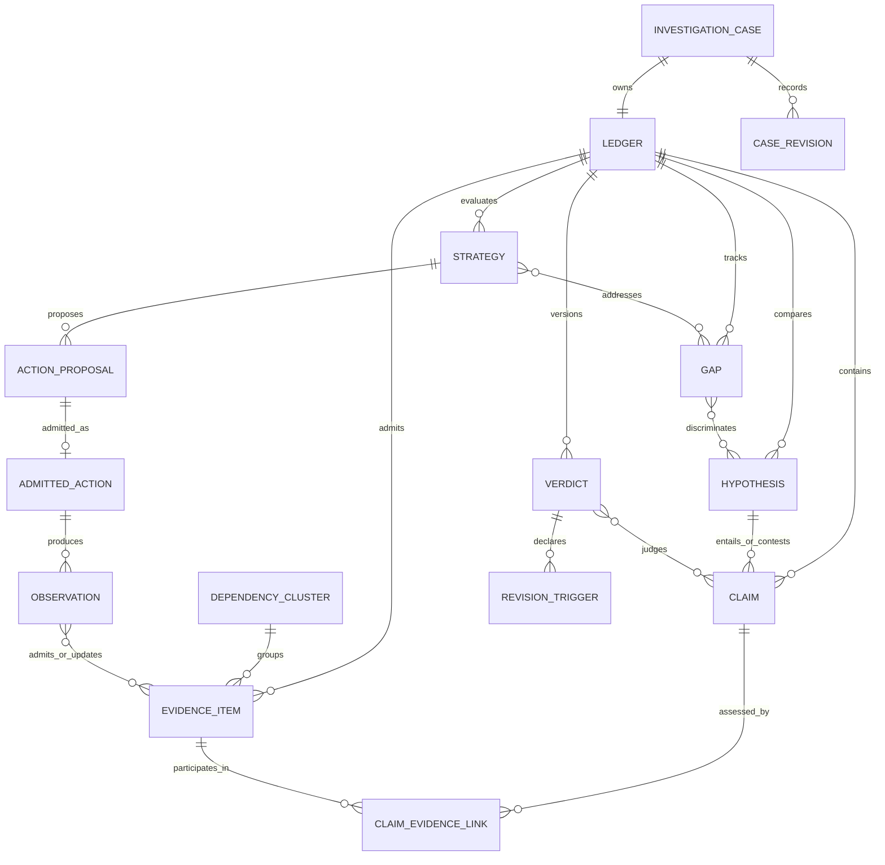
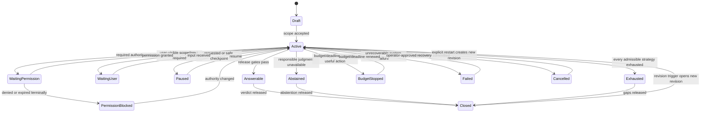
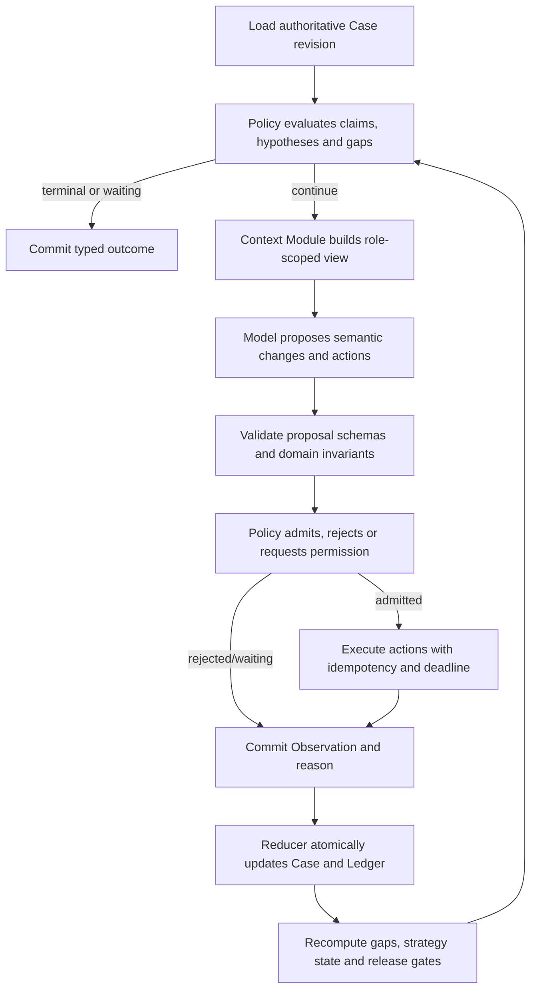

# CTI-RAG Investigator Target Design

> Status: **Draft for design review**
> Canonical scope: CTI-RAG 的目标产品语义与目标架构
> Last updated: 2026-07-13
> This is not: 当前代码说明、实施计划、迁移路线、PRD 或 coding-agent 设计

## 1. 文档权威与阅读规则

本文是 CTI-RAG 第一份 canonical target-design document。它规定系统最终应当表现成什么，以及各目标模块必须履行什么 contract；在用户确认前，仍以 Draft 状态接受修订。

发生冲突时，按下列规则解释：

1. 用户确认的产品行为和领域语义优先；本文记录其目标 contract。
2. `docs/CONTEXT.md` 是 canonical ubiquitous language；本文可展开关系和行为，但不另造同义词。
3. 已接受 ADR 记录难以逆转的架构决策。
4. 当前代码和测试只证明当前实现与已验证行为，不定义目标产品。
5. phase-control、snapshot、`HISTORICAL_*`、研究文档和旧设计是证据或历史方案，不自动成为目标真相。

本文使用以下标记，避免把不同层次混在一起：

- **[Target Domain]**：目标领域语义，与实现无关。
- **[Target Architecture]**：目标模块、interface、状态所有权与 policy。
- **[Current]**：已在当前生产代码中观察到。
- **[Verified]**：有代码路径或测试证据支持的当前行为。
- **[Historical]**：旧方案、phase 文档或只作参考的设计。
- **[Missing]**：目标需要、当前生产路径不存在。
- **[Open Decision]**：会实质改变用户可见产品行为，尚未决定。
- **[Assumption]**：为使设计闭合而采用、但可被新事实推翻的前提。

## 2. Executive summary

CTI-RAG 的目标是一个面向 Web 产品的、生产级、长期可扩展的 **CTI Investigator Agentic RAG**。它接收调查问题，把问题转化为持久的 `Investigation Case`，围绕原子 `Claim`、竞争 `Hypothesis` 和显式 `Gap` 多轮收集证据，最终发布可审计的 `Verdict`，或明确 abstain。

系统的核心不是通用 agent loop，而是三个 investigator-specific ownership：

1. `Investigation Case` 是一项调查的唯一权威持久状态；model transcript 只是可丢弃、可压缩的交互材料。
2. `Ledger` 是 Case 内的分析账本，保存 Claim、Evidence、claim-evidence links、Hypothesis、Gap、Strategy、Action、Observation、Verdict 与 revision history；corpus knowledge graph 与 Case Ledger 是两个不同真相层。
3. 模型提出语义判断与行动；deterministic harness policy 决定 action admission、权限、预算、继续、停止、abstention 和发布。工具只执行被准入的动作，不拥有调查政策。

Pi 和 OpenHarness 可提供 provider、tool、event、permission、streaming、persistence 等通用机制，但不能拥有 investigator 领域。现有 CTI-RAG 的 retrieval、RawStore、中间契约、证据去重、reducer/replay 和 citation-ID guard 提供有价值的行为与数据资产；当前 runtime harness、sufficiency contract、per-run Ledger 和一次性 supervisor 不是目标架构本身。

## 3. Problem, users and product surface

### 3.1 Problem

CTI attribution 与调查不是一次 retrieve-then-generate。证据可能不完整、互相依赖、过期、矛盾、受 handling markings 限制，且 adversary 会复用工具、转移基础设施或制造 false flag。系统必须解释“为什么能回答”“为什么仍不能回答”“还缺什么”“什么新事实会改变判断”。

### 3.2 Primary users

- CTI analyst：发起调查、追加上下文、查看证据与替代假设、审核 promotion。
- Incident responder / threat hunter：从 observable、campaign 或 malware 样本开始，要求 operational attribution 与行动相关背景。
- CTI lead / reviewer：审核证据基础、矛盾、判断语言和 release policy。
- Platform operator：管理 source、权限、预算、scheduled refresh、失败恢复和 evaluation。

### 3.3 Product surface

生产 surface 是一个 Case-oriented Web/API experience，而不是让调用者选择“single agent”或“supervisor”：

- 创建或打开 Investigation Case；
- 在 Case 内提出新问题、澄清 scope 或加入用户提供的 source；
- 实时查看调查状态、当前 gaps、行动请求、权限阻塞和已用预算；
- 查看每个结论的 evidence links、矛盾、替代假设和 confidence in basis；
- 暂停、取消、恢复、分支或请求重新评估；
- 对临时 evidence 发起 review/promotion；
- 订阅 revision triggers 和 managed source refresh 带来的 verdict 变化。

### 3.4 Goals

- autonomous task decomposition 与 gap-driven multi-round investigation；
- 内部 hybrid retrieval 和 graph query；
- 受控 external lookup、用户指定 source acquisition、scheduled refresh；
- immutable provenance、dependency-aware evidence、竞争假设和显式 abstention；
- multi-turn conversation 与 multi-round investigation 分离；
- durable persistence、compaction、resume、replay、cancel；
- permission、idempotency、retry、deadline、budget 和审计可验证；
- evaluation/calibration 能测量 false attribution risk 与 abstention trade-off。

### 3.5 Non-goals

- coding agent、patch/test loop 或以“模型不再调用工具”为成功条件；
- strategic/state responsibility、政治归责或法律证明的自动发布；
- 未经 calibration 的 attribution probability；
- unrestricted browsing 或调查结果自动写入 durable corpus；
- 以 source/document/evidence-type count 作为 sufficiency 公式；
- 让 vector store、transcript、trace 或 prompt 成为知识/调查真相源；
- 本文规定文件级重构、迁移阶段或实施顺序。

## 4. Ubiquitous language and domain model

本节是 `docs/CONTEXT.md` 的关系展开；简短 canonical definitions 维护在该 glossary。

### 4.1 Core concepts

**Investigation Case**
用户可持续交互、暂停、恢复和修订的一项调查。它拥有 scope、问题、参与者、政策版本、预算、状态、Ledger、conversation references、产出与 revision history。

**Ledger**
Case 内的权威分析账本。它保存结构化调查对象及它们的演化，不等于 corpus Fact store、model transcript、runtime trace 或 tool cache。

**Claim**
可由 evidence 支持或反驳的原子、带 entity/time/scope 的陈述。Attribution Claim 必须明确 subject、predicate、object、attribution level 与 valid time。

**Evidence Item**
可审计、内容不可变的 source span 或 artifact reference，带 provenance、time、integrity、markings、collection method、source reliability 和 dependency cluster。

**Claim-Evidence Link**
Evidence Item 在特定 scope/time 下对 Claim 的分析关系：`supports | contradicts | contextual | irrelevant | unresolved`。它保存 reasoning、assumptions、diagnosticity 与 reviewer/model identity。

**Dependency Cluster**
共享同一 upstream observation lineage 的 Evidence Items 集合。独立 corroboration 按 cluster 而非 document count 计算；未知依赖必须显式为 unknown，不能默认独立。

**Hypothesis**
对调查对象的一个可检验解释。Attribution Case 至少包含领先候选、合理 known alternatives、shared/commodity resource、transfer/compromise、false flag 和 unknown actor（按适用性）。

**Gap**
阻止回答、区分假设或提高 evidence basis 的一个明确缺口。Gap 必须可判定状态并能关联 candidate discriminator 与 Strategy；“需要更多信息”不是合格 Gap。

**Strategy**
填补某个或一组 Gaps 的有界调查方法，例如 internal semantic search、graph pivot、source-specific lookup、external primary-source search 或向用户请求权限。Strategy 不是一次 tool call。

**Action Proposal**
模型、用户、scheduler 或 deterministic policy 提出的下一动作意图，尚未获得执行权。

**Admitted Action**
通过 schema、semantic policy、permission、budget、deadline、idempotency 与 side-effect checks 的 Action Proposal。

**Observation**
一次 admitted action 的结构化结果，包括成功、空结果、拒绝、权限阻塞、retryable/permanent error、取消或 deadline 等状态及 Ledger delta。它不是 raw tool text。

**Verdict**
对一个或多个 Claims 的 versioned analytic judgment。它包含 judgment、confidence in basis、decisive clusters、material contradictions、alternatives、gaps、assumptions、revision triggers 与 release status。

**Revision Trigger**
未来出现时要求重新评估 Verdict 的可检测条件，例如 source revision、new conflicting telemetry、dependency collapse、entity merge/split、marking change 或 calibration/policy change。

### 4.2 Corpus knowledge and Case analysis are distinct

`Fact`/`supports` 属于 durable corpus knowledge：它表达 source-backed canonical triple 及其 provenance。`Claim`/`Claim-Evidence Link`/`Verdict` 属于 one Case 的 analytic state：它表达本次调查要判断什么、证据如何影响假设以及系统最终允许发布什么。

- 一个 corpus Fact 可被多个 Case Claims 使用。
- 一个 Evidence Item 可支持 corpus Fact，也可在 Case 中 contradict 某个 Claim。
- “source claims actor A”是可保存的 Fact/Evidence；“系统评估 actor A supported”只能是 Verdict。
- promotion 改变 durable corpus availability，不得反向篡改旧 Case 的 evidence snapshot；旧 Case 通过 Revision Trigger 产生新 revision。

### 4.3 Relationship model

### 4.4 Required identity and versioning

所有权威对象有 stable ID 与 revision/version。删除采用 tombstone/supersession，不能静默改写历史。Evidence content/hash、Action admission decision、Observation 原始 payload reference 和 published Verdict revision 一经提交不可原地修改；更正产生新 revision，并指向 superseded object。

## 5. Investigation Case as authoritative state

### 5.1 Case aggregate

Case 至少包含：

- `case_id`, tenant, participants, created/updated timestamps；
- original question、current investigative scope、attribution level；
- lifecycle state 与 terminal/paused reason；
- active policy/model/tool/source schema versions；
- global budget、allocated/consumed/reserved counters 与 deadline；
- Ledger current revision 与 append-only Case Events；
- conversation turns 与它们引用的 Case revision；
- branch/task tree 和 branch-local Ledger references；
- permissions/markings snapshot 与 pending approval；
- current Verdicts、release records、Revision Triggers；
- cancellation token、lease/owner、last checkpoint 和 resume cursor。

### 5.2 Ledger partitions

Ledger 对调用者呈现一个深 interface，但内部至少区分：

- analytic state：Claims、Hypotheses、Gaps、Strategies、Verdicts；
- evidence state：Evidence Items、provenance graph、dependency clusters、links；
- execution state：Action Proposals、admissions、Observations、attempts；
- policy state：permissions、budgets、deadlines、strategy exhaustion、release gates；
- revision state：events、snapshots、supersession、triggers。

Tool cache 是执行优化，不属于 Ledger 领域真相。Trace 是 Ledger/Case Events 的观测投影，也不是 Ledger 本身。

### 5.3 Event and snapshot contract

每次权威改变先提交 typed Case Event，再更新 materialized Case view。一个 event 包含 event ID、case/revision、causation/correlation、actor、policy/model/tool versions、occurred/recorded time、validated payload、markings 与 content hash。

Snapshot 是 replay 加速，不可成为独立真相。给定相同起始 snapshot、ordered events 和 deterministic reducer，必须重建等价 Case state。External action 不因 replay 重执行；replay 使用已记录 Observation。

### 5.4 Transcript and context

- Transcript 保存 user/model communication，用于 UX 与审计；它不拥有 evidence 或 continuation state。
- Working context 每轮从 Case/Ledger projection 新建，只选择当前 claims、hypotheses、gaps、recent observations、budget 与 permitted evidence。
- Compaction 只压缩 model-facing context/transcript；不能丢弃或改写 Ledger、events、evidence spans、admission reasons、Verdicts 或 Revision Triggers。
- 一个 summary 必须带 source object IDs 与 covered event range；summary 可重新生成，不能被引用为 evidence。

## 6. Lifecycle and state machine

### 6.1 Case states

`Answerable` 等状态是 policy outcome，不表示世界真相。`Closed` 表示当前 revision 已发布/封存；revision trigger 可打开新 revision，但历史结果不变。

### 6.2 Continue semantics

Policy 只在存在至少一个 admissible、non-exhausted、期望能减少 material Gap 的 Strategy，且 budget/deadline/permission 允许时继续。模型提出“stop”不会单独停止；模型没有 tool call 也不会单独停止。

### 6.3 Stop and outcome semantics

| Outcome | Exact meaning | Required user-visible disclosure |
|---|---|---|
| `answerable` | requested claims pass release gates and a publishable Verdict exists | judgment、basis confidence、evidence、contradictions、gaps、alternatives |
| `abstained` | policy主动拒绝归因/判断，因为可靠 basis 不足或风险过高 | abstention reason、known facts、gaps、what could revise |
| `exhausted` | every allowed Strategy for material Gaps is succeeded-without-resolution、inapplicable 或 permanently failed | exhausted strategies、remaining gaps |
| `budget_stopped` | useful Strategy exists但 token/cost/tool/time budget or deadline prevents it | consumed/limit、remaining candidate strategies |
| `permission_blocked` | useful Strategy exists但 required authority denied/expired/unavailable | requested permission class，不泄漏 forbidden content |
| `failed` | system invariant、storage、provider or tool failure makes current result unsafe to release | failure class、checkpoint/recovery status |
| `cancelled` | user/operator cancellation has been durably observed and no new actions may start | last committed checkpoint、in-flight disposition |
| `paused` | resumable safe checkpoint，不是 terminal analytic result | resume token/state、pending work |

### 6.4 Strategy exhaustion

一次空 retrieval 不是 exhaustion。Strategy 在下列之一成立时才 exhausted：

- 达到该 Strategy 明确 attempt/reformulation/source/pivot cap；
- tool/source 明确返回 complete negative result 且 scope 可验证；
- prerequisite 永久不满足；
- policy 判定继续的 expected information gain 低于门槛；
- repeated equivalent actions 被 idempotency/dependency checks 证明不会产生新信息。

Gap 只有在所有关联 admissible Strategies exhausted/inapplicable/permanently blocked 后才是 exhausted gap。

### 6.5 Recovery

Resume 从 durable Case revision 和 leases 开始：核对 in-flight actions，读取已提交 Observations，重新 claim 超时 lease；只对没有 terminal Observation 且 retry policy 允许的 action 重试。任何 external side effect 必须以 idempotency key 查询结果，不能盲目重发。

## 7. Authority model

| Actor | May propose | May decide/commit | Must never own |
|---|---|---|---|
| Model | claims、links、hypotheses、gaps、strategies、actions、narrative、candidate verdict | 仅生成 proposal；无直接 commit 权 | permission、budget、dependency independence、tool execution、release/stop |
| Harness | context construction、execution scheduling | lifecycle transition、checkpoint、event ordering、action dispatch、cancel/resume | CTI semantic judgment本身 |
| Deterministic policy | admission/rejection、gates、budget allocation、retry、strategy exhaustion、abstention/release eligibility | policy decisions及reason codes | 编造 evidence 或替代 analyst judgment |
| Tool/adapter | typed capability result、retry hints、cost estimate | 只提交 Observation；source-side effect obeys token | Case policy、Verdict、promotion decision |
| User/reviewer | scope、source request、permission、override、approval、cancel | explicit product choices、human review、release/promotion where required | 改写 immutable history；绕过 provenance/integrity invariants |
| Scheduler | managed-source refresh proposal | 在预授权 schedule/policy 内启动 job | 发起开放式 attribution Case 或扩大 source scope |

Human override 必须生成事件，记录前后值、理由、权限与影响；它不能删除矛盾或伪造 provenance。

## 8. Deep target modules and interfaces

目标设计按深 module 划分：外部 interface 小，复杂 policy/implementation 保持 locality。一个 seam 只有存在 production adapter 与 test/replay adapter 等真实变化时才成立。

### 8.1 Case Module — owner: Case state

外部 interface：

- `open_case(command) -> CaseView`
- `advance_case(case_id, trigger) -> TransitionResult`
- `append_user_turn(case_id, turn) -> CaseRevision`
- `pause/cancel/resume(case_id, command) -> TransitionResult`
- `read_case(case_id, view_policy) -> CaseView`

它隐藏 event append、optimistic concurrency、lease、snapshot、replay、revision 与 access filtering。调用者不能直接 mutate Ledger collections。

### 8.2 Investigation Policy Module — owner: what may happen next

外部 interface：

- `evaluate(case_view) -> PolicyDecision`
- `admit(action_proposal, case_view) -> AdmissionDecision`
- `evaluate_release(verdict_proposal, case_view) -> ReleaseDecision`

`PolicyDecision` 是 typed union：continue with admitted actions、wait、pause、answerable、abstain、exhausted、budget stop、permission blocked、fail、cancel。它隐藏 stop table、strategy accounting、risk rules 和 calibration thresholds；不执行工具。

### 8.3 Ledger Module — owner: analytic and evidence state

外部 interface：

- `apply(validated_domain_event) -> LedgerDelta`
- `project(view_request, access_context) -> LedgerView`
- `validate(candidate_change) -> ValidationResult`

它隐藏 dedup、dependency clustering、claim-link consistency、hypothesis matrices、supersession 和 conflict preservation。`LedgerDelta` 必须 atomic、idempotent、replayable。

### 8.4 Context Module — owner: model input projection

`build_context(case_view, role, token_budget, access_context) -> ModelContext`。它隐藏 selection、redaction、compaction、recency 与 citation handles；输出不是状态源。

### 8.5 Model Runtime Module — owner: provider-neutral model turns

`run_turn(role, model_context, tool_descriptors, deadline) -> ModelProposalBatch`。Borrow provider abstraction、streaming、typed events；provider-specific tool/message shape 终止在此 seam。

### 8.6 Action Execution Module — owner: safe action attempt

`execute(admitted_action, cancellation_token) -> Observation`。它隐藏 tool registry、schema binding、deadline、idempotency、retry、rate/concurrency limits、result size、raw artifact capture。它不更新 Case；Case reducer应用 Observation。

### 8.7 Evidence Access Module — owner: evidence acquisition interface

统一 capability shape，但保留不同生命周期的 adapters：

- internal retrieval；
- knowledge graph query；
- gap-driven external lookup；
- source acquisition job；
- managed source refresh job。

这些不能被压成一个 generic `search()`，因为 authority、write semantics、completion、cost 与 audit contract 不同。

### 8.8 Verdict Module — owner: analytic assessment proposal and rendering

语义 assessment 与 release admission 分离：模型/analyst生成 `VerdictProposal`；Policy Module 评估；renderer 只对 admitted Verdict 生成 user-facing answer。Citation/claim-link validator 在 release 前检查最终文本，而非在空 draft 上估算 faithfulness。

### 8.9 Source Governance Module — owner: durable source lifecycle

管理 source registry、collection contract、scheduler authorization、raw preservation、normalization validation、promotion review 与 projection publication。Investigation Case 只能引用或提议，不可直接写 durable corpus。

## 9. Investigator loop contract

每次循环都以权威 Case revision 开始并以 durable event/transition 结束。Model message、ToolMessage 或 raw tool output 不驱动后续状态，除非被解析、验证并提交为 typed object。

## 10. Deterministic continuation, abstention and release

### 10.1 Gate ordering

Policy 按固定优先级处理：

1. cancellation 与 integrity/invariant failure；
2. deadline/hard safety/permission；
3. apply completed Observations；
4. validate claims/evidence/provenance/dependency/conflicts；
5. recompute Gap/Strategy viability；
6. evaluate Verdict release；
7. continue/wait/exhaust/budget-stop/abstain。

### 10.2 Attribution release gates

一个 attribution Verdict 至少要求：

- Claim atomic、entity resolved to declared grain、time/scope/level complete；
- 每个 decisive link 指向 immutable evidence span/artifact；
- provenance/integrity/markings 可解析且允许本用户使用/发布；
- direct source claim 与 system judgment 分离；
- dependency clusters 已构造或 unknown 已披露；
- material contradictions 保留并解释；
- reasonable alternatives 与 unknown 被评估；
- judgment 与 confidence in basis 使用受控 vocabulary；
- final narrative key claims 可追到 admitted claim-evidence links；
- policy/model/data version、assumptions、gaps、Revision Triggers 完整。

Gates 只决定系统是否有资格发布某种 analytic judgment，不宣称绝对真相。

### 10.3 Verdict vocabulary

- `supported`
- `leaning_supported`
- `unresolved`
- `leaning_refuted`
- `refuted`

独立的 evidence-basis confidence：`high | moderate | low`。没有 adjudicated calibration dataset 前，不映射成固定百分比。`unresolved` 可作为 claim judgment；`abstained` 是 Case/publishing decision，两者不能混为一列。

### 10.4 No-progress

No-progress 仅是 observation/strategy signal，不是直接 terminal reason。Policy 比较 semantic delta：新 evidence、新 dependency information、新 contradiction、新 link、新 hypothesis discrimination、关闭/细化 Gap、获得权限或排除 Strategy 都可算 progress。连续无 semantic delta 只使当前 Strategy exhausted；只有所有 material Gap 的 admissible Strategies exhausted 才产生 Case `exhausted`。

## 11. Tool and execution model

### 11.1 Tool descriptor

每个 tool descriptor 声明：name/version、input/output schema、capability class、side-effect class、required permissions、marking behavior、idempotency semantics、retry classes、deadline behavior、cost estimate、concurrency group、result integrity/provenance contract。

### 11.2 Admission checks

- schema 与 unknown args；
- semantic preconditions and source scope；
- Case/branch state compatibility；
- user/tenant/source permissions and handling markings；
- budget reservation and deadline feasibility；
- duplicate/equivalent/in-flight action；
- external side-effect policy；
- concurrency/rate limits；
- expected Gap and Strategy linkage。

没有 `gap_id`/`strategy_id` 的 investigator action 必须说明它是 setup、policy、user-requested 还是 maintenance action，不能成为无目的 browsing。

### 11.3 Idempotency and attempts

Action 有 stable logical action ID；每次执行有 attempt ID。Read-only actions 以 canonical args + source snapshot + tool version dedup。External writes/jobs 使用 durable idempotency key，并先查询先前 result。Retry 产生新 attempt，不产生新 logical action；Observation 保留每次 attempt 与最终归类。

### 11.4 Retry

仅 retryable error 可重试；auth denial、invalid args、policy rejection、not found under complete source semantics 和 integrity failure 不自动重试。Backoff、jitter、provider SDK retry 与 harness retry 由一个 inspectable policy 合并，避免指数叠乘。Retry 不能越过 global deadline、budget 或 cancellation。

### 11.5 Deadline, budget and concurrency

Global Case budget向 branch/action reservation 分配，包含 model tokens、tool calls、external cost、wall time、source quota 和并发。Fan-out 不得通过每 branch 独立上限放大总额度。Deadline 传播到 provider/tool；到期后不启动新 attempt，in-flight action按 tool cancellation contract结束并产生 Observation。

## 12. Evidence acquisition paths

### 12.1 Internal retrieval

`Pipeline.run()` 所代表的 hybrid retrieve→rerank→truncate behavior 是有价值的 deep module。目标 interface 接受 explicit search intent、filters、snapshot/time 与 top-k/cost envelope，返回 immutable evidence candidates 和 retrieval trace。Query rewrite 是 retrieval-local search expansion；Investigation decomposition 属于 Case/Policy，不得混入 retrieval interface。

Vector payload 是 projection，不是 system of record。返回结果进入 Case 前须解析 raw/provenance reference、content hash、markings 与 corpus version。

### 12.2 Graph query

Graph adapter 提供 canonical entity/fact/ontology traversal、coverage outline、provenance reverse lookup 和 conflict-aware result。Graph completeness 仅限于 declared graph snapshot/schema/query scope；technique category enumeration 不能单独等于 attribution sufficiency。

### 12.3 Gap-driven external lookup

仅由 typed Gap + admitted Strategy 触发。默认 read-only、source allowlisted、scope/cost bounded。结果先成为 Case-local `Temporary Evidence`：保存 raw capture/hash、URL、publisher、collection time、markings、derivation 与 parser version。它可以影响当前 Verdict，但不自动进入 managed corpus。

若 robots/terms/auth/markings 不允许采集或发布，产生 permission/policy Observation；不得把 snippet 或模型记忆当替代 evidence。

### 12.4 User-directed source acquisition

用户指定一个新 source 时，系统创建独立、持久、可恢复的 `Source Acquisition Job`，而不是在 agent turn 内完成隐式写入。Job 明确 source identity、requested scope、authorization、fetch completeness、raw preservation、normalization contract、validation、dedup、review 和 publication outcome。Case 可等待 Job、临时引用其 validated artifacts，或在不依赖它的情况下继续。

### 12.5 Scheduled source refresh

Scheduler 只对 Source Registry 中已管理、已授权的 source 发出 refresh job。Refresh 继承既有 collection/normalization/provenance contract，使用 incremental cursor 与 idempotency，记录每个 in-scope item terminal status。它不是 Agent 决定，也不自动打开 attribution Case；发生 Revision Trigger 时，相关 Cases 才被标记待重评。

### 12.6 Temporary evidence review and promotion

Promotion 是状态转换，不是 cache：

`temporary -> review_pending -> accepted | rejected | needs_more_work -> published projection`

Review 至少验证 source/terms、raw integrity、provenance、duplicate/dependency、schema、entity resolution、markings、quality 和 downstream impact。Promotion 发布新 durable corpus revision；Case Ledger 保留原 temporary evidence identity 及其后来 promoted reference，历史 Verdict 不被原地改写。

## 13. Multi-round investigation and multi-turn conversation

`Investigation Round` 是系统内部从 policy evaluation 到一组 Observations/reduction 的循环；`Conversation Turn` 是用户与产品的一次消息交换。两者是多对多：一个 user turn 可触发多 rounds；多个 user turns 可继续同一 Case；系统也可在没有 user turn 时因 job completion/revision trigger 继续。

用户 follow-up 分三类：

- presentation request：同一 Case revision 的新视图，不重新调查；
- scope refinement：创建新 Case revision，保留旧 scope/answer；
- new investigation question：同 Case 下新 Claim set，或在隔离需要时创建 linked Case。

Conversation history 只帮助 resolve intent；任何前轮事实必须从 Ledger 引用，不能因曾在聊天中出现就成为 evidence。

## 14. Task decomposition, branch isolation and composition

### 14.1 When to branch

仅当子任务可独立收集 evidence、不会依赖另一分支未产生的答案、并且并行价值超过协调成本时 branch。顺序 multi-hop、共享探索 ledger、单一 entity resolution chain 或高度耦合 hypothesis comparison 保持单 investigation task。

### 14.2 Branch contract

Branch 继承只读 Case snapshot、policy/permission、global deadline 与预算 reservation；拥有 branch-local proposals、Observations、Ledger overlay、Gaps 和 Strategy state。分支不能直接发布 Verdict或写 master Ledger。

### 14.3 Composition

Composition 是 deterministic merge + analytic reconciliation，不是拼接 summaries：

1. 按 stable IDs/content hash 合并 Evidence；
2. 重建 cross-branch dependency clusters；
3. 检测 entity/time/scope conflicts；
4. 合并 Claims/Gaps，保留矛盾和 provenance；
5. 对合并后的 master Ledger 重新执行 release policy；
6. Composer 只渲染 admitted state。

Branch report 是协调 projection，不是 evidence authority。若 composition 产生新 Gap，Policy 可创建 repair branch；是否再 branch 仍需 admission。多-agent 不是产品模式，而是一个被 policy 选择的 execution topology。

## 15. Persistence, resume, replay and cancellation

- 每个 Case mutation 使用 optimistic revision check，避免并发覆盖。
- Action admission 与 dispatch 前后均 checkpoint；external side effect 先 durable intent、后执行、再 durable Observation。
- Worker lease 有 owner/expiry；resume 可接管 expired lease。
- Replay 永远不访问网络、不调用模型、不重放 side effects。
- Model/provider nondeterminism 通过保存 proposal/Observation/model version 被审计；re-simulation 是新 revision，不冒充原 replay。
- Cancel 先 durable set cancellation，然后阻止新 admission，传播 token，等待/归类 in-flight attempts，最后提交 `cancelled`。
- Crash 后 Case 可处于 recoverable `active_with_unknown_attempts` 内部子状态；对外显示 recovering，直到 reconcile 完成。

## 16. Events, observability and audit

### 16.1 Event families

- Case lifecycle and revision；
- user command/permission/review；
- model proposal；
- policy admission/rejection/release；
- action attempt and Observation；
- Ledger delta and invariant validation；
- branch spawn/join/repair；
- source job/refresh/promotion；
- Verdict publication/revision trigger；
- security, redaction and access denial。

### 16.2 Required telemetry

按 Case/round/branch/action/provider/source 关联：latency、tokens/cost、budget reservation/consumption、tool attempts、retry、permission waits、evidence/claim/link/hypothesis/gap deltas、dependency cluster counts、contradictions、citation/link drops、strategy exhaustion、outcome、abstention reason 和 resume/replay consistency。

Trace payload 默认不复制 full sensitive evidence 或 prompts；只存 references、hashes、typed summaries 和 access-controlled debug artifacts。审计日志与产品 Ledger 有不同 retention/access policy，但共享 correlation IDs。

## 17. Evaluation, calibration and selective behavior

### 17.1 Evaluation layers

分别测量：query/scope understanding、retrieval、graph result、external acquisition、claim extraction、evidence-span integrity、claim-evidence relation、dependency clustering、hypothesis coverage、Gap quality、strategy efficiency、tool trajectory、Verdict、basis confidence、final grounding、citation adjacency、conversation continuity、resume/replay 和 permission safety。

### 17.2 Attribution evaluation

数据切分必须 time-based，并避免同 dependency cluster 跨 train/eval；还要有 actor/campaign/source-family holdout。Stress sets 覆盖 source outage、missing provenance、contradiction、false flag、commodity tooling、shared/compromised infrastructure、actor-name overlap 和 permission redaction。

报告：每 judgment 的 precision/recall/confusion、high-severity false attribution、accepted verdict error、coverage/abstention、risk-coverage curve、revision responsiveness、subgroup drift 和 analyst agreement。不能以“answer 看起来合理”或 citation ID存在代替。

### 17.3 Calibration

在有足够 adjudicated historical Cases 之前只输出 ordinal judgment/basis confidence。之后 calibration 使用 held-out、time/source/dependency-aware sets；任何 probability、threshold 或 confidence mapping 都带 calibration version、population 和 validity window。Distribution drift 触发降级或更高 abstention。

## 18. Security, permissions and external side effects

- Access decision同时考虑 user/tenant role、source license、handling marking、purpose、Case scope 与 intended release audience。
- Evidence 在 context construction、tool execution、branch merge、Verdict rendering 四处执行 non-bypassable filtering。
- Model 不接收其无权查看的内容；redacted evidence 不通过 summary 泄漏。
- 外部 URL/source content 是不可信输入，隔离 prompt injection、active content、malware 和 oversized payload。
- Secrets 只由 adapter runtime 使用，不进入 proposal、prompt、Ledger 或 trace。
- External collection/write/promotion/notification 是 side effects，要求 explicit permission class、idempotency、audit 和 recovery。
- User-supplied source 不因用户提供就自动可信；仍执行 provenance/integrity/marking checks。

## 19. Failure and degraded modes

| Failure | Required behavior |
|---|---|
| Model/provider unavailable | retry/fallback only under central policy；可用结构化 state 继续 deterministic work；否则 pause/budget-stop/fail |
| Retrieval unavailable | graph/existing Ledger 可继续；披露 coverage gap，不把 outage 当 negative evidence |
| Graph unavailable | retrieval/external 可继续；不宣称 graph completeness |
| External source unavailable | classify retryable/permanent/permission；更新 Strategy，不删除 Gap |
| Judge/verdict parse failure | proposal invalid；不能自动视为 sufficient；policy选择retry/alternate/human/abstain |
| Persistence/event commit failure | 不承认 action/result已提交；停止新 side effect，进入 recovery/fail |
| Provenance/integrity failure | quarantine evidence；阻止其进入 decisive links/promotion |
| Partial branch failure | 合并成功分支但重新评估 gaps；不能把 failed branch 当“不存在证据” |
| Composer failure | Ledger/Verdict仍完整；可重试 rendering，不能重新执行 investigation |
| Permission revoked | future contexts/actions立即过滤；已发布内容按 governance触发 review/revision |

## 20. Borrow / Adapt / Own

### 20.1 Pi

| Class | Use |
|---|---|
| Borrow | provider/tool separation、small typed loop、typed lifecycle events、composable runtime seams |
| Adapt | steering/follow-up queues -> Case commands；context transformation -> Ledger-derived context；stateful harness hooks -> Case events/policy hooks |
| Own | CTI Case/Ledger、evidence contract、hypotheses/gaps/strategies、Verdict/revision/promotion |

直接采用 Pi 会引入 Node control plane 与 Python RPC/tool complexity，且没有 CTI semantics；因此它是 mechanism reference，不是 target control plane。

### 20.2 OpenHarness

| Class | Use |
|---|---|
| Borrow | Pydantic tool schemas、streaming protocol、provider adapters、parallel execution、MCP、generic hooks/permission primitives |
| Adapt | session persistence -> Case event/snapshot semantics；compaction -> non-authoritative context projection；permission -> CTI markings/source/side-effect policy；loop lifecycle -> policy outcomes |
| Own | deterministic CTI continuation/release、strategy exhaustion、dependency-aware Ledger、promotion governance |

OpenHarness 当前主要以 model 不再 tool-call 或 max turns 停止，且 runtime assembly 偏通用/coding 产品；不能 wholesale adopt。

### 20.3 Existing CTI-RAG

| Class | Use |
|---|---|
| Borrow | hybrid retrieval/rerank、RawStore append-only/versioning、intermediate validation、structured observation/reducer/replay、ID dedup、citation intersection、provider limiter primitives |
| Adapt | runtime action/observation/events -> durable Case contracts；EvidenceLedger -> Case Ledger；supervisor branches -> policy-driven task tree；Fact/supports -> Case evidence references |
| Own | investigator product semantics、claim-evidence-hypothesis reasoning、external temporary evidence、source governance、Verdict/revision/calibration |

## 21. Current-to-target mapping

判断基于 module depth、state ownership、interface、verified behavior 与数据资产，而非保守或重写偏好。

| Current asset | Classification | Target treatment and reason |
|---|---|---|
| Retrieval `Pipeline.run()` + dense/sparse/RRF/rerank | **保留 implementation** | interface较小、行为深、测试资产丰富；把 runtime decomposition/query policy移出 retrieval-local rewrite |
| Qdrant payload filtering/ontology expansion | **保留 implementation** | 作为 retrieval projection/query capability；不得成为 truth/sufficiency owner |
| RawStore append-only/versioned/conflict fail-loud | **保留 implementation** | 深且可验证的数据资产；纳入 Source Governance adapter |
| Intermediate contract IDs、controlled vocab、validation/projections | **保留 implementation** | 可重建、可验证的 source-level contract；与 Case analytic model分层 |
| Connector-specific collection/checkpoint patterns | **保留 behaviour** | raw preservation、terminal status、resume/idempotency；统一治理 contract 后实现可变化 |
| Fact/FactCitation/graph query conflict surface | **保留 behaviour** | corpus knowledge 与 provenance bridge有价值；不承担 Case Verdict |
| RuntimeActionProposal / RuntimeObservation / reducer atomic delta/replay | **保留 behaviour** | 已验证的 proposal→observation→reducer方向正确；扩展为 durable Case events，现有 dataclass不要求兼容 |
| RuntimeEvent | **仅作 reference** | 当前明确不是完整 trajectory store；event envelope思想可借 |
| Current `EvidenceLedger` | **应替换** | 核心 insight保留，但 per-run mutable accumulator混合 evidence/action/cache，缺 claims/links/dependency/hypothesis/gap/persistence/revision |
| Citation-ID intersection | **保留 behaviour** | 最低 hallucinated-ID guard；增加 claim adjacency/entailment/provenance/marking gates |
| `SufficiencyVerdict` (`sufficient` + `next_action`) | **应替换** | 双真相、空 draft faithfulness、无 attribution contract |
| Stop table and technique graph heuristic | **应替换** | no-progress/graph coverage不等同 strategy exhaustion/release eligibility |
| `runtime_harness.py` monolith | **仅作 reference** | 当前生产路径与 characterization tests重要，但 contracts/loop/tools/policy/query understanding混合，module浅、state owner不完整 |
| Public `answer() -> GeneratedAnswer` | **应替换** | 丢失 investigator outcome/state；目标 surface以 Case/Verdict为核心 |
| `agentic_answer()` rich output | **保留 behaviour** | stop/conflicts/iterations telemetry值得保留；字段语义升级为 Case outcome |
| Validated-plan supervisor branch-local ledgers | **保留 behaviour** | isolation、parallel gathering、deterministic merge方向正确 |
| Current supervisor one-shot gather/compose | **应替换** | 不具备 dynamic gap repair、strategy exhaustion、checkpoint/cancel与post-merge policy |
| Legacy autonomous ReAct supervisor/agentic graph | **仅作 reference** | debug/baseline trajectory，不是 target production owner |
| CLI string-only `history` chat | **仅作 reference** | 可验证的 pronoun/query context UX；不是 session persistence |
| CLI `ingest`/`refresh` | **当前缺失** | command明确 not available；目标为 Source Governance jobs |
| Gap-driven external lookup/temp evidence/promotion | **当前缺失** | 必须新增领域与治理能力 |
| Case persistence/compaction/resume/replay/cancel | **当前缺失** | tool observation slice replay不等于完整 Case persistence |
| Attribution contract evaluation/calibration | **当前缺失** | 现有 retrieval/RAGAS/technique eval不能承担 false-attribution risk |

## 22. Verified current behavior vs historical intent

### 22.1 Verified now

- `answer()`执行 runtime query understanding、conservative supervisor admission、single-agent或validated-plan supervisor，然后降格为 `GeneratedAnswer`。
- 每次 `_run_agentic_investigation_result()` 新建 `EvidenceLedger()`；没有 Case session persistence。
- production gather 把 structured Observations经 reducer应用到 Ledger；相关测试覆盖 replay、duplicate idempotency 和 parallel delta isolation。
- stop `_sufficient`读取 `verdict.next_action == "stop"`；`sufficient`字段可冲突。
- sufficiency judge在 synthesis 前以 `last_draft=""` 调用。
- `no_progress`可在一轮无 evidence/setup progress 后触发。
- graph technique-coverage heuristic可绕过 judge直接标 `sufficient`。
- supervisor validated plan只并行执行每个 branch一次，然后 merge/compose；失败成为 branch report，但没有动态 repair loop。
- citation guard只把文本中的 IDs 与 Ledger真实 IDs求交集。
- RawStore实现 append-only versioning、same-key idempotency、conflict fail-loud；中间契约和 validation存在。
- CLI `refresh`/`ingest`不可用；chat history只append user strings。

### 22.2 Historical/intent only

- runtime phase-control 和 ADR 中的 supervisor retry/repair/additional branches；
- historical LangGraph/guardrail documents 中的完整 agentic trajectory；
- source design 对所有 sources统一 raw/refresh workflow 的描述；
- knowledge design 中未在 production path 实现的全部 Fact/supports/ontology target semantics。

## 23. Invariants

1. 每个 Case revision有且只有一个 authoritative state；transcript、prompt、trace、cache、vector projection都不是它。
2. 每个 authoritative state responsibility只有一个 owner module。
3. 模型只提出；deterministic policy授予执行和发布权。
4. Tool只能返回 Observation；不能直接决定 Case stop/Verdict/promotion。
5. Evidence content/provenance不可原地改写；更正和 refresh创建新 version/revision。
6. Corpus Fact、source claim、Case Claim、system Verdict始终分层。
7. 每个 key answer claim必须有 admitted claim-evidence links；citation ID存在不是 entailment证明。
8. Contradiction、unknown 与 viable alternatives不得被静默过滤。
9. Corroboration按 dependency cluster，不按 document/source/type count。
10. `direct`描述来源陈述方式，不描述真值或独立性。
11. 无 calibration数据不输出伪概率。
12. 一次 empty/no-progress不等于 strategy或Case exhausted。
13. 没有 tool call、max turns、model stop suggestion都不能单独构成 investigator成功。
14. Branch不能直接写 master Ledger或发布 Verdict；merge后重新执行 policy。
15. Replay不调用外部系统；resume不盲目重放 side effect。
16. Compaction不能改变可审计 evidence、state、admission或Verdict。
17. Scheduled refresh、user acquisition、gap-driven lookup的authority/write semantics保持不同。
18. Temporary evidence不自动进入 durable corpus；promotion必须治理。
19. Cancellation durable 后不启动新 action；deadline/budget/permission outcome明确可见。
20. Access/marking checks在context、execution、merge和release处都不可绕过。

## 24. What counts as usable

系统只有同时满足以下 acceptance criteria，才可称为“已经能拿来用”的 investigator，而不是 demo：

### 24.1 Case continuity

- Case可创建、durably checkpoint、暂停、恢复、取消和replay；进程重启后不丢 Ledger/strategy/outcome。
- 多个conversation turns能引用同一 Case state；compaction后结论和证据不变。
- 并发更新有revision conflict而非silent overwrite。

### 24.2 Evidence and attribution

- 每个关键 Claim有entity/time/scope和immutable Evidence span/artifact。
- source claim与system judgment分层；支持、反证、context、unresolved均可表示。
- dependency cluster可折叠转载/共同上游；unknown dependence被披露。
- 至少评估一个合理 alternative 与 unknown；material contradiction可阻止 `supported`。
- Verdict输出 judgment、basis confidence、gaps、assumptions、alternatives、revision triggers。
- 系统能 deterministic abstain，并在新反证进入后生成新 Verdict revision。

### 24.3 Control and execution

- 所有 actions经过schema/semantic/permission/budget/deadline/idempotency admission。
- read、external lookup、acquisition、refresh、promotion的side-effect contracts可审计。
- retry不越过deadline/cancel/permission，且不重复external writes。
- branch fan-out受global budget/concurrency约束；partial failure不被解释为negative evidence。
- 所有 terminal/waiting outcomes有stable reason codes和用户可理解语义。

### 24.4 Source lifecycle

- Internal retrieval和graph query返回可解析provenance与snapshot identity。
- Gap-driven lookup产生temporary evidence；用户指定source产生resumable acquisition job；managed source按schedule refresh。
- Promotion需要review并产生新corpus revision；refresh可触发Case reassessment而不改写历史。

### 24.5 Evaluation and operations

- Case/round/branch/action/source/provider全链路可关联，且敏感数据遵守redaction。
- replay consistency、permission denial、outage、retry、cancel和recovery都有自动化验证。
- attribution eval使用time/source/dependency-aware split，报告false-attribution risk与risk-coverage/abstention。
- 生产release threshold有版本、适用population和drift handling；无校准时明确使用ordinal contract。

任何仅能“返回带citation的回答”，但不能满足 Case persistence、claim-evidence audit、deterministic outcome 和 abstention 的版本，都不算 usable investigator。

## 25. Rejected alternatives

### 25.1 Adopt Pi or OpenHarness wholesale

Rejected：通用机制有价值，但它们的 termination/state/product semantics不属于CTI investigation；wholesale adoption会把核心 ownership交给错误层。

### 25.2 Keep current runtime harness as the target because tests pass

Rejected：characterization tests证明行为资产，不证明 interface depth、持久state ownership或产品语义完整。69KB monolith同时承担太多职责。

### 25.3 Rewrite everything because current modules are mixed

Rejected：retrieval、RawStore、中间contract/validation、reducer/replay和citation guard有明确 leverage与数据价值。目标允许替换call path，不要求丢弃成熟implementation。

### 25.4 Stop when the model emits no tool call

Rejected：这是provider/loop signal，不是 investigator outcome。可能代表模型失败、等待、无权限、策略耗尽或真正可回答，必须由policy区分。

### 25.5 Evidence/source/type threshold as attribution formula

Rejected：无法处理shared lineage、diagnosticity、contradiction、unknown和time relevance，会制造虚假confidence。

### 25.6 One generic external-search/ingest tool

Rejected：gap lookup、user acquisition、scheduled refresh和promotion具有不同authority、completion与write semantics。

### 25.7 Transcript or vector store as system of record

Rejected：两者均可压缩/重建/丢失上下文，无法提供稳定revision、permission和audit invariants。

### 25.8 Always use multi-agent decomposition

Rejected：sequential/shared-ledger tasks会产生错误隔离，且fan-out放大cost和source dependence。Topology是policy decision，不是产品模式。

## 26. Risks

- Dependency clustering可能因公开source缺少provenance而大量unknown；policy必须宁可降级basis confidence/abstain。
- Entity identity grain错误会把overlap误作same-as；actor cluster merge/split是高风险Revision Trigger。
- External content带prompt injection、恶意artifact与license风险。
- Case event volume和evidence retention成本高；只能优化projection/snapshot，不能牺牲audit truth。
- Human reviewers也会有不一致；override与adjudication需要版本化和agreement measurement。
- Calibration会随actor/source/time drift失效；threshold必须可撤回并触发降级。
- Multi-branch合并可能在post-merge发现dependency/conflict，导致parallel收益下降；这是正确性成本而非应绕过的检查。
- Source refresh可造成大量Case revision triggers；需要policy prioritization，但不能丢失trigger。

## 27. Assumptions

- 默认产品只发布 technical/operational analytic attribution；strategic attribution需要额外human/governance gate。
- 默认 external lookup evidence为temporary，默认promotion需要human review。
- 默认用户可接受Case处于waiting/paused/abstained，而不是强制即时answer。
- 默认可用ordinal judgment，不要求未校准probability。
- 默认durable corpus与Case store可以分别实现，但通过stable IDs/version references连接。

## 28. Open decisions

这些选择会改变用户可见产品行为，因此不在本文伪装成已决定：

1. **Strategic attribution surface**：产品是否永远禁止 state-sponsorship/political responsibility judgment，还是允许在专门权限与mandatory human release下表达。
2. **Promotion authority**：哪些source/evidence类别可在deterministic validation后自动promotion，哪些必须双人/单人review；本文默认全部human-reviewed。
3. **User-visible live autonomy**：Case在用户离开后是否可继续gap-driven external lookup，还是每次external cost/新domain都等待用户；scheduled managed refresh不受此项影响。
4. **Verdict publication policy**：`leaning_supported`是否作为正式attribution answer发布，还是只允许内部analysis并对外abstain；这直接影响coverage与false-attribution risk。
5. **Retention and notification**：Closed Cases保留多久、Revision Trigger命中后是否主动通知用户；这影响privacy、cost和产品承诺。

## 29. Decision record linkage

- `docs/adr/0001-runtime-harness-orchestration.md`：当前已接受的runtime/supervisor boundary，作为目标设计的历史基础；其中未实现的retry/repair不视为current behavior。
- `docs/adr/0002-investigation-case-and-policy-authority.md`：本文采用的Case/Ledger authority与model-proposes/policy-disposes决策。

## 30. Evidence base for this draft

本文基于：handoff、`MISSION.md`、根 `GLOSSARY.md`、`docs/CONTEXT.md`、runtime phase-control、source ingestion、retrieval/knowledge/construction designs、attribution evidence research、现有ADR，以及生产 `answer()`、runtime harness、agentic state/nodes、EvidenceLedger、supervisor/Composer、retrieval Pipeline、RawStore、intermediate contract/validation、CLI和相关测试。上游 Pi/OpenHarness 结论沿用交接研究并按 Borrow/Adapt/Own重新约束；本文没有把上游框架当成CTI领域真相。
